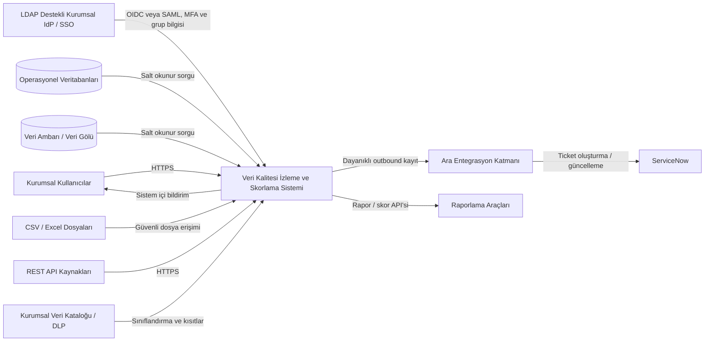
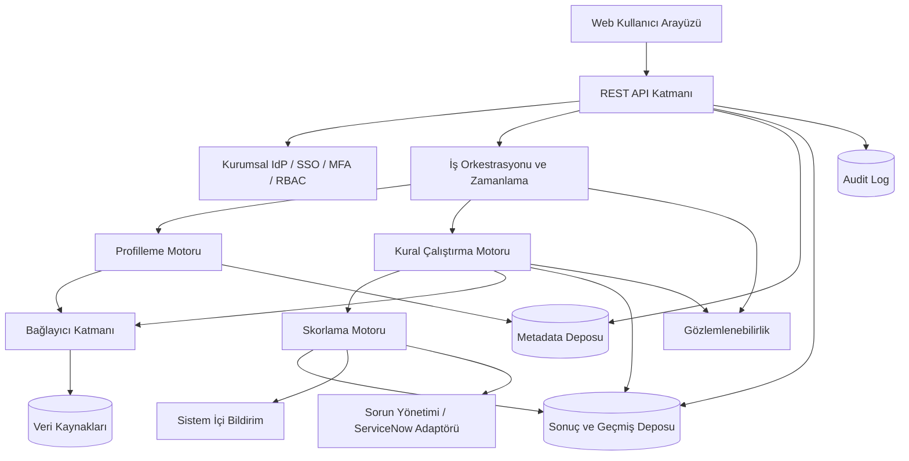

# Genel Sistem Açıklaması

Bu bölüm, sistemin kurumun veri ekosistemindeki konumunu, mantıksal mimarisini, kullanıcı sınıflarını, varsayımları ve kısıtları tanımlar.

## 2.1 Ürün Perspektifi

Sistem, operasyonel veritabanları, veri ambarı, veri gölü, dosya depoları ve REST servislerinden metadata ve kalite ölçüm sonuçları toplar. Kaynak sistemlerde veri değiştirmez; salt okunur erişimle sorgu ve örneklem gerçekleştirir. Kullanıcılar LDAP destekli kurumsal IdP/SSO üzerinden OIDC veya SAML ve zorunlu MFA ile doğrulanır. Sistem sonuçları dashboard ve raporlarla sunar, kritik bulgular için sistem içi bildirim oluşturur ve ara entegrasyon katmanı üzerinden ServiceNow ticket akışını yürütür.

Metinsel bağlamda kullanıcılar web arayüzü veya API aracılığıyla sisteme erişir. Kural motoru veri kaynağı bağlayıcıları ve kaynak kullanım politikaları üzerinden kontrolleri çalıştırır. Skorlama motoru resmî ve provizyonel sonuçları ayırır. Bildirim servisi kullanıcıları bilgilendirir. Audit altyapısı kritik işlem sınıflarında fail-closed, rutin olaylarda dayanıklı outbox davranışı uygular. Hassas sınıflandırmanın kaynağı kurumsal veri kataloğu veya DLP sistemidir.

### Sistem Bağlam Diyagramı

## 2.2 Sistem Ortamı

| Katman | Sorumluluk |
| --- | --- |
| Kullanıcı arayüzü | Dashboard, veri kaynağı, kural, çalıştırma, skor, sorun, rapor ve yönetim ekranlarını sağlar. |
| API katmanı | Web arayüzü ve entegrasyonlar için versiyonlu REST API sunar. |
| Kimlik doğrulama ve yetkilendirme | Kurumsal IdP/SSO beyanı, MFA kanıtı, oturum ve RBAC kararlarını uygular. |
| Veri kaynağı bağlantı katmanı | İlişkisel veritabanı, dosya/CSV ve API bağlayıcılarını ürün bağımsız ortak sözleşmeyle sunar. |
| Veri profilleme motoru | İstatistik, null, benzersizlik, desen, dağılım ve aykırı değer metriklerini hesaplar. |
| Kural çalıştırma motoru | Kural planlarını oluşturur, sorguları çalıştırır, hata türlerini sınıflandırır ve sonuçları üretir. |
| Skorlama motoru | Kural, boyut, veri kümesi, veri kaynağı ve kurum skorlarını ağırlıklı olarak hesaplar. |
| Zamanlama servisi | Tek seferlik, periyodik ve cron tabanlı işleri kuyruğa alır. |
| Bildirim servisi | Sistem içi bildirimleri oluşturur, tekrar ve susturma kurallarını uygular. |
| Metadata deposu | Kaynak, veri kümesi, alan, kural, sahiplik ve yapı bilgilerini saklar. |
| Sonuç ve geçmiş deposu | Profil, çalıştırma, skor, sorun ve rapor geçmişini saklar. |
| Raporlama ve dashboard katmanı | Filtrelenebilir tablo, grafik, trend ve dışa aktarma işlevlerini sunar. |
| Audit log altyapısı | Kritik kullanıcı ve sistem işlemlerini bütünlüğü korunmuş kayıtlarla izler. |

### Mantıksal Mimari

### Önerilen Çözüm Seçenekleri

Teknoloji seçimi bu SRS'nin zorunlu iş gereksinimi değildir. Üretimde stateless API ve worker bileşenleri kurumsal konteyner platformunda, veri tabanı ayrı yüksek erişilebilirlik kümesinde çalışır. API ve worker bağımsız ölçeklenir; kalıcı dosya/rapor depolaması konteyner yerel diskine bağımlı olmaz; kuyruk ve entegrasyon bileşenleri tek hata noktası oluşturmaz. Dağıtım, geri alma, sağlık kontrolü ve kontrollü kapatma dokümante edilir. Bağlantı sırları kurumsal secret manager'da tutulur.

## 2.3 Kullanıcı Sınıfları ve Özellikleri

| Rol/Aktör | Sorumluluklar | Yetkiler | Kullanım sıklığı | Teknik yeterlilik | Erişebileceği bilgiler | Gerçekleştirebileceği işlemler |
| --- | --- | --- | --- | --- | --- | --- |
| Sistem Yöneticisi | Kullanıcı, rol, bağlantı, sistem ayarı ve işletim yönetimi | Tam yönetim; iş verisini yalnız yetkili kapsamda görür | Günlük | Yüksek | Sistem yapılandırması, audit, sağlık, bağlantı metadatası | Kullanıcı/rol yönetimi; kaynak etkinleştirme; sistem ayarı |
| Veri Yönetişimi Uzmanı | Politika, sahiplik, kritiklik ve eşik yönetimi | Kurumsal kalite görünümü ve yönetişim ayarları | Haftalık/Günlük | Orta-Yüksek | Tüm onaylı metadata ve skorlar | Sahip atama; eşik ve kritik veri öğesi yönetimi |
| Veri Kalitesi Uzmanı | Kural tasarımı, profilleme, skorlama ve analiz | Yetkili alanlarda kural oluşturma ve çalıştırma | Günlük | Yüksek | Profil, örneklenmiş/maskeli hata sonuçları, skorlar | Kural tanımlama; test; zamanlama; analiz |
| Data Owner | İş anlamı ve kalite hedefi onayı | Sahibi olduğu alanlarda görüntüleme ve onay | Haftalık | Orta | Kendi veri alanına ait skor, sorun ve trendler | Sorun önceliği/onayı; kalite hedefi kararı |
| Data Steward | Günlük veri kalite operasyonu | Atandığı alanlarda kural/sorun yönetimi | Günlük | Orta-Yüksek | Atandığı veri kümeleri, kurallar ve sorunlar | Sorun inceleme; yorum; çözüm doğrulama |
| Veri Mühendisi | Teknik bağlantı, sorgu ve düzeltme desteği | Teknik metadata ve hata ayrıntıları | Günlük | Yüksek | Sorgu planı, teknik hata, şema bilgisi | Bağlantı testi; teknik tanı; çalıştırma desteği |
| İş Birimi Kullanıcısı | Kalite durumunu izleme | Salt okunur, yetkili iş alanı | Haftalık/Aylık | Düşük-Orta | Özet skorlar ve raporlar | Dashboard görüntüleme; rapor alma |
| Denetçi | Kanıt ve geçmiş inceleme | Salt okunur audit ve tarihsel sonuç erişimi | Dönemsel | Orta | Audit, rapor ve değişiklik geçmişi | Filtreleme; dışa aktarma |
| Harici Veri Kaynağı | Veri ve metadata sağlar | İnsan kullanıcı değildir | Zamanlanmış | TBD | Salt okunur sorgu yüzeyi | Bağlantı ve sorgu yanıtı |
| Bildirim Servisi | Sistem içi bildirim üretir | Servis hesabı | Olay bazlı | Teknik | Bildirim olayı ve alıcı metadatası | Bildirim oluşturma ve durum güncelleme |
| Kimlik Doğrulama Servisi | Kurumsal IdP/SSO beyanı ve MFA kanıtı sağlar | Servis entegrasyonu | Her oturum | Teknik | Kullanıcı kimliği ve grup üyeliği | OIDC veya SAML doğrulama yanıtı sağlama |

## 2.4 Varsayımlar ve Bağımlılıklar

| ID | Varsayım/Bağımlılık | Durum |
| --- | --- | --- |
| A-001 | Kurum içi veri merkezinde ağ, DNS, sertifika ve güvenlik duvarı kuralları sağlanır. | Varsayım |
| A-002 | Her veritabanı için salt okunur kullanıcı oluşturulur. | Varsayım |
| A-003 | LDAP destekli kurumsal IdP/SSO, MFA ve grup bilgisi sağlayabilir. | Kesinleşmiş yön; ürün/topoloji TBD |
| A-004 | Kaynak sistem çalışma pencereleri ve kotaları sürümlü kaynak kullanım politikasında tanımlanır. | Kesinleşmiş karar; değerler TBD |
| A-005 | Data Owner ve Data Steward atamaları kurum tarafından yapılır. | İş birimi kararı gerekli |
| A-006 | Yerel prototip i7-13620H, 16 GB RAM, RTX 4050 Ti ve üçüncü nesil SSD bulunan bilgisayarda çalışır. | Kesin kullanıcı girdisi |
| A-007 | 20 milyon satırlık referans testi, onaylı anonimleştirilmiş üretim örneği ve kısıtlı test ortamıyla yürütülür. | Kesinleşmiş karar; veri onayı TBD |
| A-008 | ServiceNow entegrasyonu için kurum tarafından servis hesabı ve API erişimi sağlanır. | Varsayım |
| A-009 | Sistem içi bildirim tek zorunlu bildirim kanalıdır. | Kesin kullanıcı girdisi |
| A-010 | Saklama ve imha kayıt sınıfı bazlı politika matrisiyle yönetilir; kesin süreler ilgili kurumsal onaylara kadar TBD'dir. | Kesinleşmiş karar; süreler TBD |

## 2.5 Kısıtlar

| Kısıt ID | Açıklama |
| --- | --- |
| C-001 | Sistem kişisel verileri gereksiz yere kopyalamamalı; hata örnekleri maskelenmelidir. |
| C-002 | Kaynak sistem erişimleri salt okunur olmalıdır. |
| C-003 | Kaynak sorguları yapılandırılmış zaman aşımı, satır limiti ve eş zamanlılık sınırına tabi olmalıdır. |
| C-004 | Tüm insan kullanıcı girişleri LDAP destekli kurumsal IdP/SSO üzerinden OIDC veya SAML ve MFA ile doğrulanmalıdır; güvenliksiz yerel giriş yoktur. Kontrollü break-glass yalnız süreli, yetkili ve auditli olabilir. |
| C-005 | Veri merkezi dışına veri çıkarılmamalıdır. |
| C-006 | Bağlantı parolaları uygulama veritabanında açık metin saklanmamalıdır. |
| C-007 | Kritik işlemler audit loga yazılmalıdır. |
| C-008 | Yerel prototip, 16 GB RAM sınırı nedeniyle dağıtık üretim kapasitesini temsil etmeyebilir. |
| C-009 | Kurum ağ ve güvenlik duvarı kuralları bağlayıcı erişimini sınırlayabilir. |
| C-010 | Saklama ve silme işlemleri kurumsal politika ve KVKK kararlarıyla uyumlu olmalıdır. |
