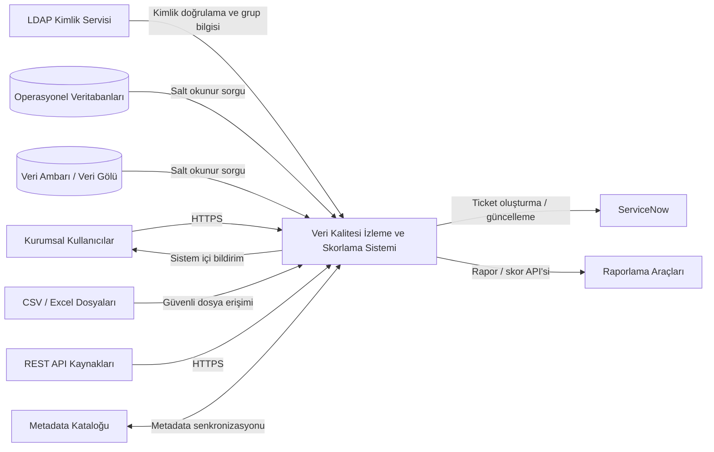
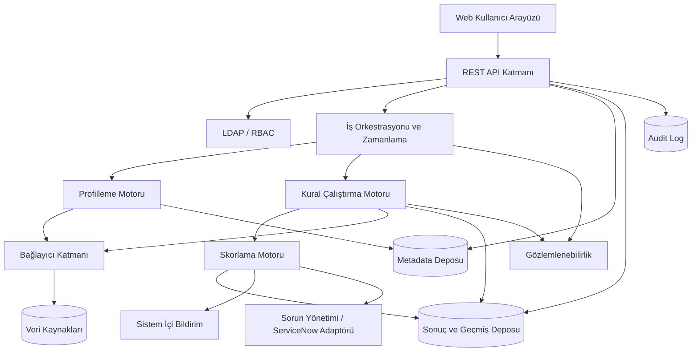

# Genel Sistem Açıklaması

Bu bölüm, sistemin kurumun veri ekosistemindeki konumunu, mantıksal mimarisini, kullanıcı sınıflarını, varsayımları ve kısıtları tanımlar.

## 2.1 Ürün Perspektifi

Sistem, operasyonel veritabanları, veri ambarı, veri gölü, dosya depoları ve REST servislerinden metadata ve kalite ölçüm sonuçları toplar. Kaynak sistemlerde veri değiştirmez; salt okunur erişimle sorgu ve örneklem gerçekleştirir. Sistem, LDAP üzerinden kullanıcı doğrular, sonuçları dashboard ve raporlarla sunar, kritik bulgular için sistem içi bildirim oluşturur ve gerektiğinde ServiceNow üzerinde ticket açar.

Metinsel bağlamda kullanıcılar web arayüzü veya API aracılığıyla sisteme erişir. Kural motoru veri kaynağı bağlayıcıları üzerinden kontrolleri çalıştırır. Skorlama motoru sonuçları birleştirir. Bildirim servisi kullanıcıları bilgilendirir. Audit altyapısı tüm kritik işlemleri kaydeder. Metadata kataloğu ve raporlama araçlarıyla entegrasyon ikinci fazda genişletilir.

### Sistem Bağlam Diyagramı

## 2.2 Sistem Ortamı

| Katman | Sorumluluk |
| --- | --- |
| Kullanıcı arayüzü | Dashboard, veri kaynağı, kural, çalıştırma, skor, sorun, rapor ve yönetim ekranlarını sağlar. |
| API katmanı | Web arayüzü ve entegrasyonlar için versiyonlu REST API sunar. |
| Kimlik doğrulama ve yetkilendirme | LDAP doğrulaması, oturum yönetimi ve RBAC kararlarını uygular. |
| Veri kaynağı bağlantı katmanı | PostgreSQL, SQL Server, Oracle, MySQL, CSV, Excel ve REST API bağlayıcılarını ortak sözleşmeyle sunar. |
| Veri profilleme motoru | İstatistik, null, benzersizlik, desen, dağılım ve aykırı değer metriklerini hesaplar. |
| Kural çalıştırma motoru | Kural planlarını oluşturur, sorguları çalıştırır, hata türlerini sınıflandırır ve sonuçları üretir. |
| Skorlama motoru | Kural, boyut, veri kümesi, veri kaynağı ve kurum skorlarını ağırlıklı olarak hesaplar. |
| Zamanlama servisi | Tek seferlik, periyodik ve cron tabanlı işleri kuyruğa alır. |
| Bildirim servisi | Sistem içi bildirimleri oluşturur, tekrar ve susturma kurallarını uygular. |
| Metadata deposu | Kaynak, veri kümesi, alan, kural, sahiplik ve yapı bilgilerini saklar. |
| Sonuç ve geçmiş deposu | Profil, çalıştırma, skor, sorun ve rapor geçmişini saklar. |
| Raporlama ve dashboard katmanı | Filtrelenebilir tablo, grafik, trend ve dışa aktarma işlevlerini sunar. |
| Audit log altyapısı | Kritik kullanıcı ve sistem işlemlerini bütünlüğü korunmuş kayıtlarla izler. |

### Mantıksal Mimari

### Önerilen Çözüm Seçenekleri

Teknoloji seçimi bu SRS'nin zorunlu iş gereksinimi değildir. Yerel prototip için konteyner tabanlı modüler monolit, arka planda iş kuyruğu ve ilişkisel metadata deposu önerilir. Kurum içi üretim ortamında bileşenlerin bağımsız ölçeklenebildiği servis tabanlı mimari değerlendirilebilir. Bağlantı sırları için kurumsal secret manager, gözlemlenebilirlik için merkezi log/metric altyapısı ve dağıtım için kurum standardı CI/CD kullanılmalıdır.

## 2.3 Kullanıcı Sınıfları ve Özellikleri

| Rol/Aktör | Sorumluluklar | Yetkiler | Kullanım sıklığı | Teknik yeterlilik | Erişebileceği bilgiler | Gerçekleştirebileceği işlemler |
| --- | --- | --- | --- | --- | --- | --- |
| Sistem Yöneticisi | Kullanıcı, rol, bağlantı, sistem ayarı ve işletim yönetimi | Tam yönetim; iş verisini yalnız yetkili kapsamda görür | Günlük | Yüksek | Sistem yapılandırması, audit, sağlık, bağlantı metadatası | Kullanıcı/rol yönetimi; kaynak etkinleştirme; sistem ayarı |
| Veri Yönetişimi Uzmanı | Politika, sahiplik, kritiklik ve eşik yönetimi | Kurumsal kalite görünümü ve yönetişim ayarları | Haftalık/Günlük | Orta-Yüksek | Tüm onaylı metadata ve skorlar | Sahip atama; eşik ve kritik veri öğesi yönetimi |
| Veri Kalitesi Uzmanı | Kural tasarımı, profilleme, skorlama ve analiz | Yetkili alanlarda kural oluşturma ve çalıştırma | Günlük | Yüksek | Profil, örneklenmiş/maskeli hata sonuçları, skorlar | Kural tanımlama; test; zamanlama; analiz |
| Data Owner | İş anlamı ve kalite hedefi onayı | Sahibi olduğu alanlarda görüntüleme ve onay | Haftalık | Orta | Kendi veri alanına ait skor, sorun ve trendler | Sorun önceliği/onayı; kalite hedefi kararı |
| Data Steward | Günlük veri kalite operasyonu | Atandığı alanlarda kural/sorun yönetimi | Günlük | Orta-Yüksek | Atandığı veri kümeleri, kurallar ve sorunlar | Sorun inceleme; yorum; çözüm doğrulama |
| Veri Mühendisi | Teknik bağlantı, sorgu ve düzeltme desteği | Teknik metadata ve hata ayrıntıları | Günlük | Yüksek | Sorgu planı, teknik hata, şema bilgisi | Bağlantı testi; teknik tanı; çalıştırma desteği |
| İş Birimi Kullanıcısı | Kalite durumunu izleme | Salt okunur, yetkili iş alanı | Haftalık/Aylık | Düşük-Orta | Özet skorlar ve raporlar | Dashboard görüntüleme; rapor alma |
| Denetçi | Kanıt ve geçmiş inceleme | Salt okunur audit ve tarihsel sonuç erişimi | Dönemsel | Orta | Audit, rapor ve değişiklik geçmişi | Filtreleme; dışa aktarma |
| Harici Veri Kaynağı | Veri ve metadata sağlar | İnsan kullanıcı değildir | Zamanlanmış | TBD | Salt okunur sorgu yüzeyi | Bağlantı ve sorgu yanıtı |
| Bildirim Servisi | Sistem içi bildirim üretir | Servis hesabı | Olay bazlı | Teknik | Bildirim olayı ve alıcı metadatası | Bildirim oluşturma ve durum güncelleme |
| Kimlik Doğrulama Servisi | LDAP kimlik doğrulaması yapar | Servis entegrasyonu | Her oturum | Teknik | Kullanıcı kimliği ve grup üyeliği | Doğrulama yanıtı sağlama |

## 2.4 Varsayımlar ve Bağımlılıklar

| ID | Varsayım/Bağımlılık | Durum |
| --- | --- | --- |
| A-001 | Kurum içi veri merkezinde ağ, DNS, sertifika ve güvenlik duvarı kuralları sağlanır. | Varsayım |
| A-002 | Her veritabanı için salt okunur kullanıcı oluşturulur. | Varsayım |
| A-003 | LDAP yüksek erişilebilirlikte hizmet verir ve grup bilgisi sağlayabilir. | Varsayım |
| A-004 | Kaynak sistemler üzerinde kalite sorguları için kabul edilebilir çalışma penceresi tanımlanır. | İş birimi kararı gerekli |
| A-005 | Data Owner ve Data Steward atamaları kurum tarafından yapılır. | İş birimi kararı gerekli |
| A-006 | Yerel prototip i7-13620H, 16 GB RAM, RTX 4050 Ti ve üçüncü nesil SSD bulunan bilgisayarda çalışır. | Kesin kullanıcı girdisi |
| A-007 | Yerel prototipte 20 milyon satırlık tablolar için tam tarama yerine örnekleme, bölümleme veya kaynakta toplulaştırma kullanılabilir. | Teknik karar gerekli |
| A-008 | ServiceNow entegrasyonu için kurum tarafından servis hesabı ve API erişimi sağlanır. | Varsayım |
| A-009 | Sistem içi bildirim tek zorunlu bildirim kanalıdır. | Kesin kullanıcı girdisi |
| A-010 | Kritik kayıtların hedef saklama süresi beş yıldır; mevzuat ve kurum politikasıyla doğrulanmalıdır. | Varsayım |

## 2.5 Kısıtlar

| Kısıt ID | Açıklama |
| --- | --- |
| C-001 | Sistem kişisel verileri gereksiz yere kopyalamamalı; hata örnekleri maskelenmelidir. |
| C-002 | Kaynak sistem erişimleri salt okunur olmalıdır. |
| C-003 | Kaynak sorguları yapılandırılmış zaman aşımı, satır limiti ve eş zamanlılık sınırına tabi olmalıdır. |
| C-004 | Tüm kullanıcı girişleri LDAP üzerinden doğrulanmalıdır; yerel acil durum hesabı yalnız güvenlik onayıyla tanımlanabilir. |
| C-005 | Veri merkezi dışına veri çıkarılmamalıdır. |
| C-006 | Bağlantı parolaları uygulama veritabanında açık metin saklanmamalıdır. |
| C-007 | Kritik işlemler audit loga yazılmalıdır. |
| C-008 | Yerel prototip, 16 GB RAM sınırı nedeniyle dağıtık üretim kapasitesini temsil etmeyebilir. |
| C-009 | Kurum ağ ve güvenlik duvarı kuralları bağlayıcı erişimini sınırlayabilir. |
| C-010 | Saklama ve silme işlemleri kurumsal politika ve KVKK kararlarıyla uyumlu olmalıdır. |
