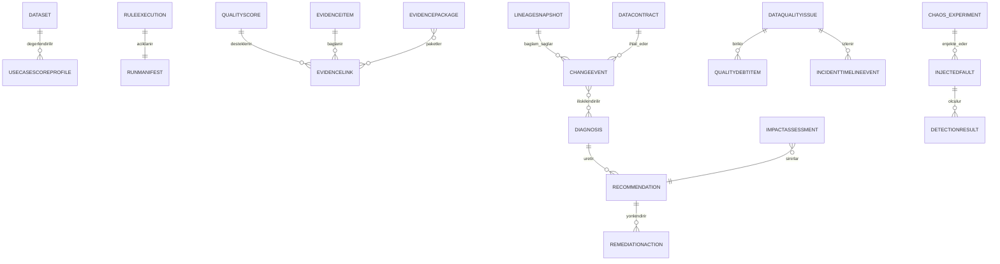

# Kanıt ve Karar Desteği Varlıkları

Bu belge hedef mantıksal modeli tanımlar; fiziksel tablo veya migration kararı
değildir. Mevcut varlıklar yeniden kullanılır ve sonuç kayıtları append-only
kalır. Secret, ham sorgu parametresi veya gereksiz müşteri verisi saklanmaz.

## Mevcut Varlıkların Genişletilmesi

| İstenen kavram | Model kararı |
| --- | --- |
| score_run / rule_execution | `RuleExecution` ve bağlı `RunManifest` |
| score_component | `QualityScore.calculation_details` için şemalı bileşen kaydı; ayrı genel varlık yok |
| metric_result | `RuleResult` ve `ScoreMeasurementSummary`; ayrı genel varlık yok |
| rule_version / policy_version | Mevcut `RuleVersion` ve sürümlü politika varlıkları |
| data_sample_reference / record_fingerprint | `EvidenceItem` türleri |
| recommendation_evidence | `EvidenceLink`; ayrı içerik kopyası yok |
| approval | Mevcut modüle özel maker-checker kararlarıyla referans; genel sınırsız approval yok |
| rollback | `RemediationAction` olay türü |
| reproduction_manifest | `RunManifest` |

## UseCaseScoreProfile

| Alan | Zorunluluk | Açıklama |
| --- | --- | --- |
| use_case_score_profile_id | Evet | Değişmez profil kimliği |
| dataset_id | Evet | Dataset kapsamı |
| usage_context_code | Evet | Kurumsal kullanım amacı kodu |
| dimension_weight_policy_version | Evet | Boyut/ağırlık politika sürümü |
| critical_field_set_version | Evet | Kritik alan referansı |
| threshold_policy_version | Evet | Minimum eşik sürümü |
| blocking_rule_set_version | Evet | Bloke edici kural sınıfı/sürümü |
| qualification_policy_version | Evet | Yeterlilik ve kanıt kapısı sürümü |
| profile_version | Evet | Değişmez profil sürümü |
| effective_from / effective_to | Evet/Hayır | Geçerlilik aralığı |
| approval_status / approval_reference | Evet | Risk bazlı onay bağlantısı |
| audit_reference | Evet | Veri-minimum audit/outbox referansı |

Profil kataloğunun şema, sözlük ve yaşam döngüsü merkezi; dataset profilinin
sahibi Data Owner'dır. Data Governance sözlüğü, Risk Yönetimi düzenleyici/risk
kullanımını yönetir. Profil yoksa veya onaylı değilse olumlu `UsageDecision`
üretilmez.

## RunManifest

| Alan | Zorunluluk | Açıklama |
| --- | --- | --- |
| run_manifest_id / execution_id | Evet | Manifest ve `RuleExecution` ilişkisi |
| dataset_id / dataset_version | Evet | Ölçülen dataset ve sürümü |
| snapshot_or_partition_reference | Evet | Opak snapshot/partition referansı |
| population_count / evaluated_count | Evet | Kanonik sayaçlar |
| sampling_strategy / sample_size / seed_reference | Koşullu | Örnekleme yöntemi ve yeniden üretim kanıtı |
| executed / failed / skipped rule counts | Evet | Kural yürütme özeti |
| rule_set_version / policy_versions | Evet | Kural ve tüm etkili politikalar |
| scoring_model_version / engine_version | Evet | Model ve motor sürümleri |
| query_or_process_hashes | Evet | Hesaplama kaynağı bütünlük referansı |
| started_at / completed_at | Evet | UTC çalışma zamanı |
| triggered_actor_reference / correlation_id | Evet | Güvenilir aktör ve korelasyon |
| reproducibility_status | Evet | COMPLETE/INCOMPLETE/UNAVAILABLE |
| manifest_digest | Evet | Kanonik manifest özeti |

## EvidenceItem ve EvidenceLink

### EvidenceItem

| Alan | Zorunluluk | Açıklama |
| --- | --- | --- |
| evidence_item_id | Evet | Kanıt kimliği |
| evidence_type | Evet | METRIC/CALCULATION_SOURCE/SAMPLE_REFERENCE/FINGERPRINT/LINEAGE/CHANGE/DEPLOYMENT/APPROVAL/VALIDATION |
| source_system / source_reference | Evet | Kanıtın kaynağı ve opak referansı |
| content_digest | Evet | Kaynak içeriğin bütünlük özeti |
| classification_level | Evet | Katalog/DLP sınıfı |
| observed_at / captured_at | Evet | Kaynak ve yakalama zamanı |
| verification_status | Evet | VERIFIED/UNVERIFIED/FAILED/UNAVAILABLE |
| retention_policy_id | Evet | Kayıt sınıfı saklama referansı |
| metadata | Evet | Tür bazlı allowlist; ham payload içermez |

### EvidenceLink

| Alan | Zorunluluk | Açıklama |
| --- | --- | --- |
| evidence_link_id | Evet | Bağ kimliği |
| evidence_item_id | Evet | Kanıt referansı |
| subject_type / subject_id | Evet | SCORE/RUN/DIAGNOSIS/RECOMMENDATION/IMPACT/CHANGE/REMEDIATION/INCIDENT/PACKAGE |
| relation_type | Evet | SUPPORTS/CONTRADICTS/PRODUCED_BY/VERIFIES/INVALIDATES |
| linked_at / linked_by | Evet | Zaman ve güvenilir aktör/servis |
| audit_reference | Evet | Bağ oluşturma auditi |

Kanıt çoktan çoğa bağlanır; içerik başka varlıklara kopyalanmaz.

## ConfidenceAssessment

| Alan | Zorunluluk | Açıklama |
| --- | --- | --- |
| confidence_assessment_id | Evet | Değerlendirme kimliği |
| subject_type / subject_id | Evet | Ölçüm, teşhis, öneri veya kanıt paketi |
| confidence_type | Evet | MEASUREMENT/DIAGNOSIS/RECOMMENDATION/EVIDENCE_STRENGTH |
| value / level | Koşullu | Politika tanımlı değer veya seviye |
| calculation_details | Evet | Formül, girdiler ve eksik bileşenler |
| policy_version | Evet | Güven politikası sürümü |
| assessed_at | Evet | UTC değerlendirme zamanı |

## LineageSnapshot, ChangeEvent ve Diagnosis

`LineageSnapshot`; kurumsal veri kataloğunu sistem-of-record kabul eder ve
OpenLineage uyumlu source/dataset/table/column, transformation, pipeline/job,
downstream dataset/data product/report/model, owner, repository/file/commit/deploy
referansları ile source/version/captured_at/freshness/completeness alanlarını
taşır. İç eşleme W3C PROV `Entity/Activity/Agent` anlamlarını koruyabilir.

`ChangeEvent`; DATA/RULE/POLICY/MEASUREMENT/SCHEMA/REFERENCE_DATA/PIPELINE/
DEPLOYMENT/SOURCE_OUTAGE türü, etkilenen kapsam, önceki/yeni sürüm referansı,
occurred_at, kaynak ve correlation alanlarını taşır. Ham diff içermez.

`Diagnosis`; incident/issue referansı, sınıflandırılmış hipotez, nedensellik
durumu, `ConfidenceAssessment`, karşı hipotez, doğrulama durumu ve kanıt
bağlarını taşır. Yeni değerlendirme önceki kaydı güncellemez.

## Recommendation ve RemediationAction

`Recommendation`; type, source mechanism, mechanism/version reference,
confidence, counterevidence, validation status, application risk, required
approval, status, created_at ve `EvidenceLink` ilişkilerini taşır. İlk üretim
allowlist'i `DeterministicRule`, `IncidentSimilarity` ve auditli `ExpertInput`
türleridir. `LLMAssisted` üretimde kapalıdır. Serbest metin hassas veri içeremez.

`RemediationAction`; recommendation/issue, policy level, action type, target
reference, idempotency digest, dry-run/impact/approval/canary/validation ve
rollback referansları, güvenilir kullanıcı/servis aktörü, status ve audit
alanlarını taşır. Kaynak üretim verisine yazan action type modele alınmaz.
`SuggestOnly` varsayılandır; `AutoFixLowRisk` ilk fazda üretim dışıdır.

## ImpactAssessment ve QualityDebtItem

`ImpactAssessment`; subject, affected count türleri, downstream varlık
referansları, finansal/operasyonel/düzenleyici/müşteri/criticality/cost bileşenleri,
her bileşen için `Observed/Calculated/Estimated/Unknown`, source/effective_at,
formula/policy version, confidence ve evidence bağlarını taşır.

`QualityDebtItem`; source issue, first_detected_at, age snapshot, affected system
referansları, recurrence/exception counts, operational cost/risk increase
değerlendirmeleri, owner, target date, status ve evidence bağlarını taşır.
`QualityDebtScoreV1 = 100 * (0.20 * age_ratio + 0.20 * recurrence_ratio +
0.20 * exception_ratio + 0.20 * impact_ratio + 0.20 * control_gap_ratio)`
formülünü, `evidence_coverage` değerini ve kullanılan politika sürümlerini ayrı
saklar. Oranlar `0–1` aralığına onaylı politikayla normalize edilir. Gerekli
bileşen eksikse skor `Unknown` olur; eksik değer sıfır sayılmaz.

## DataContract

`DataContract`; kurumsal veri kataloğu referansı, producer/consumer owner,
dataset/schema version, required field/
type constraints, quality/freshness/completeness/uniqueness/availability policy
referansları, breaking change/notification/exception/violation policy sürümleri,
effective dates, approval ve audit alanlarını taşır. Metadata kataloğunu yeniden
geliştirmez; kurumsal sistem-of-record'a referans verir. Breaking change için
etki simülasyonu, Data Owner onayı ve tüketici bildirimi; istisna için kapsam,
süre sonu ve maker-checker referansı zorunludur.

## ChaosExperiment, InjectedFault ve DetectionResult

`ChaosExperiment`; dataset/scenario/run, environment attestation, fault policy,
authorization/approval, rollback plan, status, started/completed_at ve manifest
referansını taşır. İlk fazda ortam üretim dışı ve veri sentetik olmalıdır.
Fault policy kaynak/dataset/partition/zaman/hacim bütçesi ile durdurma nedenlerini
taşır. `InjectedFault`; fault type, target scope, injection evidence,
ground truth ve rollback reference taşır. `DetectionResult`; detected/missed/
false-positive sonucu, detection time, rule/dimension/critical-field coverage,
technical status ve evidence bağlarını taşır.

## IncidentTimelineEvent ve EvidencePackage

`IncidentTimelineEvent`; incident/issue, event type, occurred_at, source
reference, actor type/reference, correlation, evidence links ve classification
alanlarını taşır.

`EvidencePackage`; scope, status, RFC 8785 canonicalization version, manifest
version/digest, SHA-256 algorithm reference, signature/key reference,
included/missing evidence references, evidence strength, generated_by/at,
retention policy, export/DLP decision ve audit alanlarını taşır. Kanıt içeriğini
kopyalamak yerine referans ve digest kullanır. İmza üretimde kurum onaylı
KMS/HSM'den, saklama ve imha davranışı kayıt sınıfı politikasından çözülür.

## İlişkiler

## Saklama, İndeks ve Migration Etkisi

- Yeni kayıt sınıfları mevcut `RetentionPolicy` kataloğuna açık eşleme olmadan
  kalıcılaştırılmaz; süreler `OPEN-BNK-008` incelemesi ve etkin kayıt sınıfı
  politikası olmadan uydurulmaz.
- Run, kanıt, teşhis, öneri, karar, remediation ve timeline kayıtları append-only
  tasarlanır; fiziksel silme legal hold ve imha prosedürüne uyar.
- Sık sorgulanan subject type/id, source reference, status, occurred_at,
  captured_at ve correlation alanlarında indeks ihtiyacı hacim testiyle
  doğrulanır.
- Fiziksel tablo bölme/birleştirme, PostgreSQL migration ve rollback ayrı
  uygulama artımıdır; bu belge migration çalıştırmaz.
