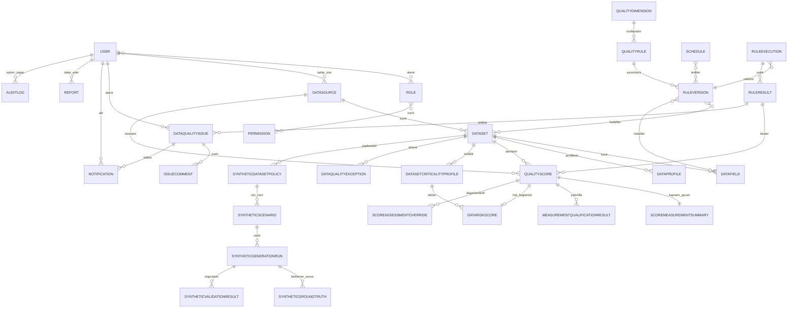

# Veri Modeli — Genel

Bu bölüm, sistemin temel veri varlıklarını, veri sözlüğünü, saklama politikasını ve varlıklar arası ilişkileri tanımlar.

## 7.1 Temel Veri Varlıkları

| Varlık | Açıklama |
| --- | --- |
| User | Kurumsal IdP kimliğinin yerel rol, kapsam ve durum bilgisi. |
| Role | İşlev ve veri erişimi için yetki grubu. |
| Permission | Bir işlem veya nesne sınıfına ilişkin izin. |
| DataSource | Veritabanı, dosya veya REST API bağlantı tanımı. |
| Dataset | Tablo, görünüm, dosya sayfası veya API veri kümesi. |
| DataField | Veri kümesindeki kolon/alan metadatası. |
| DataProfile | Belirli zamanda üretilen profil metrikleri. |
| QualityRule | Mantıksal veri kalitesi kuralı. |
| RuleVersion | Kuralın değişmez sürümü ve parametreleri. |
| RuleExecution | Kural/profil çalıştırma işinin yaşam döngüsü. |
| RuleResult | Bir kuralın sayaç ve hata özetleri. |
| QualityScore | Kural, veri öğesi, boyut, veri kümesi veya portföy kapsamındaki değişmez ham ve kritik politika etkili nihai kalite sonucu. |
| QualityDimension | Desteklenen veri kalitesi boyutu ve uygulanabilirlik durumu. |
| ScoreMeasurementSummary | Kalite skorundan ayrı kapsam, güven, örnekleme ve teknik sağlık özeti. |
| MeasurementQualificationResult | Ölçümün karar vermeye yeterli olup olmadığını kalite skorundan ayrı açıklayan sonuç. |
| DatasetCriticalityProfile | Kalite skorundan ayrı dataset iş etkisi/kritiklik profili. |
| DataRiskScore | Kalite problemi ile iş etkisi/kritikliği ayrı modelde birleştiren risk sonucu. |
| ScoringPolicy | Normalizasyon, eşik, ağırlık, kritik kural ve güven davranışının sürümlü politikası. |
| DataQualityException | Süreli, onaylı ve auditli iş istisnası. |
| ScoreAssessmentOverride | Ham skoru değiştirmeyen süreli ve onaylı değerlendirme/override. |
| Schedule | Tek seferlik veya tekrarlı çalışma planı. |
| Notification | Sistem içi bildirim ve teslim/okunma durumu. |
| DataQualityIssue | Kalite veya teknik olaydan doğan sorun kaydı. |
| IssueComment | Sorun yorumu ve ek bağlantısı. |
| AuditLog | Kritik kullanıcı/sistem işlem kaydı. |
| Report | Rapor şablonu, üretim işi ve çıktı metadatası. |
| SourceUsagePolicy | Kaynak bazlı worker, sorgu kotası, çalışma penceresi ve kaynak koruma politikası. |
| DatasetPartialScorePolicy | Kısmi çalıştırmanın resmî skora katılma koşulları. |
| RetentionPolicy | Kayıt sınıfı bazlı çevrimiçi/arşiv saklama ve imha politikası. |
| RecoveryObjectivePolicy | Bileşen bazlı RPO/RTO hedefi. |
| OutboundIntegrationRecord | ServiceNow için dayanıklı ve idempotent outbound kayıt. |
| SyntheticDatasetPolicy | Sentetik üretim izni, profil, seed, gizlilik, ground truth ve test bildirimi davranışını sürümleyen dataset politikası. |
| SyntheticScenario | Şema, dağılım, ilişki, zaman, eksiklik, geçerli uç ve kusur enjeksiyonunun değişmez senaryo sürümü. |
| SyntheticGenerationRun | Üretici/konfigürasyon/şema/politika sürümü, random seed, hacim ve çıktı kimliğiyle tek üretim çalışması. |
| SyntheticGroundTruth | Sentetik kayıt/senaryo için runtime motorundan bağımsız beklenen kural, skor, önem ve olay sonucu. |
| SyntheticValidationResult | Yapısal, istatistiksel, görev faydası, gizlilik ve teknik doğrulamanın değişmez sonucu. |
| UseCaseScoreProfile | Dataset ve kullanım amacı için ağırlık, eşik, kritik alan, bloke edici kural ve yeterlilik politika referansları. |
| RunManifest | Snapshot/partition, sayaç, örnekleme/seed, kural/politika/model/motor sürümü ve hashlerle yeniden üretim kanıtı. |
| EvidenceItem / EvidenceLink | Veri-minimum kanıt metadata'sı ve skor/run/teşhis/öneri/olay arasındaki çoktan çoğa ilişki. |
| LineageSnapshot / ChangeEvent | Kaynaklı tablo/kolon/dönüşüm ilişkisi ve data/rule/policy/measurement/deploy değişiklik olayı. |
| Diagnosis / Recommendation | Nedensellik sınıflı teşhis ve mekanizma/kanıt/güven/risk bağlı öneri. |
| RemediationAction | Dry-run, onay, canary, yeniden doğrulama ve rollback olaylarının değişmez yaşam döngüsü. |
| ImpactAssessment | Gözlenen/hesaplanan/tahmini/bilinmeyen etki bileşenleri ve kaynakları. |
| DataContract / QualityDebtItem | Sürümlü üretici-tüketici sözleşmesi ile kaynaklı kalite borcu kaydı. |
| ChaosExperiment | İzole fault enjeksiyonu, detection sonucu ve rollback kanıtı. |
| IncidentTimelineEvent / EvidencePackage | Olay zaman çizelgesi ve referans/digest tabanlı kanıt paketi. |

## Veri Sözlüğü Grupları

- [Kimlik ve Yetki Varlıkları](Kimlik-ve-Yetki-Varliklari.md)
- [Kaynak ve Metadata Varlıkları](Kaynak-ve-Metadata-Varliklari.md)
- [Kural ve Çalıştırma Varlıkları](Kural-ve-Calistirma-Varliklari.md)
- [Sorun, Bildirim ve Audit Varlıkları](Sorun-Bildirim-ve-Audit-Varliklari.md)
- [Kanıt ve Karar Desteği Varlıkları](Kanit-ve-Karar-Destegi-Varliklari.md)

## 7.3 Veri Saklama ve Arşivleme

| Kayıt türü | Önerilen süre | Durum | Politika |
| --- | --- | --- | --- |
| Audit kayıtları | Kritik olay `P10Y`; rutin erişim/olay özeti `P5Y` | KararAlındı; banka incelemesi ayrı | `RET-10Y-BANKING` veya `RET-5Y-REGLOG` olay sınıfından çözülür. |
| Kimlik doğrulama ve yetkilendirme kayıtları | Rutin güvenlik izi `P5Y`; sonlandırılmış normal session güvenlik metadatası ve rate-limit anahtarı `P90D` | ApprovedByBank | `RET-5Y-REGLOG` veya `RET-90D-TRANSIENT` uygulanır; session sırrı ile access/refresh token sonlandırmada derhal silinir ve arşivlenmez. |
| Kural değişiklikleri | `P10Y` | KararAlındı | `RET-10Y-BANKING`; tarihsel açıklanabilirlik korunur. |
| Onay kayıtları | `P10Y` | KararAlındı | `RET-10Y-BANKING`; maker-checker kanıtı korunur. |
| Çalıştırma kayıtları | Resmî `P10Y`; resmî olmayan test `P1Y` | KararAlındı | `RET-10Y-BANKING` veya `RET-1Y-OPS`; RuleVersion bağı korunur. |
| Skor sonuçları | Resmî `P10Y`; provizyonel/test `P1Y` | KararAlındı | Resmî ve provizyonel sonuç ayrımı saklama sınıfını belirler. |
| Kısmi ve geçici sonuçlar | Resmî kabul edilmiş `P10Y`; diğerleri `P1Y` | KararAlındı | Resmî kullanım kararı sınıflandırmayı belirler. |
| Bildirim kayıtları | `P1Y` | KararAlındı | `RET-1Y-OPS`; içerik minimizasyonu uygulanır. |
| ServiceNow entegrasyon kayıtları | Eşleme/audit `P10Y`; terminal retry payloadı `P90D` | KararAlındı | `RET-10Y-BANKING` ve `RET-90D-TRANSIENT` ayrı uygulanır. |
| Rapor dosyaları | `P30D` | KararAlındı | `RET-30D-EXPORT`; şifreli saklama ve kriptografik imha uygulanır. |
| Rapor metadata kayıtları | `P10Y` | KararAlındı | `RET-10Y-BANKING`; dosyadan bağımsız saklanır. |
| Teknik loglar | Ayrıntılı log `P90D`; veri-minimum SIEM özeti `P5Y` | KararAlındı | Secret ve ham hassas veri içermez. |
| Geçici işleme verileri | En fazla `P30D` | KararAlındı | `RET-30D-EXPORT`; amaç tamamlanınca daha erken güvenli imha edilebilir. |
| Hata ve yeniden deneme kayıtları | `P90D` | KararAlındı | `RET-90D-TRANSIENT`; güvenli hata özetiyle sınırlıdır. |
| Sentetik datasetler | Fiziksel çıktı `P30D`; geri döndürülemez anonim toplulaştırma amaç sürdükçe | KararAlındı; kullanım onayı ayrı | `RET-30D-EXPORT` veya yalnız anonimlik kanıtı varsa `RET-ANON`. |
| Sentetik üretim, ground truth ve doğrulama kayıtları | Operasyonel test `P1Y`; resmî kabul kanıtı `P10Y` | KararAlındı | `RET-1Y-OPS` veya `RET-10Y-BANKING`; lineage korunur. |
| Karar desteği kanıtı, manifest, lineage, teşhis, öneri, remediation, contract, borç, chaos ve kanıt paketi kayıtları | `TBD` | ComplianceReviewRequired | `OPEN-036` ve `OPEN-BNK-008` sonuçlanmadan süre uydurulmaz; etkin `RET-*` eşlemesi yoksa kalıcılaştırma fail-closed reddedilir. |

Her `RetentionPolicy` kaydı en az kayıt sınıfı, saklama süresi, hukuki dayanak
veya kurumsal gerekçe, çevrimiçi saklama süresi, arşiv süresi, imha yöntemi ve
sorumlu birim alanlarını taşır. Etkin `RET-*` sınıfı bulunmadan kayıt
kalıcılaştırılmaz veya imha kararı verilmez.

### RetentionPolicy

| Alan | Açıklama |
| --- | --- |
| record_class | Kayıt sınıfı |
| retention_duration | Toplam saklama süresi; etkin `RET-*` politika sınıfından çözülür |
| legal_or_corporate_basis | Hukuki dayanak veya kurumsal gerekçe |
| online_duration | Çevrimiçi saklama süresi; etkin politika kaydında zorunlu |
| archive_duration | Arşiv süresi; etkin politika kaydında zorunlu |
| destruction_method | Onaylı imha yöntemi |
| responsible_unit | Sorumlu birim |
| policy_version | Değişmez politika sürümü |
| approval_status | Onay durumu |
| audit_reference | Politika değişikliği audit referansı |

### SyntheticDatasetPolicy

Bu politika `RetentionPolicy`, `ScoringPolicy`, `DatasetCriticalityProfile` ve
sınıflandırma kayıtlarına referans verir; aynı alanları kopyalamaz.

| Alan | Açıklama |
| --- | --- |
| dataset_id | Hedef dataset |
| synthetic_generation_allowed | Sentetik üretim izni; yok/false ise fail-closed |
| synthetic_profile | Golden, Normal Operasyon, Bozulmuş, Stress, Drift, Şema Değişikliği, Nadir Olay, Gizlilik Test veya Olay Yönetimi profili |
| volume_profile | Fonksiyonel, entegrasyon, performans ve diğer teknik hacim profili |
| distribution_profile | Sürümlü dağılım/korelasyon/segment profili |
| missingness_profile | Sürümlü eksiklik mekanizması profili |
| defect_injection_profile | Kusur türü, kapsamı ve yoğunluk sınıfı |
| privacy_profile | Uygulanacak gizlilik risk değerlendirme profili |
| retention_policy_id | Ortak saklama ve imha politikası referansı |
| ground_truth_enabled | Bağımsız ground truth zorunluluğu |
| seed_strategy | Deterministik random seed üretim/sağlama yöntemi |
| expected_score_tolerance | Beklenen/gerçekleşen skor toleransı; senaryo/politika kaydında zorunlu, yoksa doğrulama `BLOCKED` |
| criticality_profile_id | Ayrı dataset kritiklik profili referansı |
| notification_test_enabled | Yalnız izole test hedefi kullanım izni |
| schema_version | Sentetik şema sürümü |
| policy_version | Değişmez politika sürümü |
| effective_from, effective_to | Politika geçerlilik aralığı |
| approved_by, approval_status | Risk bazlı onay ve görevler ayrılığı kanıtı |

### Sentetik Üretim ve Ground Truth

`SyntheticGenerationRun`; `scenario_id`, `generator_version`,
`configuration_version`, `schema_version`, `policy_version`, `random_seed`,
`created_at`, `record_count`, kusur enjeksiyon oranları, çıktı kimliği ve doğrulama
referanslarını taşır. Aynı girdiyle replay yeni run kaydı oluşturur; önceki run
değiştirilmez.

`SyntheticGroundTruth`; `synthetic_record_id`, `scenario_id`,
`generation_run_id`, `generator_version`, `random_seed`, `source_system`,
`dataset_id`, `injected_defect`, `affected_dimension`, `affected_rule_id`,
`expected_rule_result`, `expected_severity`, `expected_dataset_score`,
`expected_notification`, `expected_escalation`, `injection_timestamp`,
`is_valid_edge_case` ve `ground_truth_version` alanlarını taşır. Ground truth iş
verisiyle karıştırılmaz ve runtime skor/kural motorunun çıktısından türetilmez.

`SyntheticValidationResult`; doğrulama sınıfı, politika/tolerans sürümü,
`PASS/BLOCKED/TECHNICAL_ERROR` durumu, veri-minimum neden kodları, beklenen ve
gerçekleşen sonuç özetleri ile audit referansını taşır. Gizlilik ve görev faydası
başarısızlığı teknik hatadan ayrı tutulur.

## 7.3.1 Bileşen Bazlı Kurtarma Hedefleri

`RecoveryObjectivePolicy`; sistem yapılandırması, kural/sürüm, eşik/ağırlık, kullanıcı/rol eşlemesi, audit, onay, çalıştırma metadatası, skor, rapor dosyası ve bildirim/entegrasyon kuyruğu için ayrı kayıt taşır.

| Alan | Açıklama |
| --- | --- |
| component_class | Kurtarma hedefi uygulanan bileşen |
| rpo_value | Normal kapsam `PT15M`, kritik düzenleyici/risk zinciri `PT5M`; sürümlü override desteklenir |
| rto_value | Normal kapsam `PT4H`, kritik düzenleyici/risk zinciri `PT1H`; sürümlü override desteklenir |
| business_impact_reference | İş etki analizi referansı |
| policy_version | Değişmez politika sürümü |
| approval_status | Onay durumu |
| audit_reference | Politika değişikliği audit referansı |

## 7.4 Veri Modeli

Temel ilişkiler şöyledir: Bir DataSource birden çok Dataset; bir Dataset birden çok DataField içerir. QualityRule mantıksal kimliği altında birden çok değişmez RuleVersion bulunur. RuleVersion bir veya daha çok Dataset/DataField ile ilişkilidir. Schedule bir kural veya kural grubunu tetikler ve RuleExecution oluşturur. RuleExecution, RuleResult üretir; RuleResult'tan değişmez ham ve kritik politika sonrası nihai QualityScore hesaplanır. ScoreMeasurementSummary kapsam/güveni, MeasurementQualificationResult ölçüm yeterliliğini, DatasetCriticalityProfile kritiklik profilini ve DataRiskScore ayrı risk sonucunu taşır. ScoringPolicy hesaplama ve yeterlilik davranışını sürümler; DataQualityException paydayı kontrollü etkileyebilir, ScoreAssessmentOverride ham/nihai skoru değiştirmez. SyntheticDatasetPolicy bir Datasetin sentetik üretim davranışını sürümler; SyntheticScenario birden çok SyntheticGenerationRun üretir; her run SyntheticGroundTruth ve SyntheticValidationResult ile ilişkilidir. Sentetik ground truth ile RuleResult/QualityScore yalnız karşılaştırma aşamasında eşlenir, birbirinin kaynağı değildir. UseCaseScoreProfile kullanım kararını, RunManifest yeniden üretimi, EvidenceItem/Link kanıt zincirini, LineageSnapshot/ChangeEvent yayılımı, Diagnosis/Recommendation/RemediationAction kontrollü iyileştirmeyi ve EvidencePackage olay kanıtını ilişkilendirir; ayrıntı ayrı varlık grubu belgesindedir. Skor veya çalışma olayı Notification ve DataQualityIssue oluşturabilir. Issue birden çok IssueComment ve ServiceNow referansı taşıyabilir. User, Role ve Permission ilişkileri RBAC'ı kurar. Kritik değişiklikler AuditLog ile izlenir. (`DQ-SCR-002`, `DQ-SCR-018`–`DQ-SCR-025`, `DQ-SCR-032`, RULE-016–RULE-023)

