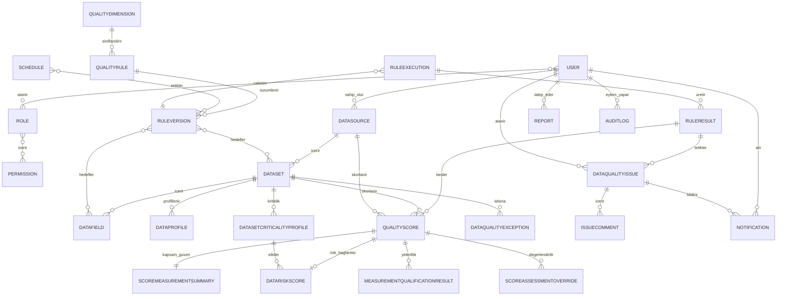

# Veri Modeli — Genel

Bu bölüm, sistemin temel veri varlıklarını, veri sözlüğünü, saklama politikasını ve varlıklar arası ilişkileri tanımlar.

## 7.1 Temel Veri Varlıkları

| Varlık | Açıklama |
| --- | --- |
| User | Kurumsal IdP kimliğinin yerel rol, kapsam ve durum bilgisi. |
| Role | İşlev ve veri erişimi için yetki grubu. |
| Permission | Bir işlem veya nesne sınıfına ilişkin izin. |
| DataSource | Veritabanı, dosya veya REST API bağlantı tanımı. |
| Dataset | Tablo, görünüm, dosya sayfası veya API veri kümesi. |
| DataField | Veri kümesindeki kolon/alan metadatası. |
| DataProfile | Belirli zamanda üretilen profil metrikleri. |
| QualityRule | Mantıksal veri kalitesi kuralı. |
| RuleVersion | Kuralın değişmez sürümü ve parametreleri. |
| RuleExecution | Kural/profil çalıştırma işinin yaşam döngüsü. |
| RuleResult | Bir kuralın sayaç ve hata özetleri. |
| QualityScore | Kural, veri öğesi, boyut, veri kümesi veya portföy kapsamındaki değişmez ham ve kritik politika etkili nihai kalite sonucu. |
| QualityDimension | Desteklenen veri kalitesi boyutu ve uygulanabilirlik durumu. |
| ScoreMeasurementSummary | Kalite skorundan ayrı kapsam, güven, örnekleme ve teknik sağlık özeti. |
| MeasurementQualificationResult | Ölçümün karar vermeye yeterli olup olmadığını kalite skorundan ayrı açıklayan sonuç. |
| DatasetCriticalityProfile | Kalite skorundan ayrı dataset iş etkisi/kritiklik profili. |
| DataRiskScore | Kalite problemi ile iş etkisi/kritikliği ayrı modelde birleştiren risk sonucu. |
| ScoringPolicy | Normalizasyon, eşik, ağırlık, kritik kural ve güven davranışının sürümlü politikası. |
| DataQualityException | Süreli, onaylı ve auditli iş istisnası. |
| ScoreAssessmentOverride | Ham skoru değiştirmeyen süreli ve onaylı değerlendirme/override. |
| Schedule | Tek seferlik veya tekrarlı çalışma planı. |
| Notification | Sistem içi bildirim ve teslim/okunma durumu. |
| DataQualityIssue | Kalite veya teknik olaydan doğan sorun kaydı. |
| IssueComment | Sorun yorumu ve ek bağlantısı. |
| AuditLog | Kritik kullanıcı/sistem işlem kaydı. |
| Report | Rapor şablonu, üretim işi ve çıktı metadatası. |
| SourceUsagePolicy | Kaynak bazlı worker, sorgu kotası, çalışma penceresi ve kaynak koruma politikası. |
| DatasetPartialScorePolicy | Kısmi çalıştırmanın resmî skora katılma koşulları. |
| RetentionPolicy | Kayıt sınıfı bazlı çevrimiçi/arşiv saklama ve imha politikası. |
| RecoveryObjectivePolicy | Bileşen bazlı RPO/RTO hedefi. |
| OutboundIntegrationRecord | ServiceNow için dayanıklı ve idempotent outbound kayıt. |

## Veri Sözlüğü Grupları

- [Kimlik ve Yetki Varlıkları](Kimlik-ve-Yetki-Varliklari.md)
- [Kaynak ve Metadata Varlıkları](Kaynak-ve-Metadata-Varliklari.md)
- [Kural ve Çalıştırma Varlıkları](Kural-ve-Calistirma-Varliklari.md)
- [Sorun, Bildirim ve Audit Varlıkları](Sorun-Bildirim-ve-Audit-Varliklari.md)

## 7.3 Veri Saklama ve Arşivleme

| Kayıt türü | Önerilen süre | Durum | Politika |
| --- | --- | --- | --- |
| Audit kayıtları | TBD | Hukuk/KVKK/Bilgi Güvenliği/İç Denetim onayı gerekli | Süre, çevrimiçi/arşiv ayrımı, imha ve sorumlu birim politika kaydındadır. |
| Kimlik doğrulama ve yetkilendirme kayıtları | TBD | Onay gerekli | Veri minimizasyonu ve güvenlik olayı ayrımı uygulanır. |
| Kural değişiklikleri | TBD | Onay gerekli | Tarihsel açıklanabilirlik korunur. |
| Onay kayıtları | TBD | Onay gerekli | Maker-checker kanıtı korunur. |
| Çalıştırma kayıtları | TBD | Onay gerekli | RuleVersion bağı korunur. |
| Skor sonuçları | TBD | Onay gerekli | Resmî ve provizyonel sonuç ayrımı korunur. |
| Kısmi ve geçici sonuçlar | TBD | Onay gerekli | Resmî sonuçlardan ayrı politika uygulanır. |
| Bildirim kayıtları | TBD | Onay gerekli | İçerik minimizasyonu uygulanır. |
| ServiceNow entegrasyon kayıtları | TBD | Onay gerekli | İdempotency ve audit bağı korunur. |
| Rapor dosyaları | TBD | Onay gerekli | Çevrimiçi dosya ve arşiv ayrı tutulur; hassas rapor daha kısa çevrimiçi politikayı destekler. |
| Rapor metadata kayıtları | TBD | Onay gerekli | Dosyadan bağımsız saklanır. |
| Teknik loglar | TBD | Onay gerekli | Secret ve ham hassas veri içermez. |
| Geçici işleme verileri | TBD | Onay gerekli | Amaç bitiminde güvenli imha uygulanır. |
| Hata ve yeniden deneme kayıtları | TBD | Onay gerekli | Güvenli hata özeti ve operasyon gereksinimiyle sınırlıdır. |

Her `RetentionPolicy` kaydı en az kayıt sınıfı, saklama süresi, hukuki dayanak veya kurumsal gerekçe, çevrimiçi saklama süresi, arşiv süresi, imha yöntemi ve sorumlu birim alanlarını taşır. Kesin süreler onaylanmadan değer atanmaz.

### RetentionPolicy

| Alan | Açıklama |
| --- | --- |
| record_class | Kayıt sınıfı |
| retention_duration | Toplam saklama süresi; onaya kadar TBD |
| legal_or_corporate_basis | Hukuki dayanak veya kurumsal gerekçe |
| online_duration | Çevrimiçi saklama süresi; onaya kadar TBD |
| archive_duration | Arşiv süresi; onaya kadar TBD |
| destruction_method | Onaylı imha yöntemi |
| responsible_unit | Sorumlu birim |
| policy_version | Değişmez politika sürümü |
| approval_status | Onay durumu |
| audit_reference | Politika değişikliği audit referansı |

## 7.3.1 Bileşen Bazlı Kurtarma Hedefleri

`RecoveryObjectivePolicy`; sistem yapılandırması, kural/sürüm, eşik/ağırlık, kullanıcı/rol eşlemesi, audit, onay, çalıştırma metadatası, skor, rapor dosyası ve bildirim/entegrasyon kuyruğu için ayrı kayıt taşır.

| Alan | Açıklama |
| --- | --- |
| component_class | Kurtarma hedefi uygulanan bileşen |
| rpo_value | Bileşen RPO değeri; iş etki analizine kadar TBD |
| rto_value | Bileşen RTO değeri; iş etki analizine kadar TBD |
| business_impact_reference | İş etki analizi referansı |
| policy_version | Değişmez politika sürümü |
| approval_status | Onay durumu |
| audit_reference | Politika değişikliği audit referansı |

## 7.4 Veri Modeli

Temel ilişkiler şöyledir: Bir DataSource birden çok Dataset; bir Dataset birden çok DataField içerir. QualityRule mantıksal kimliği altında birden çok değişmez RuleVersion bulunur. RuleVersion bir veya daha çok Dataset/DataField ile ilişkilidir. Schedule bir kural veya kural grubunu tetikler ve RuleExecution oluşturur. RuleExecution, RuleResult üretir; RuleResult'tan değişmez ham ve kritik politika sonrası nihai QualityScore hesaplanır. ScoreMeasurementSummary kapsam/güveni, MeasurementQualificationResult ölçüm yeterliliğini, DatasetCriticalityProfile kritiklik profilini ve DataRiskScore ayrı risk sonucunu taşır. ScoringPolicy hesaplama ve yeterlilik davranışını sürümler; DataQualityException paydayı kontrollü etkileyebilir, ScoreAssessmentOverride ham/nihai skoru değiştirmez. Skor veya çalışma olayı Notification ve DataQualityIssue oluşturabilir. Issue birden çok IssueComment ve ServiceNow referansı taşıyabilir. User, Role ve Permission ilişkileri RBAC'ı kurar. Kritik değişiklikler AuditLog ile izlenir. (`DQ-SCR-002`, `DQ-SCR-018`–`DQ-SCR-025`, `DQ-SCR-032`)

