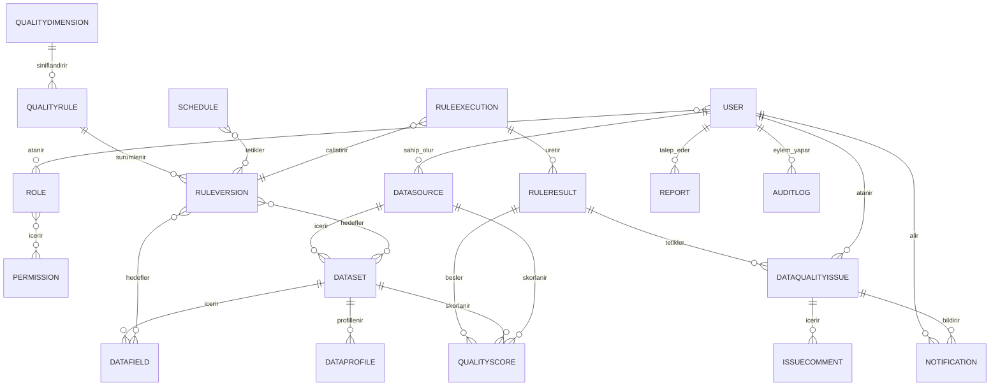

# Veri Modeli — Genel

Bu bölüm, sistemin temel veri varlıklarını, veri sözlüğünü, saklama politikasını ve varlıklar arası ilişkileri tanımlar.

## 7.1 Temel Veri Varlıkları

| Varlık | Açıklama |
| --- | --- |
| User | LDAP kimliğinin yerel rol, kapsam ve durum bilgisi. |
| Role | İşlev ve veri erişimi için yetki grubu. |
| Permission | Bir işlem veya nesne sınıfına ilişkin izin. |
| DataSource | Veritabanı, dosya veya REST API bağlantı tanımı. |
| Dataset | Tablo, görünüm, dosya sayfası veya API veri kümesi. |
| DataField | Veri kümesindeki kolon/alan metadatası. |
| DataProfile | Belirli zamanda üretilen profil metrikleri. |
| QualityRule | Mantıksal veri kalitesi kuralı. |
| RuleVersion | Kuralın değişmez sürümü ve parametreleri. |
| RuleExecution | Kural/profil çalıştırma işinin yaşam döngüsü. |
| RuleResult | Bir kuralın sayaç ve hata özetleri. |
| QualityScore | Kural, boyut, veri kümesi, kaynak veya kurum skoru. |
| QualityDimension | Desteklenen veri kalitesi boyutu ve ağırlığı. |
| Schedule | Tek seferlik veya tekrarlı çalışma planı. |
| Notification | Sistem içi bildirim ve teslim/okunma durumu. |
| DataQualityIssue | Kalite veya teknik olaydan doğan sorun kaydı. |
| IssueComment | Sorun yorumu ve ek bağlantısı. |
| AuditLog | Kritik kullanıcı/sistem işlem kaydı. |
| Report | Rapor şablonu, üretim işi ve çıktı metadatası. |

## Veri Sözlüğü Grupları

- [Kimlik ve Yetki Varlıkları](Kimlik-ve-Yetki-Varliklari.md)
- [Kaynak ve Metadata Varlıkları](Kaynak-ve-Metadata-Varliklari.md)
- [Kural ve Çalıştırma Varlıkları](Kural-ve-Calistirma-Varliklari.md)
- [Sorun, Bildirim ve Audit Varlıkları](Sorun-Bildirim-ve-Audit-Varliklari.md)

## 7.3 Veri Saklama ve Arşivleme

| Kayıt türü | Önerilen süre | Durum | Politika |
| --- | --- | --- | --- |
| Kural çalıştırma sonuçları | 5 yıl | Varsayım | İlk 12 ay çevrimiçi; sonraki dönem düşük maliyetli arşiv değerlendirilebilir. RuleVersion bağı korunur. |
| Kalite skorları | 5 yıl | Varsayım | Trend sorguları için aylık/yıllık özetler daha uzun saklanabilir; kesin politika TBD. |
| Audit logları | En az 5 yıl | Varsayım/Güvenlik onayı gerekli | Append-only veya WORM özellikli ortam; erişim yalnız denetçi/yönetici. |
| Bildirim kayıtları | 5 yıl | Varsayım | İçerik minimizasyonu; eski bildirim gövdesi anonimleştirilebilir. |
| Sorun kayıtları | 5 yıl veya kapanıştan sonra 5 yıl | İş birimi kararı gerekli | Kök neden, faaliyet ve ServiceNow referansı korunur. |
| Rapor çıktıları | 90 gün çevrimiçi; rapor metadatası 5 yıl | Önerilen başlangıç hedefi | Rapor yeniden üretilebilir; dosya süresi kurum politikasıyla doğrulanır. |
| Kullanıcı oturum kayıtları | 1 yıl; güvenlik olayları 5 yıl | Güvenlik onayı gerekli | Gerekenden fazla cihaz/IP verisi tutulmaz. |
| Metadata ve kural sürümleri | İlişkili sonuçların saklama süresi boyunca en az 5 yıl | Varsayım | Tarihsel açıklanabilirlik için fiziksel silme yapılmaz. |

## 7.4 Veri Modeli

Temel ilişkiler şöyledir: Bir DataSource birden çok Dataset; bir Dataset birden çok DataField içerir. QualityRule mantıksal kimliği altında birden çok değişmez RuleVersion bulunur. RuleVersion bir veya daha çok Dataset/DataField ile ilişkilidir. Schedule bir kural veya kural grubunu tetikler ve RuleExecution oluşturur. RuleExecution, RuleResult üretir; RuleResult'tan QualityScore hesaplanır. Skor veya çalışma olayı Notification ve DataQualityIssue oluşturabilir. Issue birden çok IssueComment ve ServiceNow referansı taşıyabilir. User, Role ve Permission ilişkileri RBAC'ı kurar. Kritik değişiklikler AuditLog ile izlenir.

