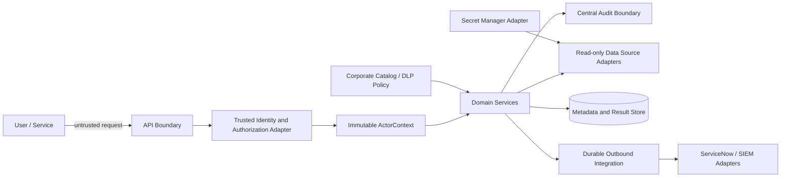

# Güven Sınırları ve Veri Akışları

## Güvenilmeyen Girdiler

- HTTP header ve query parametreleri
- İstek gövdesindeki actor, rol veya scope
- CSV dosyası adı ve içeriği
- Özel SQL kuralı
- Kaynak sistem hata metni
- ServiceNow dönüş mesajı
- Kullanıcı yorumları ve issue açıklaması

## Güvenilir Kaynaklar

- LDAP destekli kurumsal IdP/SSO ve IAM adaptörü
- Sürümlü rol-scope eşleme politikası
- Merkezi secret resolver
- Kurumsal veri kataloğu/DLP sınıflandırma adaptörü ve son güvenilir önbellek
- Sistem saati/zaman senkronizasyon kaynağı
- Onaylı audit olay sözlüğü

## Mermaid Bağlamı

## Ana İlke

Domain servisi, aktör ve yetki kapsamını çağıranın serbest girdisinden değil güvenilir context'ten alır.
