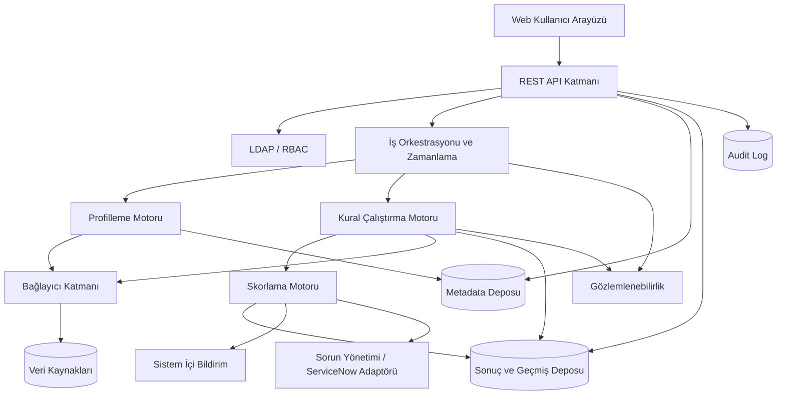

# Mantıksal Mimari ve Sistem Ortamı

| Katman | Sorumluluk |
| --- | --- |
| Kullanıcı arayüzü | Dashboard, veri kaynağı, kural, çalıştırma, skor, sorun, rapor ve yönetim ekranlarını sağlar. |
| API katmanı | Web arayüzü ve entegrasyonlar için versiyonlu REST API sunar. |
| Kimlik doğrulama ve yetkilendirme | LDAP doğrulaması, oturum yönetimi ve RBAC kararlarını uygular. |
| Veri kaynağı bağlantı katmanı | PostgreSQL, SQL Server, Oracle, MySQL, CSV, Excel ve REST API bağlayıcılarını ortak sözleşmeyle sunar. |
| Veri profilleme motoru | İstatistik, null, benzersizlik, desen, dağılım ve aykırı değer metriklerini hesaplar. |
| Kural çalıştırma motoru | Kural planlarını oluşturur, sorguları çalıştırır, hata türlerini sınıflandırır ve sonuçları üretir. |
| Skorlama motoru | Kural, boyut, veri kümesi, veri kaynağı ve kurum skorlarını ağırlıklı olarak hesaplar. |
| Zamanlama servisi | Tek seferlik, periyodik ve cron tabanlı işleri kuyruğa alır. |
| Bildirim servisi | Sistem içi bildirimleri oluşturur, tekrar ve susturma kurallarını uygular. |
| Metadata deposu | Kaynak, veri kümesi, alan, kural, sahiplik ve yapı bilgilerini saklar. |
| Sonuç ve geçmiş deposu | Profil, çalıştırma, skor, sorun ve rapor geçmişini saklar. |
| Raporlama ve dashboard katmanı | Filtrelenebilir tablo, grafik, trend ve dışa aktarma işlevlerini sunar. |
| Audit log altyapısı | Kritik kullanıcı ve sistem işlemlerini bütünlüğü korunmuş kayıtlarla izler. |

### Mantıksal Mimari

### Önerilen Çözüm Seçenekleri

Teknoloji seçimi bu SRS'nin zorunlu iş gereksinimi değildir. Yerel prototip için konteyner tabanlı modüler monolit, arka planda iş kuyruğu ve ilişkisel metadata deposu önerilir. Kurum içi üretim ortamında bileşenlerin bağımsız ölçeklenebildiği servis tabanlı mimari değerlendirilebilir. Bağlantı sırları için kurumsal secret manager, gözlemlenebilirlik için merkezi log/metric altyapısı ve dağıtım için kurum standardı CI/CD kullanılmalıdır.
