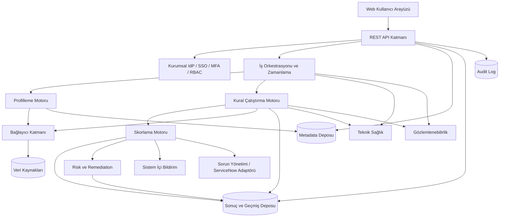

# Mantıksal Mimari ve Sistem Ortamı

| Katman | Sorumluluk |
| --- | --- |
| Kullanıcı arayüzü | Dashboard, veri kaynağı, kural, çalıştırma, skor, sorun, rapor ve yönetim ekranlarını sağlar. |
| API katmanı | Web arayüzü ve entegrasyonlar için versiyonlu REST API sunar. |
| Kimlik doğrulama ve yetkilendirme | Kurumsal IdP/SSO beyanı, MFA kanıtı, oturum ve RBAC kararlarını uygular. |
| Veri kaynağı bağlantı katmanı | İlişkisel veritabanı, dosya/CSV ve API bağlayıcılarını ürün bağımsız ortak sözleşmeyle sunar. |
| Politika katmanı | Normalizasyon, eşik, ağırlık, kritik kural, güven, istisna/override, kaynak kullanımı, kısmi skor, saklama, sınıflandırma ve kurtarma hedeflerini sürümlü ve risk bazlı onayla uygular. |
| Entegrasyon katmanı | ServiceNow outbound kayıtlarını idempotent retry/dead-letter akışıyla yönetir. |
| Veri profilleme motoru | İstatistik, null, benzersizlik, desen, dağılım ve aykırı değer metriklerini hesaplar. |
| Kural çalıştırma motoru | Kural planlarını oluşturur, sorguları çalıştırır, hata türlerini sınıflandırır ve sonuçları üretir. |
| Skorlama motoru | Kural → veri öğesi → boyut → dataset ham kalite skorunu, kapsamı ve güveni sürümlü politikalarla hesaplar; kaynak/kurum portföy özetlerinde alt kırılımları korur. Teknik sağlık, dataset kritikliği ve veri riskini ham kalite skoruna katmaz. (`DQ-SCR-002`, `DQ-SCR-016`, `DQ-SCR-018`–`DQ-SCR-021`) |
| Risk değerlendirme ve remediation | Ayrı dataset kritiklik profili ile kalite problemini iş etkisi/kullanımla birleştirir; risk önceliği ve remediation hedefini üretir. Kesin risk formülü `TBD`'dir. |
| Teknik sağlık | Bağlantı, timeout, worker, sorgu ve platform olaylarını veri kalitesi alarmından ayrı yönetir; son başarılı skor fallback'inin eskiliğini sağlar. |
| Zamanlama servisi | Tek seferlik, periyodik ve cron tabanlı işleri kuyruğa alır. |
| Bildirim servisi | Sistem içi bildirimleri oluşturur, tekrar ve susturma kurallarını uygular. |
| Metadata deposu | Kaynak, veri kümesi, alan, kural, sahiplik ve yapı bilgilerini saklar. |
| Sonuç ve geçmiş deposu | Profil, çalıştırma, skor, sorun ve rapor geçmişini saklar. |
| Raporlama ve dashboard katmanı | Ham kalite skoru, kapsam, güven, kritiklik/risk, teknik sağlık, istisna/override, sürüm sınırı ve açıklanabilir kırılımları filtrelenebilir tablo/grafikle sunar. |
| Audit log altyapısı | Kritik kullanıcı ve sistem işlemlerini bütünlüğü korunmuş kayıtlarla izler. |

### Mantıksal Mimari

### Önerilen Çözüm Seçenekleri

Teknoloji seçimi bu SRS'nin zorunlu iş gereksinimi değildir. Üretimde stateless API ve worker bileşenleri kurumsal konteyner platformunda, veri tabanı ayrı yüksek erişilebilirlik kümesinde çalışır. API ve worker bağımsız ölçeklenir; kalıcı dosya/rapor depolaması konteyner yerel diskine bağlı olmaz; iş kuyruğu ve entegrasyon bileşenleri tek hata noktası oluşturmaz. Dağıtım, geri alma, sağlık kontrolü ve kontrollü kapatma dokümante edilir. Secret erişimi servis/workload identity ile kurumsal secret manager üzerinden yürür.
