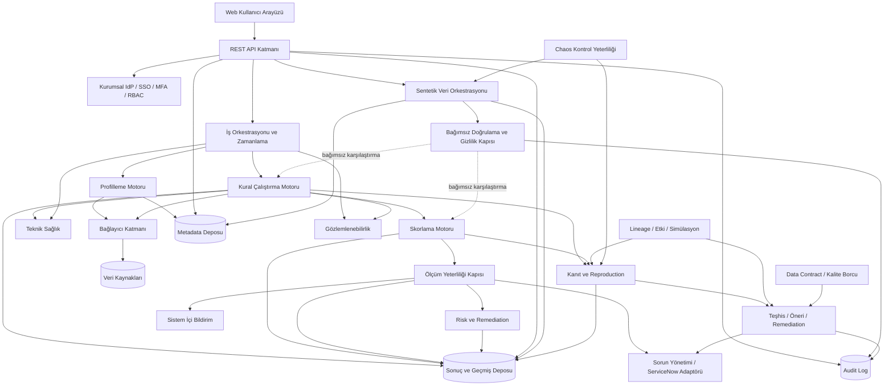

# Mantıksal Mimari ve Sistem Ortamı

| Katman | Sorumluluk |
| --- | --- |
| Kullanıcı arayüzü | Dashboard, veri kaynağı, kural, çalıştırma, skor, sorun, rapor ve yönetim ekranlarını sağlar. |
| API katmanı | Web arayüzü ve entegrasyonlar için versiyonlu REST API sunar. |
| Kimlik doğrulama ve yetkilendirme | Kurumsal IdP/SSO beyanı, MFA kanıtı ve RBAC kararlarını uygular; BFF üzerinde sunucu taraflı opak normal kullanıcı oturumunu, tek aktif oturum ve merkezi iptal politikasını yönetir. |
| Veri kaynağı bağlantı katmanı | İlişkisel veritabanı, dosya/CSV ve API bağlayıcılarını ürün bağımsız ortak sözleşmeyle sunar. |
| Politika katmanı | Normalizasyon, eşik, ağırlık, kritik kural, güven, istisna/override, kaynak kullanımı, kısmi skor, saklama, sınıflandırma ve kurtarma hedeflerini sürümlü ve risk bazlı onayla uygular. |
| Entegrasyon katmanı | ServiceNow outbound kayıtlarını idempotent retry/dead-letter akışıyla yönetir. |
| Veri profilleme motoru | İstatistik, null, benzersizlik, desen, dağılım ve aykırı değer metriklerini hesaplar. |
| Kural çalıştırma motoru | Kural planlarını oluşturur, sorguları çalıştırır, hata türlerini sınıflandırır ve sonuçları üretir. |
| Skorlama motoru | Kural → veri öğesi → boyut → dataset ham kalite skorunu ve kritik kontrol tavanlı nihai skoru sürümlü politikalarla hesaplar; kaynak/kurum portföy özetlerinde alt kırılımları korur. Teknik sağlık, dataset kritikliği, veri riski ve ölçüm yeterliliğini ham kalite skoruna katmaz. (`DQ-SCR-002`, `DQ-SCR-016`, `DQ-SCR-018`–`DQ-SCR-021`) |
| Ölçüm yeterliliği kapısı | Kapsam, örneklem, güncellik, teknik başarı, sürüm, kritik kontrol ve kanıt koşullarını değerlendirir; kalite skorundan ayrı yeterlilik durumu ile kullanım kararını üretir. |
| Risk değerlendirme ve remediation | Ayrı dataset kritiklik profili ile kalite problemini iş etkisi/kullanımla birleştirir; risk önceliği ve remediation hedefini aktif sürümlü politikadan üretir. Politika yoksa risk sonucu üretilmez. |
| Teknik sağlık | Bağlantı, timeout, worker, sorgu ve platform olaylarını veri kalitesi alarmından ayrı yönetir; son başarılı skor fallback'inin eskiliğini sağlar. |
| Zamanlama servisi | Tek seferlik, periyodik ve cron tabanlı işleri kuyruğa alır. |
| Bildirim servisi | Sistem içi bildirimleri oluşturur, tekrar ve susturma kurallarını uygular. |
| Metadata deposu | Kaynak, veri kümesi, alan, kural, sahiplik ve yapı bilgilerini saklar. |
| Sonuç ve geçmiş deposu | Profil, çalıştırma, skor, sorun ve rapor geçmişini saklar. |
| Raporlama ve dashboard katmanı | Ham ve nihai kalite skoru, ölçüm yeterliliği, kullanım kararı, kapsam, güven, kritiklik/risk, teknik sağlık, istisna/override, sürüm sınırı ve açıklanabilir kırılımları filtrelenebilir tablo/grafikle sunar. |
| Audit log altyapısı | Kritik kullanıcı ve sistem işlemlerini bütünlüğü korunmuş kayıtlarla izler. |
| Sentetik veri orkestrasyonu | Sürümlü dataset politikasına göre şema/ilişki/dağılım/zaman temelini, kusur enjeksiyonunu, deterministik run kaydını ve yaşam döngüsünü koordine eder; üretim verisini kopyalamaz. |
| Sentetik doğrulama ve gizlilik kapısı | Ground truth'u runtime kural/skor motorundan bağımsız tutar; yapı, istatistik, görev faydası, gizlilik ve teknik sonuçları değerlendirir; gerçek operasyon hedeflerini fail-closed engeller. |
| Kanıt ve yeniden üretim | Run manifesti, metrik/hesaplama/örnek kanıtı, çoktan çoğa kanıt bağlantıları ve orijinali koruyan replay'i yönetir. |
| Lineage, etki ve değişiklik simülasyonu | Otoriter kaynaklardan tablo/kolon/dönüşüm/deploy ilişkisini alır; eksikliği görünür tutarak blast radius ve kaynaklı etki dry-run'ı üretir. |
| Teşhis, öneri ve remediation | Korelasyonu nedensellikten ayırır; öneriyi mekanizma/kanıt/güven/risk ile bağlar ve yalnız politika izin verirse dry-run/onay/canary/doğrulama/rollback akışını yürütür. Kaynak üretim verisini değiştirmez. |
| Data contract ve kalite borcu | Kurumsal sistem-of-record referanslı sözleşme ihlallerini ve tekrar/istisna/etki kaynaklı kalite borcunu sürümlü izler. |
| Chaos kontrol yeterliliği | Yalnız izole sentetik/yetkili test ortamında fault enjeksiyonu, detection coverage, false positive/negative ve rollback kanıtı üretir. |

### Mantıksal Mimari

Sentetik veri yetenekleri ayrı mikroservisler değildir. Orkestrasyon içinde şema
ve kısıt yükleyici, dağılım/ilişki/zaman üreticileri, kusur enjeksiyon motoru,
ground truth ve run kayıtları ile dataset kataloğu iç bileşenlerdir. Doğrulama
sınırında gizlilik değerlendiricisi ve expected-versus-actual karşılaştırıcı
bulunur. Ground truth üretimi kural veya skor motorunu çağırmaz. Ayrıntılı hedef
sözleşme [Sentetik Veri ve Gizlilik Stratejisi](Sentetik-Veri-ve-Gizlilik-Stratejisi.md)
belgesindedir.

Kanıt, lineage, etki, öneri, remediation, contract, kalite borcu ve chaos
bileşenleri de ayrı mikroservis varsayımı değildir. Modüler monolit içindeki
açık domain sınırlarıdır; bağımsız ölçekleme ancak ölçülmüş ihtiyaçla
değerlendirilir. Ayrıntılı hedef sözleşme
[Kanıta Dayalı Karar Sistemi](Kanita-Dayali-Karar-Sistemi.md) belgesindedir.

### Önerilen Çözüm Seçenekleri

Teknoloji seçimi bu SRS'nin zorunlu iş gereksinimi değildir. Üretimde stateless API ve worker bileşenleri kurumsal konteyner platformunda, veri tabanı ayrı yüksek erişilebilirlik kümesinde çalışır. API ve worker bağımsız ölçeklenir; kalıcı dosya/rapor depolaması konteyner yerel diskine bağlı olmaz; iş kuyruğu ve entegrasyon bileşenleri tek hata noktası oluşturmaz. Dağıtım, geri alma, sağlık kontrolü ve kontrollü kapatma dokümante edilir. Secret erişimi servis/workload identity ile kurumsal secret manager üzerinden yürür.
