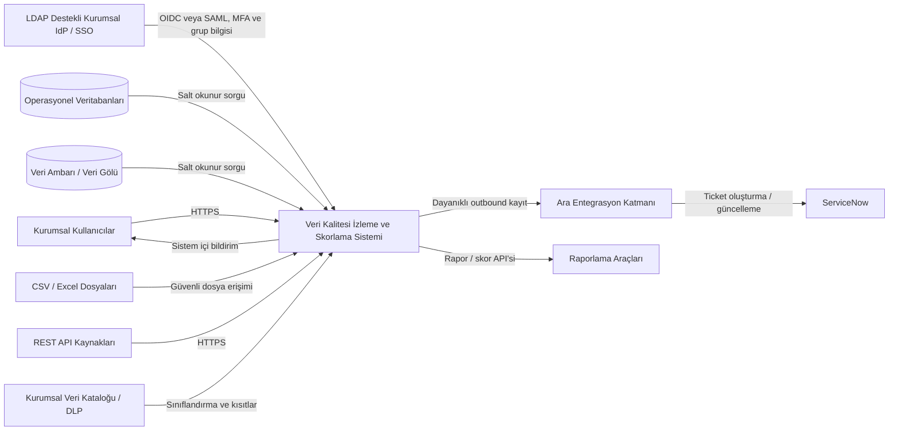

# Sistem Bağlamı

Sistem, operasyonel veritabanları, veri ambarı, veri gölü, dosya depoları ve REST servislerinden metadata ve kalite ölçüm sonuçları toplar. Kaynak sistemlerde veri değiştirmez; salt okunur erişimle sorgu ve örneklem gerçekleştirir. Kullanıcılar LDAP destekli kurumsal IdP/SSO üzerinden OIDC veya SAML ve zorunlu MFA ile doğrulanır. Sistem sonuçları dashboard ve raporlarla sunar, kritik bulgular için sistem içi bildirim oluşturur ve ara entegrasyon katmanı üzerinden ServiceNow ticket akışını yürütür.

Metinsel bağlamda kullanıcılar web arayüzü veya API aracılığıyla sisteme erişir. Kural motoru bağlayıcı ve kaynak kullanım politikaları üzerinden kontrolleri çalıştırır. Skorlama motoru ham ve kritik kontrol etkili nihai kalite skorunu üretir; ölçüm yeterliliği kapısı kapsam, güven, güncellik, teknik başarı ve kanıt koşullarını ayrı değerlendirerek kullanım kararını verir. Resmî ve provizyonel sonuçlar bu kapıda ayrılır. Audit altyapısı kritik işlemlerde fail-closed, rutin olaylarda dayanıklı outbox uygular. Kurumsal veri kataloğu veya DLP sistemi sınıflandırma ve kullanım kısıtlarının kaynağıdır.

### Sistem Bağlam Diyagramı

