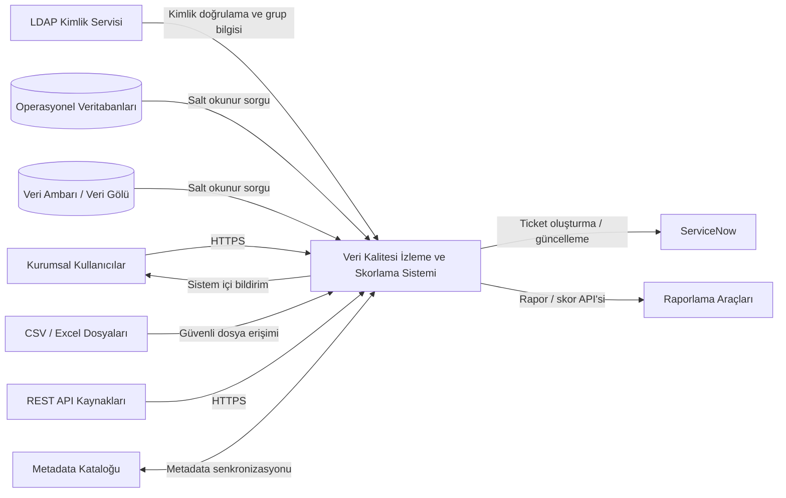

# Sistem Bağlamı

Sistem, operasyonel veritabanları, veri ambarı, veri gölü, dosya depoları ve REST servislerinden metadata ve kalite ölçüm sonuçları toplar. Kaynak sistemlerde veri değiştirmez; salt okunur erişimle sorgu ve örneklem gerçekleştirir. Sistem, LDAP üzerinden kullanıcı doğrular, sonuçları dashboard ve raporlarla sunar, kritik bulgular için sistem içi bildirim oluşturur ve gerektiğinde ServiceNow üzerinde ticket açar.

Metinsel bağlamda kullanıcılar web arayüzü veya API aracılığıyla sisteme erişir. Kural motoru veri kaynağı bağlayıcıları üzerinden kontrolleri çalıştırır. Skorlama motoru sonuçları birleştirir. Bildirim servisi kullanıcıları bilgilendirir. Audit altyapısı tüm kritik işlemleri kaydeder. Metadata kataloğu ve raporlama araçlarıyla entegrasyon ikinci fazda genişletilir.

### Sistem Bağlam Diyagramı

