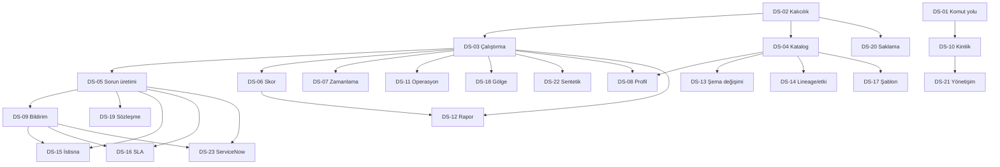

# 13 — Uygulama Yol Haritası

> [12-Prioritized-Backlog.md](12-Prioritized-Backlog.md) sınıflandırmasının
> **uçtan uca dikey dilimlere** çevrilmesi. Dilimler teknik katmana göre değil,
> bir aktörün baştan sona tamamlayabildiği işe göre kesilir; her dilim
> tamamlandığında çalışan üründe **gözlemlenebilir bir davranış değişir**.
> Efor tahmini içermez — boyut yerine çıkış kapısı kullanılır.

---

## 1. Kapsam ve yöntem

### 1.1 Dikey dilim ilkesi

Bir dilim, tek bir teknik katmanı (örneğin "tüm repository'ler" veya "tüm
endpoint'ler") değil, **tek bir kullanıcı sonucunu** kapsar. Her dilim
domain'den frontend'e kadar zincirin gerektirdiği her halkasına dokunur:

```
domain → migration → repository → servis → endpoint → frontend → yetki → audit → test
```

Bu tercih denetimin ana bulgusunun doğrudan sonucudur: repository'de katman
katman ilerlenmiş, dokuz halkanın sekizi yazılmış, fakat hiçbir zincir
tamamlanmamıştır. `03 §2`'ye göre 13 akıştan **hiçbiri** uçtan uca yürümüyor.
Katman bazlı devam etmek bu durumu tekrar üretir.

### 1.2 Bir dilim ne zaman biter

Üç koşulun tamamı sağlandığında:

1. **Gözlemlenebilirlik** — davranış değişikliği çalışan uygulamada, kod
   okumadan doğrulanabilir.
2. **Zincir bütünlüğü** — dilim kapsamındaki fonksiyon için yetki ve audit
   halkaları da kapatılmıştır; "sonra ekleriz" bırakılmaz.
3. **Çıkış kapısı** — kaydın son alanındaki cümle karşılanmıştır.

Kısmen biten dilim yoktur: kapsam daraltılır, kalite düşürülmez.

### 1.3 Kodlama ve iterasyon eşlemesi

Dilimler `DS-01`…`DS-23` olarak kodlanır (`DS` = dikey slice). Bu kodlar
repository'nin `09-İterasyonlar/` numaralandırmasından **bağımsızdır**; bir
dilim tek bir iterasyona da, ardışık iki iterasyona da düşebilir. Eşleme
uygulama anında yapılır ve şu kuralla kaydedilir:

| Alan | Kural |
|---|---|
| Dal adı | `feature/<dilim-slug>` — `docs/workflow/ITERATION_IMPLEMENTATION_LOOP.md` sözleşmesi |
| İterasyon dosyası | `09-İterasyonlar/Iterasyon-<N>-<Baslik>.md`, frontmatter'a `vertical_slice: DS-NN` eklenir |
| Kapanış kaydı | `09-İterasyonlar/Iterasyon-Kapanis-Sablonu.md` şablonu; çıkış kapısı bu belgeden kopyalanır |
| Backlog güncellemesi | `docs/memory/Sonraki-Adimlar.md` `## Aktif Backlog` tablosuna satır |

### 1.4 Kayıt formatı

Her dilim, denetim prompt'u §15'in **17 zorunlu alanıyla** kaydedilir. İki
alan özellikle boş bırakılmaz:

- **kapsam dışı** — dilimin bilinçli olarak *yapmadığı* iş. Dış bağımlılık
  taşıyan işler (gerçek IdP, PAM/secret manager, broker, SIEM/WORM,
  ServiceNow) burada işaretlenir ve port/adaptör sınırıyla stub bırakılır.
- **çıkış kapısı** — dilimin bittiğini gösteren tek, sınanabilir cümle.

### 1.5 Mevcut kodun korunması

Denetim prompt'u §18: *"mevcut güçlü parçaların gereksiz yeniden
yazılmaması"*. Dilim kayıtlarındaki `domain servisleri` alanı bu nedenle
**yeniden kullanılacak mevcut sembolü** adıyla ve satırıyla verir. `12 §2.2`
altı kaydı erken kazanım olarak işaretlemiştir; bu dilimlerde sıfırdan servis
yazılmamalıdır.

---

## 2. Dilim haritası

### 2.1 Yirmi üç dilim

| Kod | Dilim | Kapattığı GAP | Sınıf | Bağımlılık |
|---|---|---|---|---|
| DS-01 | Komut yolu bütünlüğü ve onay sınırı | GAP-027 | `P0` | — |
| DS-02 | Kalıcı kaynak, kural ve sorun | GAP-001 | `P0` | — |
| DS-03 | Çalıştırma uçtan uca | GAP-002, GAP-017 | `P0`,`P2` | DS-02 |
| DS-04 | Katalog ve metadata keşfi | GAP-004 | `P1` | DS-02 |
| DS-05 | Otomatik sorun üretimi | GAP-006 | `P1` | DS-03 |
| DS-06 | Skor kalıcılığı ve yayım | GAP-008 | `P1` | DS-03 |
| DS-07 | Zamanlama | GAP-003, GAP-015 | `P1`,`P2` | DS-03 |
| DS-08 | Profilleme ve baseline | GAP-005 | `P2` | DS-04, DS-03 |
| DS-09 | Bildirim hattı | GAP-007 | `P1` | DS-05 |
| DS-10 | Kimlik, rol ve oturum | GAP-022 | `P1` | DS-01 |
| DS-11 | Kuyruk, dead-letter ve operasyon | GAP-018, GAP-024 | `P2` | DS-03 |
| DS-12 | Rapor asenkron üretimi | GAP-016 | `P2` | DS-03, DS-06 |
| DS-13 | Şema değişimi tespiti ve kararı | GAP-019 | `P2` | DS-04 |
| DS-14 | Lineage alımı ve etki analizi | GAP-012, GAP-013 | `P3` | DS-04 |
| DS-15 | İstisna ve kalite borcu | GAP-009 | `P2` | DS-05, DS-09 |
| DS-16 | SLA ve eskalasyon | GAP-014 | `P2` | DS-05, DS-09 |
| DS-17 | Kural şablonları ve çakışma | GAP-020 | `P3` | DS-04 |
| DS-18 | Gölge yürütme yüzeyi | GAP-021 | `P3` | DS-03 |
| DS-19 | Veri sözleşmesi yaşam döngüsü | GAP-010 | `P3` | DS-05 |
| DS-20 | Saklama, imha ve legal hold | GAP-011 | `P2` | DS-02 |
| DS-21 | Yönetişim, sözlük ve politika | GAP-026 | `P2` | DS-10 |
| DS-22 | Sentetik veri yüzeyi | GAP-025 | `P4` | DS-03 |
| DS-23 | ServiceNow giden entegrasyon | GAP-023 | `P4` | DS-05, DS-09 |

27 GAP'in tamamı en az bir dilime atanmıştır. Dört dilim iki GAP birden
kapatır; bunlar aynı kullanıcı sonucuna hizmet ettikleri için birleştirilmiştir
(örn. GAP-002 worker'ı çalıştırır, GAP-017 aynı akışın kullanıcı yüzeyidir).

### 2.2 Bağımlılık grafiği



`DS-01` ve `DS-02` grafiğin köküdür ve birbirini beklemez; paralel
başlatılabilirler.

### 2.3 Yol haritası özeti

Mevcut `09-İterasyonlar/Kalan-Iterasyonlar-Banka-Yol-Haritasi.md` sözleşmesiyle
aynı sütun düzeninde:

| Öncelik | Çalışma paketi | Durum | Çıkış kapısı |
|---|---|---|---|
| P0 | DS-01 Komut yolu bütünlüğü ve onay sınırı | `READY` | Aktivasyon maker=checker ile reddediliyor ve kural mutasyon uçları `503` dönmüyor |
| P0 | DS-02 Kalıcı kaynak, kural ve sorun | `READY` | Süreç yeniden başlatıldığında kayıtlar duruyor ve denetim ekranı gerçek olayı gösteriyor |
| P0 | DS-03 Çalıştırma uçtan uca | `Blocked: DS-02` | UI'dan başlatılan çalıştırma tamamlanıyor ve sonucu aynı listede görünüyor |
| P1 | DS-04 Katalog ve metadata keşfi | `Blocked: DS-02` | Aktif kaynakta keşif tetiklenince dataset/alan katalogda görünüyor |
| P1 | DS-05 Otomatik sorun üretimi | `Blocked: DS-03` | Eşiği aşan uygun başarısızlık atanmış sorun üretiyor, uygunsuz olan üretmiyor |
| P1 | DS-06 Skor kalıcılığı ve yayım | `Blocked: DS-03` | Dashboard skoru seed'den değil `quality_scores`'tan okuyor |
| P1 | DS-07 Zamanlama | `Blocked: DS-03` | Tanımlanan zamanlama vadesinde tam bir kez çalıştırma açıyor |
| P1 | DS-09 Bildirim hattı | `Blocked: DS-05` | Sorun ataması alıcının gelen kutusunda görünüyor |
| P1 | DS-10 Kimlik, rol ve oturum | `Blocked: DS-01` | Yetki `role_assignments`'tan çözülüyor; dev başlığı üretim profilinde kapalı |
| P2 | DS-08, DS-11, DS-12, DS-13, DS-15, DS-16, DS-20, DS-21 | `Planned` | Bkz. ilgili dilim kaydı |
| P3 | DS-14, DS-17, DS-18, DS-19 | `Planned` | Bkz. ilgili dilim kaydı |
| P4 | DS-22, DS-23 | `Planned` | Bkz. ilgili dilim kaydı |

### 2.4 Akış kapanma sırası

Her dilim tamamlandığında `03-End-to-End-Workflow-Audit.md`'deki hangi akışın
ilerlediği:

| Dilim | Açılan/ilerleyen akış | Kapanan kök neden |
|---|---|---|
| DS-01 | 1 (aktivasyon adımı), 4 (tamamı yeniden işler) | K9 |
| DS-02 | 1, 3, 4, 7, 8 (kalıcılık halkası) | K2 |
| DS-03 | 5, 6, 7, 10 (yürütme halkası) | K1 |
| DS-04 | 1, 2, 3, 4 (katalog halkası) | K4 |
| DS-05 | 3, 7, 8, 12 (sorun halkası) | K6 |
| DS-06 | 7 (skor halkası) | K7 (kısmi) |
| DS-07 | 5, 10 (zamanlama halkası) | K5 |
| DS-09 | 2, 6, 7, 10 (bildirim halkası) | K3 |
| DS-11, DS-14, DS-20 | 6, 8, 11, 13 (yüzey halkası) | K8 |

Dokuz kök nedenden yedisi ilk dokuz dilimde kapanır. K7 (eksik kalıcılık)
birden çok domaine yayıldığı için DS-06, DS-15, DS-19, DS-20 ve DS-21
arasında bölünmüştür.

---

## 3. Dilim kayıtları

### 3.1 Çekirdek dilimler — DS-01 … DS-06

Bu altı dilim, sistemin "çalışıyor" sayılabilmesi için gereken minimum
zinciri kurar: güvenli komut yolu, kalıcılık, ölçüm, katalog, sorun ve skor.

---

#### DS-01 — Komut yolu bütünlüğü ve onay sınırı

| Alan | Değer |
|---|---|
| **Kod** | `DS-01` · dal `feature/komut-yolu-onay-siniri` |
| **Amaç** | Komut port'larının aktör bağlamı taşımasını sağlamak; bağlanmamış kural mutasyon portunu bağlamak. Kodda hâlihazırda **var olan ve testli** onay/kapsam kontrollerini çalışan yüzeyde devreye almak |
| **Kullanıcı değeri** | Kural yaşam döngüsü baştan sona işler hâle gelir (bugün `POST /rules` sonrası her adım `503`); ve hiçbir kullanıcı ikinci bir onaycı olmadan veri kaynağını tek başına aktive edemez |
| **Aktör** | Technical Data Steward (maker), Data Owner (checker), Rule Author, Rule Approver, Operations User |
| **Kapsam** | Veri kaynağı komut ailesi (`create`/`test`/`activation`/`passivation`), kural mutasyon ailesi (sürüm/test/onay/aktivasyon/pasifleştirme), manuel çalıştırma başlatma. Port sözleşmelerinin `ActorContext` taşıyacak biçimde değiştirilmesi ve gerçek servislere bağlanması |
| **Fonksiyonlar** | `D03.C02.W01.A02` aktivasyon kararı · `D06.C02.W01.A01` kural oluştur · `D06.C02.W04.A02` onay kararı · `D06.C02.W05.A01` sürüm aktive · `D07.C01.W01.A01` manuel çalıştırma |
| **Tablolar/kolonlar/migration** | **Migration yok.** `rule_approval_requests` ve `data_source_activation_requests` tabloları mevcut ve yeterli. (DB düzeyi maker ≠ checker `CHECK` kısıtı bilinçli olarak kapsam dışı — bkz. kapsam dışı) |
| **Domain servisleri** | Yeniden kullanılır, **yazılmaz**: `data_sources/service.py:461` `decide_activation` (checker rolü, süre, politika sürümü, bayat revizyon, maker≠checker); `rules/service.py:542` `decide_rule_approval`. Değişen tek şey bunların çağrılıyor olması |
| **Endpoint'ler** | **Yeni endpoint yok** (`06 §6`). Mevcut altı route'un sözleşmesi değişir: `POST /api/v1/data-sources`, `/{id}/test`, `/{id}/activation`, `/{id}/passivation` (`app.py:2017-2110`), `POST /api/v1/executions` (`app.py:2120-2137`). `DataSourceMutationService` protokolünün dört metodu da `actor_context` alacak biçimde genişletilir (`app.py:316-338`) |
| **Frontend** | `dataSources/DataSourcesPage.tsx`: aktivasyon **talep** ve **karar** adımlarının ayrılması; maker ile checker aynı olduğunda `403` yanıtının kullanıcıya anlaşılır gösterimi. `rules/RulesPage.tsx`: bugün `503` alan mutasyon aksiyonlarının gerçek yanıtlarla çalışması. Kaynak oluşturmada `owner_user_id` istek gövdesinden **kaldırılır**, oturumdan alınır |
| **Yetki** | `datasource.activation.decide` checker rolü zorunlu; maker = checker reddedilir; kural oluşturmada aktörün `permitted_dataset_ids` kapsamı doğrulanır; manuel çalıştırmada kural sürümü/kaynak kimliklerinin kapsam ve aktiflik doğrulaması. `"unknown"` aktör kabul edilmez |
| **Audit** | `DATA_SOURCE_ACTIVATION_DECIDED` çalışan yolda **ilk kez** üretilir. Kural onay/aktivasyon olayları dev store yerine gerçek servisten gelir. Yetki reddi olayları `PolicyAuthorizationService` DENY kaydıyla audit'lenir |
| **Test** | İki yanıltıcı test düzeltilir: `test_rule_api.py:405` `test_fr_031_create_rule_without_dataset_scope_returns_403` gerçekten `403` assert eder; `test_data_source_api.py:360` onaysız `TEST_SUCCEEDED → ACTIVE` geçişinin **reddedildiğini** doğrular. Yeni: maker=checker reddi API düzeyinde, kapsam dışı kural oluşturma reddi, `start_manual` kapsam doğrulaması, kural mutasyon uçlarının `503` dönmediği smoke testi |
| **Bağımlılık** | **Yok.** `04 §4`: GAP-027 hiçbir kaydı beklemez |
| **Kapsam dışı** | Kalıcı IAM, `role_assignments`/`assignment_scopes` tabloları ve gerçek IdP entegrasyonu (DS-10). Bu dilimde kapsam, mevcut `ActorContext`'in taşıdığı kimliklerden çözülür — kaynak hâlâ dev kayıt defteridir. DB düzeyi maker ≠ checker `CHECK` kısıtı (aktör kolonları `users` tablosuna FK olmadan anlamlı değil, DS-10) |
| **Kabul kriterleri** | 1) Her komut endpoint'i çözülmüş `ActorContext`'i mutation portuna iletiyor. 2) `activate`/`passivate` gerçek `decide_activation` üzerinden geçiyor; maker = checker `403` ile reddediliyor. 3) Kapsam dışı dataset'te kural oluşturma `403` dönüyor ve test bunu assert ediyor. 4) Kural sürüm/test/onay/aktivasyon uçları `503` dönmüyor. 5) Manuel çalıştırma kural sürümü ve kaynak kimliklerini varlık, aktiflik ve kapsam için doğruluyor. 6) Kaynak sahibi oturumdan alınıyor, istek gövdesinden değil |
| **Çıkış kapısı** | Aktivasyon maker=checker ile reddediliyor, `DATA_SOURCE_ACTIVATION_DECIDED` audit'i üretiliyor ve kural mutasyon uçlarının hiçbiri `503` dönmüyor |

---

#### DS-02 — Kalıcı kaynak, kural ve sorun

| Alan | Değer |
|---|---|
| **Kod** | `DS-02` · dal `feature/kalici-bilesim-koku` |
| **Amaç** | Yazılmış ve testli PostgreSQL repository'lerini çalıştırılabilir bileşime bağlamak; şema ayrışmasını ve audit yayım hatasını gidermek |
| **Kullanıcı değeri** | Oluşturulan kaynak, kural ve sorun süreç yeniden başladığında kaybolmaz; denetim ekranı sentetik değil gerçek olayları gösterir |
| **Aktör** | Tüm aktörler (dolaylı); doğrudan Platform Admin (bileşim ve şema yapılandırması) |
| **Kapsam** | `create_development_app` yerine üretim bileşimi: `PostgreSQLIssueRepository`, `PostgreSQLRuleRepository`, `PostgreSQLDataSourceRepository`, `PostgreSQLContributionGraphRepository` bağlanır. Şema tek kaynağa indirgenir. Gerçek `PreparedAuditRepository` sağlanır. Execution okuma yolu PG'ye taşınır |
| **Fonksiyonlar** | `D03.C01.W01.A01` kaynak kaydı · `D06.C02.W01.A01` kural oluşturma · `D09.C02.W01.A01` sorun atama ve tüm issue mutasyonları · `D08.C04` katkı grafiği okuma · `D13.C01` audit defteri |
| **Tablolar/kolonlar/migration** | Yeni tablo yok; mevcut 31 tablo yeterli. **Şema kararı:** `dq` tek kaynak olarak seçilir (Alembic ve `persistence/database.py:15` varsayılanı zaten budur); `run_dev.py:11` `data_quality` değeri kaldırılır. Migration 15 gerekirse yalnız `audit_events` kalıcı defteri için (bkz. audit) |
| **Domain servisleri** | Yeniden kullanılır: `issues/postgresql_repository.py:234` `add_or_increment`, `data_sources/postgresql_repository.py:1145` `replace_metadata`, `rules/postgresql_repository.py:148`. Yeni yazılacak: gerçek `PreparedAuditRepository` implementasyonu (`run_dev.py:14` `_FakePreparedRepo` yerine) ve PostgreSQL `ExecutionReader` |
| **Endpoint'ler** | Yeni endpoint yok; mevcut 44 route'un arkasındaki port'lar değişir. `GET /api/v1/audit/events` artık gerçek `audit_events` okur |
| **Frontend** | Değişiklik gerekmez. Doğrulama yüzeyi olarak `audit/AuditPage.tsx` kullanılır: sentetik olay yerine gerçek olay listelenmeli |
| **Yetki** | Okuma kapsamı zaten backend'de uygulanıyor ve korunur; komut kapsamı DS-01'de kapatıldı. Bu dilim yetki davranışını **değiştirmez**, yalnız kalıcı kılar |
| **Audit** | Üç defekt giderilir: (1) iş verisi ve `audit_outbox` aynı şemaya yazar; (2) `publish_pending` gerçek bir `PreparedAuditRepository.append` çağırır — protokol uyuşmazlığı `except Exception` ile yutulmaz; (3) yayım hatası artık sessiz değil, gözlemlenebilir. Kalıcı `audit_events` defteri bu dilimde eklenir |
| **Test** | **Skip-gated olmayan** bileşim smoke testi: kaynak/kural/sorun oluştur → süreci yeniden başlat → kayıtların durduğunu doğrula. Şema tekliği testi (iş verisi ve outbox aynı şemada). `publish_pending` protokol uyumu testi (uyumsuz repository'de **hata fırlatmalı**, sessiz kalmamalı). Mevcut 92 entegrasyon testinin CI'da koşabilmesi için ortam değişkeni sağlanması |
| **Bağımlılık** | **Yok.** DS-01 ile paralel yürütülebilir; ikisi farklı dosyalara dokunur (DS-01 route/port sözleşmesi, DS-02 bileşim ve repository bağlama) |
| **Kapsam dışı** | Yüksek erişilebilirlik, connection pool ayarı, PgBouncer, yedekleme/DR — hepsi `ExternalDependency` (`Sonraki-Adimlar.md`). Partition ve `JSONB` migrasyonu (`08 §3.3`) ayrı bir performans çalışmasıdır. Skor kalıcılığı DS-06'dadır |
| **Kabul kriterleri** | 1) Çalıştırılabilir bileşimde issue/kural/kaynak mutasyonları PostgreSQL'e yazıyor. 2) Süreç yeniden başlatıldığında kayıtlar korunuyor. 3) Mutasyonlar `audit_outbox`'a aynı transaction'da yazıyor ve `GET /api/v1/audit/events`'te görünüyor. 4) Başlatılan execution listeden okunabiliyor (yazma/okuma aynı kaynak). 5) İş verisi ve audit outbox tek şemada; bileşimde şema argümanı açıkça geçiliyor. 6) Bileşim için skip-gated olmayan bir smoke testi var |
| **Çıkış kapısı** | Süreç yeniden başlatıldığında oluşturulan kayıtlar duruyor ve denetim ekranı sentetik değil gerçek audit olaylarını gösteriyor |

---

#### DS-03 — Çalıştırma uçtan uca

| Alan | Değer |
|---|---|
| **Kod** | `DS-03` · dal `feature/calistirma-uctan-uca` |
| **Amaç** | Kuyruğa giren işin işlenmesini sağlamak: worker sürecini başlatmak, sahiplenme audit'ini eklemek ve çalıştırmayı kullanıcı yüzeyine bağlamak |
| **Kullanıcı değeri** | Kullanıcı arayüzden çalıştırma başlatır, ilerlemesini izler ve sonucunu aynı listede görür. Bugün başlatılan çalıştırma sonsuza dek `QUEUED` kalıyor |
| **Aktör** | Operations User (başlat/iptal/izle), Sistem (worker servis kimliği) |
| **Kapsam** | Worker entrypoint ve süpervizör tanımı; `claim_next` audit bütünlüğü; hedef durum modeline hizalama; çalıştırma başlat/iptal/izle kullanıcı yüzeyi |
| **Fonksiyonlar** | `D07.C03.W02.A01` işi sahiplen · `D07.C03.W03.A01` heartbeat · `D07.C04.W01–W04` retry/timeout/lease/dead-letter · `D07.C01.W01.A01` çalıştırma başlat · `D07.C01.W03.A01` iptal |
| **Tablolar/kolonlar/migration** | **Migration 15:** `workers` (worker_id, hostname, capacity, supported_job_types, state, last_seen_at). `background_jobs` durum kümesine kota/pencere ertelemesi için `BLOCKED` karşılığı eklenir (`09 §7.2` uygulama farkı tablosu). `background_jobs.progress` (0–100) |
| **Domain servisleri** | Yeniden kullanılır, **yazılmaz**: `jobs/composition.py:33` `create_persistent_job_runtime` (bugün hiçbir yerden çağrılmıyor — testler dâhil), `jobs/worker.py:76` `run_forever`, `jobs/handlers.py` execution/report handler'ları, `DeadLetterReprocessService`. Değişecek: `jobs/postgresql_repository.py:271` `claim_next` audit/outbox parametresi alacak |
| **Endpoint'ler** | Yeni endpoint yok; `POST /api/v1/executions` ve `/{id}/cancel` mevcut. `GET /api/v1/executions` artık gerçek veriyi döner (DS-02 ile) |
| **Frontend** | `executions/ExecutionsPage.tsx`: "Çalıştır" ve "İptal" aksiyonları (`05 §3.10`); durum rozeti canlı güncellenir; sonuç detayı görünür. Bu, GAP-017'nin tamamıdır |
| **Yetki** | Worker servis kimliğiyle çalışır (`ActorType.SERVICE`); daemon claim'i insan aktör bağlamı taşımaz. Başlat/iptal aksiyonları `permitted_source_ids` kapsamıyla sınırlıdır (DS-01 sözleşmesi) |
| **Audit** | **`JOB_CLAIMED` ilk kez üretilir.** `claim_next` durum geçişini, lease yazımını ve audit olayını **aynı transaction'da** yapar — bugün imzasında audit parametresi yok. `JOB_LEASE_RECLAIMED`, `JOB_DEAD_LETTERED`, `JOB_RETRY_SCHEDULED` runtime'da üretilir |
| **Test** | Kuyruğa giren işin uçtan uca tamamlandığını gösteren smoke testi (skip-gated değil). `claim_next` audit atomikliği: outbox yazımı başarısızsa sahiplenme geri alınmalı. Drain (düzgün kapatma) testi. Lease kaybında eski worker'ın sonuç yazamaması. `11 §8.2`'deki "ST-Job sahiplenme" satırı bu dilimde karşılanır |
| **Bağımlılık** | DS-02 — worker'ın yazacağı kalıcı depo ve okunabilir sonuç yolu gerekir |
| **Kapsam dışı** | Operatör kuyruk/dead-letter yönetim ekranı (DS-11); worker'ın çoklu-düğüm yatay ölçeklenmesi ve süpervizör altyapısı (`ExternalDependency`); rapor işlerinin asenkronlaştırılması (DS-12) |
| **Kabul kriterleri** | 1) Kuyruğa yazılan `EXECUTION` işi tanımlı süre içinde sahiplenilip işleniyor ve `rule_execution_results`'a yazıyor. 2) `claim_next` durum geçişini `JOB_CLAIMED` audit olayı ve lease yazımıyla aynı transaction'da yapıyor. 3) Heartbeat lease'i uzatıyor; lease kaybında worker sonucu yazmıyor. 4) Deneme sınırı aşılan iş dead-letter'a düşüyor. 5) Düzgün kapatmada açık işler yarıda kesilmiyor. 6) Kota/pencere ertelemesi ayrı bir durumla operatöre görünüyor. 7) UI'dan başlatılan çalıştırma aynı ekranda tamamlanmış görünüyor |
| **Çıkış kapısı** | Arayüzden başlatılan çalıştırma worker tarafından işlenip tamamlanıyor ve sonucu aynı listede görünüyor |

---

#### DS-04 — Katalog ve metadata keşfi

| Alan | Değer |
|---|---|
| **Kod** | `DS-04` · dal `feature/katalog-ve-metadata-kesfi` |
| **Amaç** | Yazılmış keşif orkestrasyonunu HTTP yüzeyine ve katalog ekranlarına bağlamak; `PARTIAL` keşif semantiğini eklemek |
| **Kullanıcı değeri** | Kullanıcı dataset ve alanları görebilir; kural yazarken kimlikleri elle girmez, geçersiz referans çalıştırma anında değil yazım anında yakalanır |
| **Aktör** | Technical Data Steward (keşif tetikleme, kapsam yapılandırma), Data Steward (sınıflandırma), Data Owner (fark kararı) |
| **Kapsam** | Keşif tetikleme ve kapsam yapılandırma uçları; fark hesaplama/uygulama; dataset/alan listeleme; katalog ekranları. `PARTIAL` keşifte kaldırma çıkarımı yapılmaması kuralı |
| **Fonksiyonlar** | `D04.C01.W01.A01-A02` keşif başlat/kapsam · `D04.C01.W02.A01-A02` fark hesapla/uygula · `D04.C02` dataset yaşam döngüsü · `D04.C03.W01/W02` alan ve sınıflandırma · `D04.C05` katalog arama |
| **Tablolar/kolonlar/migration** | **Migration 16:** `discovery_scopes` (include/exclude örüntüleri, version), `metadata_diffs` (added, removed, changed, status). `datasets` ve `data_fields`'a yaşam döngüsü `status` kolonu. `metadata_discovery_results`'a `PARTIAL` durumu |
| **Domain servisleri** | Yeniden kullanılır, **yazılmaz**: `data_sources/service.py:763` `discover_metadata` (bağlantı denetimi, hata sınıflandırma, normalizasyon, kimlik koruma), `:1559` `_diff_metadata`, `postgresql_repository.py:1145` `replace_metadata`. Yeni: fark uzlaştırma servisi ve katalog okuma servisi. **Değişecek:** `replace_metadata` bugün anlık görüntüyü silip yeniden kuruyor (`:1157-1196`); `PARTIAL` keşifte görünmeyen nesneyi silinmiş saymayan bir uzlaştırmaya çevrilmeli |
| **Endpoint'ler** | `POST /data-sources/{id}/metadata-discoveries` · `PUT /data-sources/{id}/discovery-scope` · `GET /metadata-discoveries/{id}` · `GET /metadata-discoveries/{id}/diff` · `POST /metadata-diffs/{id}/application` · `GET /datasets` · `GET /datasets/{id}` · `GET /datasets/{id}/fields` · `GET /fields/{id}` (`06 §4.1`, 9 uç) |
| **Frontend** | Yeni **Katalog** bölümü (`05 §3.3-3.6`): Dataset Listesi/Detay, Alan Detay, Şema Değişiklikleri. `AppShell.tsx` kenar çubuğuna "Katalog" grubu eklenir. Kaynak detayına "Metadata" sekmesi ve keşif tetikleme aksiyonu |
| **Yetki** | `catalog.discovery.execute`, `catalog.discovery.configure`, `catalog.diff.apply` izinleri; kaynak kapsamıyla sınırlı. Keşif komutu DS-01 sözleşmesi gereği `ActorContext` alır |
| **Audit** | `METADATA_DISCOVERY_STARTED/COMPLETED`, `DISCOVERY_SCOPE_CHANGED`, `METADATA_DIFF_COMPUTED`, `METADATA_DIFF_APPLIED`. Keşif yazımı ve outbox aynı transaction'da (mevcut `replace_metadata` davranışı korunur) |
| **Test** | Mevcut testler korunur (`test_data_sources.py:843,876,892,942`). Yeni: HTTP yüzeyi testleri; **`PARTIAL` keşifte kaldırma çıkarımı yapılmadığının** testi; fark uygulamasının etkilenen kuralları `REVIEW_REQUIRED` yaptığının testi; katalog kapsam filtresi testi |
| **Bağımlılık** | DS-02 — keşif sonucunun kalıcı yazılabilmesi için gerçek repository bağı gerekir |
| **Kapsam dışı** | Şema değişikliği tespiti ve karar akışı (DS-13); iş sözlüğü/glossary (DS-21); sahiplik atama (DS-21); profil çalıştırma (DS-08). Katalog arama bu dilimde basit filtreleme olarak yapılır, tam metin arama altyapısı kapsam dışıdır |
| **Kabul kriterleri** | 1) `ACTIVE` kaynakta keşif tetiklenince `datasets`/`data_fields` doluyor ve katalog UI'da görünüyor. 2) Keşif hatası `TECHNICAL_ERROR` sınıfında kaydediliyor, kalite hatasıyla karışmıyor. 3) İkinci keşif fark üretiyor. 4) `PARTIAL` keşifte kaldırma çıkarımı yapılmıyor. 5) Fark uygulaması etkilenen kuralları `REVIEW_REQUIRED` yapıyor ve kritik kuralda açık onay istiyor. 6) Tüm adımlar audit outbox'a yazıyor. 7) Kural yazarken dataset/alan seçicisi katalogdan besleniyor |
| **Çıkış kapısı** | Aktif kaynakta keşif tetiklenince dataset ve alanlar katalog ekranında görünüyor ve kural yazarken seçilebiliyor |

---

#### DS-05 — Otomatik sorun üretimi

| Alan | Değer |
|---|---|
| **Kod** | `DS-05` · dal `feature/otomatik-sorun-uretimi` |
| **Amaç** | Çalıştırma sonucu ile yazılmış sorun üretici servisi arasındaki köprüyü kurmak ve **uygunluk kapısını** sözleşmeye taşımak |
| **Kullanıcı değeri** | Kalite bozulması otomatik olarak bir sahibe ulaşır; sorun listesi seed veriden değil gerçek ölçümden beslenir. Kullanıcı ayrıca elle sorun açabilir |
| **Aktör** | Sistem (üretici servis kimliği), Data Steward (manuel sorun açma), Issue Assignee (atanan) |
| **Kapsam** | Execution sonucundan `IssueTrigger` üreten adapter; `eligible_for_auto_issue` bilgisinin trigger sözleşmesine taşınması ve doğrulanması; manuel sorun açma ucu ve formu |
| **Fonksiyonlar** | `D09.C01.W01.A01` kalite ihlalinden sorun üret · `A02` teknik hatadan üret · `D09.C01.W02.A01-A02` tekilleştirme/yinelenme · `D09.C01.W03.A01` manuel sorun açma |
| **Tablolar/kolonlar/migration** | Yeni tablo yok — `data_quality_issues`, `issue_history`, `issue_relationships` mevcut ve `deduplication_key_digest`/`occurrence_count` kolonlarını taşıyor. **Migration gerekmez;** eksik olan kod tarafındadır |
| **Domain servisleri** | Yeniden kullanılır, **yazılmaz**: `issues/service.py:139` `create_for_trigger` (güvenilir servis bağlamı, `uuid5` dedup, yinelenme ilişkisi, `DATA_QUALITY_ISSUE_REOPENED`), `issues/postgresql_repository.py:234` `add_or_increment` (advisory lock + satır kilidi + outbox tek transaction). **Yeni:** execution→trigger adapter ve uygunluk kapısı. **Değişecek:** `issues/models.py:72-79` `IssueTrigger` sözleşmesi `eligible_for_auto_issue` taşıyacak |
| **Endpoint'ler** | `POST /api/v1/issues` (manuel açma, idempotency anahtarlı) — `06 §4.8`. Otomatik üretim iç servis çağrısıdır, endpoint gerektirmez |
| **Frontend** | `issues/IssuesPage.tsx`: "Yeni Sorun" formu (kapsam, başlık, öncelik, benzer sorun önerisi); sorun detayında kaynak çalıştırma/kural sürümü bağı ve `occurrence_count` görünümü |
| **Yetki** | Otomatik üretim `ActorType.SERVICE` gerektirir (mevcut `allowed_producer_actor_types` politikası korunur). Manuel açmada `issue.create` izni + dataset/kaynak kapsamı |
| **Audit** | `ISSUE_CREATED`, `ISSUE_RECURRENCE_RECORDED`, `DATA_QUALITY_ISSUE_REOPENED` — üçü de mevcut kodda üretiliyor, bu dilimde **çalışan yolda** üretilmeye başlar |
| **Test** | Mevcut testler korunur (`test_issues.py`, `test_postgresql_issue_mutations.py:53,327`). Yeni: **uygunluk kapısı testi** — `eligible_for_auto_issue=False` sonuç sorun üretmemeli (`BR-D09-001`); teknik hata ayrı tipte sorun üretmeli (`BR-D09-002`); aynı anahtarla ikinci bozulmanın `occurrence_count` artırdığının uçtan uca testi; tekilleştirme anahtarının hassas veri içermediği testi (`BR-D09-004`) |
| **Bağımlılık** | DS-03 — sorun üretecek başarısız ölçüm sonucunun gerçekten üretilmesi gerekir |
| **Kapsam dışı** | Bildirim gönderimi (DS-09) — bu dilimde sorun oluşur ve atanır, ancak alıcıya haber gitmez. SLA hesaplama (DS-16); istisna ile bastırma (DS-15); sözleşme ihlalinden sorun üretimi (DS-19) |
| **Kabul kriterleri** | 1) Eşiği aşan `QUALIFIED` başarısızlık `NEW` sorun üretiyor ve sahibe atanıyor. 2) Aynı anahtarla ikinci bozulma yeni sorun açmıyor, `occurrence_count` artırıyor. 3) `NOT_QUALIFIED` ölçümden kalite sorunu açılmıyor; teknik hata ayrı tipte. 4) Uygunluk bilgisi trigger sözleşmesinde taşınıyor ve serviste doğrulanıyor. 5) Manuel sorun açma kapsam yetkisi ve içerik doğrulamasıyla çalışıyor. 6) Tekilleştirme anahtarı hassas veri içermiyor |
| **Çıkış kapısı** | Eşiği aşan uygun bir başarısızlık atanmış sorun üretiyor, uygunsuz olan üretmiyor ve ikinci kez tekrarı yeni kayıt açmıyor |

---

#### DS-06 — Skor kalıcılığı ve yayım

| Alan | Değer |
|---|---|
| **Kod** | `DS-06` · dal `feature/skor-kaliciligi-ve-yayim` |
| **Amaç** | Hesaplanan skoru PostgreSQL'e kalıcı yazmak, atomik yayım zincirini kurmak ve dashboard'u sentetik veriden kurtarmak |
| **Kullanıcı değeri** | Dashboard gerçek skoru gösterir; kullanıcı skor geçmişine, tekil skor kaydına ve dönem karşılaştırmasına erişir; skorun nasıl hesaplandığı yeniden üretilebilir |
| **Aktör** | Data Owner, Data Steward, Auditor (yeniden üretim doğrulaması), Report Consumer |
| **Kapsam** | Skor kalıcılık tabloları; atomik yayım servisi; skor okuma/karşılaştırma API'si; skor ekranları; kısmi skor politikası audit'inin outbox'a taşınması |
| **Fonksiyonlar** | `D08.C03.W03.A01` skoru atomik yayımla · `D08.C03.W01.A01` kural skoru · `W02.A01-A03` toplulaştırma/veto · `D08.C04.W01.A02` yeniden üretim · `D08.C04.W02.A01` dönem karşılaştırma |
| **Tablolar/kolonlar/migration** | **Migration 17:** `quality_scores` (scope_type, score_value, score_status, qualification_verdict, rule_version_digest, policy_version, veto_applied, publication_id) ve `score_publications` (period, status, published_at). Not: `quality_scores` bugün yalnız `scoring/repository.py:48` içinde **SQLite DDL'i** olarak var; PostgreSQL karşılığı yok. `score_contribution_graphs` mevcut ve korunur |
| **Domain servisleri** | Yeniden kullanılır, **yazılmaz**: `scoring/service.py` hesaplama, `scoring/contributions.py`, `partial_score_policies.py`, `trends.py`, `scoring/postgresql_contributions.py:47` katkı grafiği repository'si. **Yeni:** `PostgreSQLScoreRepository` ve yayım servisi (tüm seviyeler tek transaction). **Değişecek:** `partial_score_policies.py` audit'i `SQLiteTransactionalAudit`'ten PostgreSQL outbox'a taşınır |
| **Endpoint'ler** | `GET /scores` (kapsam parametreli) · `GET /scores/{id}` · `GET /scores/rules/{ruleVersionId}` · `POST /scores/{id}/reproduction` · `GET /scores/comparison` (`06 §4.7`, 5 uç) |
| **Frontend** | Yeni **Skorlar** bölümü (`05 §3.16-3.17`): Skor Listesi/Detay ve Karşılaştırma ekranı. `dashboard/DashboardPage.tsx` sentetik seed yerine `/scores` okur; mevcut `ScoreContributionPanel` ve `FieldScoreComparison` bileşenleri korunur ve gerçek veriye bağlanır |
| **Yetki** | `score.read` ve `score.reproduce` izinleri + kapsam. Yayım komutu sistem aktörüyle çalışır; okuma yolu mevcut `PolicyAuthorizationService` filtresini kullanır |
| **Audit** | `RULE_SCORE_CALCULATED`, `SCORE_AGGREGATED`, `CRITICAL_VETO_APPLIED`, `SCORE_PUBLISHED`, `SCORE_REPRODUCTION_VERIFIED`. Yayım ve audit aynı transaction'da; önceki yayım `SUPERSEDED` işaretlenir |
| **Test** | Mevcut `test_scoring.py` ve katkı grafiği testleri korunur. Yeni: PostgreSQL skor kalıcılık testi; **atomik yayım testi** — tüm seviyeler tek transaction, kısmi hesapta yayım yok; iki eşzamanlı yayım denemesinde tek kazanan (`11 §7.2` ST-QualityScore satırı); yeniden üretimin saklanan sayaç/ağırlık/politikayla birebir aynı sonucu verdiği testi |
| **Bağımlılık** | DS-03 — skorlanacak `rule_execution_results` kayıtlarının gerçekten üretilmesi gerekir |
| **Kapsam dışı** | Risk derecelendirme (`D08.C05.W02.A01`, GAP-013 ile ilişkili, DS-14); skor tabanlı raporlama içeriği (DS-12); `SERIALIZABLE` yalıtım ayarının performans optimizasyonu |
| **Kabul kriterleri** | 1) Hesaplanan skor politika ve kural sürümü damgalarıyla PostgreSQL'e yazıyor. 2) Yayımlama tüm seviyeleri tek transaction'da yapıyor; kısmi hesapta yayım yok. 3) Önceki yayım `SUPERSEDED`, yenisi `PUBLISHED`. 4) Yeniden üretim, saklanan sayaç/ağırlık/politikayla birebir aynı sonucu veriyor. 5) `NOT_QUALIFIED` kapsamda skor iddiası üretilmiyor. 6) Dashboard skoru seed'den değil `quality_scores`'tan okuyor |
| **Çıkış kapısı** | Dashboard'daki skor `quality_scores` tablosundan geliyor ve aynı skor `POST /scores/{id}/reproduction` ile birebir yeniden üretilebiliyor |

---

### 3.2 Otomasyon ve operasyon dilimleri — DS-07 … DS-14

Çekirdek zincir kurulduktan sonra sistemi **kendi kendine çalışır** ve
**izlenebilir** kılan dilimler: zamanlama, profil, bildirim, kimlik,
operasyon yüzeyi, rapor, şema değişimi ve lineage.

---

#### DS-07 — Zamanlama

| Alan | Değer |
|---|---|
| **Kod** | `DS-07` · dal `feature/zamanlama-daemon-ve-yuzey` |
| **Amaç** | Yazılmış ve testli zamanlama servisini bir daemon'a ve kullanıcı yüzeyine bağlamak; çok zamanlayıcılı yarış koşulunu kapatmak; rapor zamanlama UI bağını tamamlamak |
| **Kullanıcı değeri** | Aktive edilen kural kendiliğinden çalışır; ölçüm manuel tetiklemeye bağlı olmaktan çıkar ve skor zaman serisi birikmeye başlar |
| **Aktör** | Data Steward (zamanlama tanımlama), Operations User (duraklat/sürdür), Sistem (zamanlayıcı servis kimliği) |
| **Kapsam** | Zamanlayıcı daemon ve bileşim bağı; `PAUSED`/`DELETED` durumları; kaçırılan çalışma politikası; PG due sorgusunda claim protokolü; zamanlama CRUD uçları ve ekranı; rapor zamanlaması tetikleme bağı (GAP-015) |
| **Fonksiyonlar** | `D07.C02.W02.A01` vadesi geleni tetikle · `A02` kaçırılan çalışma · `D07.C02.W01.A01-A03` zamanlama yaşam döngüsü · `D11.C03.W03.A01-A02` rapor zamanlaması |
| **Tablolar/kolonlar/migration** | **Migration 18:** `schedules`'a `status` (`ACTIVE`/`PAUSED`/`DELETED`), `deleted_at`, `paused_until`; `schedule_missed_runs` (schedule_id, missed_at, decision, policy_version). `schedules.next_run_at` üzerine claim için kısmi indeks |
| **Domain servisleri** | Yeniden kullanılır, **yazılmaz**: `executions/scheduling.py:218` `SchedulingService` — `create_schedule` (`:234`), `trigger_due` (`:303`), `preview_runs` (`:343`), DST filtresi (`:383`), `schedule:{id}:{scheduled_for}` idempotency anahtarı (`:311`). **Yeni:** scheduler daemon döngüsü, kaçırılan çalışma politikası. **Değişecek:** `postgresql_scheduling.py:109` `due` sorgusuna `with_for_update(skip_locked=True)` eklenir — bugün düz `SELECT` |
| **Endpoint'ler** | `GET /schedules` · `POST /schedules` · `GET /schedules/{id}` · `POST /schedules/{id}/state` · `DELETE /schedules/{id}` (`06 §4.6`, 5 uç). Mevcut `POST /report-schedules/trigger-due` daemon'a bağlanır |
| **Frontend** | **Çalıştırmalar > Zamanlamalar** ekranı (`05 §3.11`): liste, yeni zamanlama formu (zaman dilimi seçimi ve sonraki beş çalışma önizlemesi), duraklat/sürdür/sil, son tetikleme görünürlüğü. `reports/ReportsPage.tsx` zamanlama sekmesi mevcut uçlara bağlanır (GAP-015) |
| **Yetki** | `schedule.manage` ve `schedule.trigger.execute` izinleri + dataset/kaynak kapsamı. `SchedulingService` bugün yalnız `actor_id` dizesi alıyor; DS-01 sözleşmesi gereği güvenilir `ActorContext` alacak biçimde genişletilir |
| **Audit** | `SCHEDULE_CREATED` mevcut ve korunur (outbox hatasında oluşturma geri alınıyor — testli). **Yeni:** `SCHEDULE_STATE_CHANGED`, `SCHEDULE_DELETED`, `SCHEDULE_TRIGGERED`, `SCHEDULE_RUN_MISSED` |
| **Test** | Mevcut 10 birim testi korunur (`test_executions.py:643-1005`). Yeni: **çok zamanlayıcılı tek kazanan** PG entegrasyon testi (`11 §7.2` ST-Schedule satırı); kaçırılan çalışmanın politikaya göre telafi/atlanması; duraklat/sürdür/sil geçişleri ve audit'i; daemon'un `trigger_due`'yu çağırdığını gösteren smoke testi |
| **Bağımlılık** | DS-03 — tetiklenen çalıştırmanın gerçekten işlenmesi gerekir; aksi hâlde zamanlama yalnız kuyruk şişirir |
| **Kapsam dışı** | Dağıtık zamanlayıcı koordinasyonu için harici bir kilit servisi (Redis/etcd) — PostgreSQL advisory lock ve `SKIP LOCKED` yeterlidir. Cron ifadesi düzenleyici (gelişmiş UI); takvim/tatil günü farkındalığı (DS-16 iş takvimiyle birlikte ele alınır) |
| **Kabul kriterleri** | 1) Tanımlanan zamanlama vadesinde tam bir kez çalıştırma açıyor (idempotency anahtarıyla). 2) `next_run_at` tetikleme sonrası ilerliyor. 3) Kaçırılan çalışma politikaya göre telafi/atlanıyor ve `SCHEDULE_RUN_MISSED` audit'leniyor. 4) İki zamanlayıcı süreci aynı anda çalıştığında aynı vade için tek çalıştırma açılıyor. 5) Duraklat/sürdür/sil durum makinesi ve audit ile çalışıyor. 6) Rapor zamanlaması UI'dan yönetilebiliyor ve tetikleniyor |
| **Çıkış kapısı** | Arayüzden tanımlanan zamanlama, iki zamanlayıcı süreci açıkken bile vadesinde tam bir kez çalıştırma açıyor |

---

#### DS-08 — Profilleme ve baseline

| Alan | Değer |
|---|---|
| **Kod** | `DS-08` · dal `feature/profil-talebi-ve-baseline` |
| **Amaç** | Yazılmış profil yürütücüsünü talep yüzeyine bağlamak ve örtük baseline'ı bilinçli, sürümlenmiş bir baseline yönetimine çevirmek |
| **Kullanıcı değeri** | Kullanıcı bir dataset için profil çalıştırabilir ve hangi profilin "normal" sayılacağını kendisi belirler; drift hükmü kayan bir referansa göre değil onaylanmış bir baseline'a göre ölçülür |
| **Aktör** | Technical Data Steward (profil talebi), Data Steward (baseline belirleme/geçersiz kılma) |
| **Kapsam** | Profil talep ve iptal uçları; profil yürütme durum makinesi; baseline atama, sürümleme ve geçersiz kılma; profil ekranlarının katalog altına taşınması |
| **Fonksiyonlar** | `D05.C01.W01.A01` profil talep et · `A02` iptal · `D05.C03.W01.A01` baseline belirle · `A02` geçersiz kıl · `D05.C04.W02.A01` drift hükmü |
| **Tablolar/kolonlar/migration** | **Migration 19:** `data_profiles`'a yürütme durum kolonları (`status`, `started_at`, `finished_at`, `cancelled_by`) — mevcut durum kümesi `COMPLETED/NO_DATA/TECHNICAL_ERROR` sonuç odaklı, hedef `QUEUED/RUNNING/SUCCESS/PARTIAL/CANCEL_REQUESTED/CANCELLED` ister (`08 §4.6`). `profile_baselines` (dataset_id, profile_id, status, approved_by, policy_version, superseded_at) |
| **Domain servisleri** | Yeniden kullanılır, **yazılmaz**: `data_sources/service.py:901` `run_profile` (CSV/PostgreSQL profil yürütücüleri), `ProfilePolicyResolver`, `build_advanced_field_metrics`, `data_sources/profiling.py` `compare_profile_snapshots`. **Yeni:** baseline servisi ve profil talebinin kuyruğa bağlanması. **Değişecek:** `data_sources/query.py:229-260` örtük baseline (`sorted_profiles[idx-1]`) yerine `profile_baselines` okunur |
| **Endpoint'ler** | `POST /datasets/{id}/profiles` (idempotency anahtarlı) · `POST /profiles/{id}/cancellation` · `POST /datasets/{id}/baseline` · `POST /baselines/{id}/invalidation` (`06 §4.3`, 4 uç) |
| **Frontend** | Katalog > Dataset Detay içinde "Profil" sekmesi (`05 §3.4`): profil çalıştırma ve iptal aksiyonları, baseline belirleme/geçersiz kılma, drift karşılaştırması. Mevcut `profiling/ProfilingPage.tsx` bu yapıya taşınır ve `POST /profile-comparisons` için eksik istemci fonksiyonu eklenir |
| **Yetki** | `profile.execute`, `profile.cancel` + dataset kapsamı; `profile.baseline.approve` baseline atama için ayrı izin (maker ≠ checker gerekmez, ancak onay kaydı tutulur) |
| **Audit** | `PROFILE_REQUESTED`, `PROFILE_CANCELLED`, `PROFILE_BASELINE_ASSIGNED`, `PROFILE_BASELINE_INVALIDATED`. Baseline geçişinde önceki kayıt `SUPERSEDED` işaretlenir ve aynı transaction'da audit'lenir |
| **Test** | Mevcut `run_profile` testleri korunur (`test_data_sources.py:968-1464`). Yeni: profil talebinin `QUEUED → RUNNING → SUCCESS` akışını izlediği testi; politika yoksa talebin fail-closed reddedildiği testi; çalışan profilin iptal edilebildiği testi; baseline geçersiz kılınana kadar yeni ölçümlerin `NOT_QUALIFIED` işaretlenebildiği testi (`BR-D05-008`) |
| **Bağımlılık** | DS-04 (profillenecek dataset kaydı), DS-03 (profil işinin kuyrukta işlenmesi) |
| **Kapsam dışı** | Gelişmiş istatistiksel drift algoritmaları (mevcut karşılaştırma mantığı korunur); profil sonuçlarının örneklem verisi saklaması — hassas veri riski nedeniyle bilinçli olarak dışarıda |
| **Kabul kriterleri** | 1) Profil talebi `data_profiles`'a `QUEUED → RUNNING → SUCCESS` akışıyla yazıyor. 2) Politika yoksa talep fail-closed reddediliyor. 3) Çalışan profil iptal edilebiliyor. 4) Baseline onaylanarak atanıyor ve sürümleniyor; drift baseline'a göre ölçülüyor. 5) Baseline geçersiz kılınıncaya kadar yeni ölçümler `NOT_QUALIFIED` işaretlenebiliyor |
| **Çıkış kapısı** | Kullanıcı dataset detayından profil çalıştırıp sonucu baseline olarak atayabiliyor ve sonraki drift hükmü bu baseline'a göre üretiliyor |

---

#### DS-09 — Bildirim hattı

| Alan | Değer |
|---|---|
| **Kod** | `DS-09` · dal `feature/bildirim-olayi-ve-teslimat` |
| **Amaç** | Yazılmış bildirim servisini iş transaction'ına ve bir teslimat hattına bağlamak; kullanıcıya gelen kutusu vermek |
| **Kullanıcı değeri** | Sorun ataması, SLA riski, rapor hazırlığı ve dead-letter gibi olaylar ilgili kişiye ulaşır; sahiplendirme fiilen çalışır |
| **Aktör** | Tüm aktörler (alıcı), Platform Admin (kanal yapılandırma), Operations User (teslimat izleme) |
| **Kapsam** | Bildirim olayı yayımı (iş transaction'ıyla atomik); abonelik çözümleme; teslimat worker'ı; kanal yapılandırma; gelen kutusu ve teslimat izleme ekranları |
| **Fonksiyonlar** | `D12.C01.W01.A01` olay yayımla · `A02` veri-minimum yük · `D12.C01.W02.A01-A02` abonelik/görüntüleme · `D12.C02.W01.A01` kanal yapılandırma · `W02.A01-A02` teslimat/yeniden deneme · `W03.A01` teslimat izleme |
| **Tablolar/kolonlar/migration** | **Migration 20:** `notification_events`, `notification_channels`, `notification_subscriptions`, `notification_deliveries` (`PENDING`/`DELIVERED`/`UNDELIVERABLE` durum makinesi, attempt_count, last_error_code) |
| **Domain servisleri** | Yeniden kullanılır, **yazılmaz**: `notifications/service.py` `NotificationService`, `notifications/channel_adapters.py` kanal adaptörleri ve `suppression_window_seconds` dedup mantığı (`:53`, `_is_suppressed` `:197`). **Yeni:** abonelik çözümleyici ve teslimat worker handler'ı (DS-03 kuyruğunda). **Not:** `channel_adapters.py:6` yorumu retry/escalation semantiğinin uygulanmadığını söylüyor — bu dilimde eklenir |
| **Endpoint'ler** | `GET /notifications` · `POST /notifications/{id}/read` · `POST /notification-channels` · `GET /notification-channels` · `GET /notification-deliveries` · `PUT /users/{id}/notification-subscriptions` · `POST /notification-deliveries/{id}/reroute` (`06 §4.15`, 7 uç) |
| **Frontend** | Üst çubukta bildirim paneli ve **Bildirimler** bölümü (`05 §3.25-3.27`): Gelen Kutusu, Kanallar, Teslimat. `AppShell.tsx`'e okunmamış sayacı |
| **Yetki** | `notification.channel.manage`, `notification.subscription.manage(.all)`, `notification.delivery.read/manage`. Kullanıcı yalnız kendi aboneliklerini yönetir; `.all` izni olmadan başkasının aboneliğini değiştiremez |
| **Audit** | `NOTIFICATION_EVENT_PUBLISHED`, `NOTIFICATION_PAYLOAD_REJECTED`, `NOTIFICATION_DELIVERY_ATTEMPTED`, `NOTIFICATION_UNDELIVERABLE`. Olay, doğuran iş transaction'ıyla **aynı anda** yazılır (`BR-D12-001`) |
| **Test** | Mevcut `test_notifications.py` korunur. Yeni: olayın iş transaction'ıyla atomik yazıldığı PG testi; **veri-minimum testi** — hassas alan tespitinde yük yayımlanmıyor (`BR-D12-002/003`); kanal kimlik bilgisinin yalnız sır referansı olduğu testi (`BR-D12-004`); teslim edilemeyen kritik bildirimin alternatif kanala düştüğü testi (`BR-D12-006`); zorunlu tiplerden çıkılamadığı testi (`BR-D12-007`) |
| **Bağımlılık** | DS-05 — bildirilecek olayın (sorun oluşumu/ataması) gerçekten üretilmesi gerekir |
| **Kapsam dışı** | **Gerçek mesaj broker'ı ve kurumsal e-posta/SMS altyapısı** — `Sonraki-Adimlar.md`'de `ExternalDependency`. Bu dilimde kanal adaptörü port'u tanımlanır ve **veritabanı tabanlı gelen kutusu** ile uçtan uca çalışır; SMTP/broker adaptörü stub kalır ve yapılandırmayla devreye alınır. SIEM/WORM entegrasyonu da kapsam dışı |
| **Kabul kriterleri** | 1) Bildirim olayı doğuran iş transaction'ıyla aynı anda yazılıyor. 2) Yük veri-minimum; hassas alan tespitinde yayımlanmıyor. 3) Kanal kimlik bilgisi yalnız sır referansı. 4) Teslimat ayrı durum makinesi: `PENDING → DELIVERED`/`UNDELIVERABLE`; teslim edilemeyen kritik bildirim alternatif kanala düşüyor. 5) Zorunlu tiplerden çıkılamıyor. 6) Sorun ataması alıcının gelen kutusunda görünüyor |
| **Çıkış kapısı** | Bir sorun atandığında atanan kişinin gelen kutusunda bildirim görünüyor ve teslimat kaydı izlenebiliyor |

---

#### DS-10 — Kimlik, rol ve oturum

| Alan | Değer |
|---|---|
| **Kod** | `DS-10` · dal `feature/kalici-kimlik-ve-rol-yonetimi` |
| **Amaç** | Yetkinin kaynağını dev sabitinden kalıcı atama kayıtlarına taşımak; üretim oturum sınırını bileşime bağlamak; serbest dize rolleri kaldırmak |
| **Kullanıcı değeri** | Kullanıcılar gerçek rolleriyle ve gerçek kapsamlarıyla çalışır; yetki reddi anlamlı bir güvence hâline gelir; erişim gözden geçirme kanıtı üretilebilir |
| **Aktör** | Security Admin (rol/izin yönetimi), Platform Admin (servis hesabı), Auditor (erişim gözden geçirme) |
| **Kapsam** | D02 kalıcılık tabloları; rol atama ve kapsam çözümleme servisi; SoD denetimi; `BffSessionBoundary`'nin bileşime bağlanması; kullanıcı/rol yönetim ekranları; erişim gözden geçirme kampanyası |
| **Fonksiyonlar** | `D02.C01.W01.A01-A03` kullanıcı yaşam döngüsü · `W02.A01-A02` servis hesabı · `D02.C02.W01-W03` rol/izin/atama · `W02.A02` görev ayrılığı kuralları · `D02.C04` oturum · `D02.C05.W01` erişim gözden geçirme |
| **Tablolar/kolonlar/migration** | **Migration 21:** `users`, `roles`, `permissions`, `role_permissions`, `role_assignments`, `assignment_scopes`, `sessions`, `segregation_rules`, `service_accounts`, `access_review_campaigns`, `access_review_items`. **Migration 22:** mevcut tablolardaki aktör kolonlarının (`String(128)`) `users`'a FK'ye çevrilmesi ve maker ≠ checker `CHECK` kısıtlarının eklenmesi (`08 §3.3`, DS-01'de kapsam dışı bırakılmıştı) |
| **Domain servisleri** | Yeniden kullanılır: `identity/service.py:90` `PolicyAuthorizationService` (karar, ALLOW/DENY audit'i, kapsam taşıma — **sözleşmesi korunur**, yalnız veri kaynağı değişir), `identity/sessions.py:112,350` SQLite oturum deposu ve `SessionService`, `identity/ldap.py:70` `LdapAuthenticationService` ve `:48` `LdapGroupRoleScopePolicy`, `api/bff.py:34` `BffSessionBoundary`. **Yeni:** rol atama servisi, kapsam çözümleyici (`assignment_scopes` → izinli ID kümesi), SoD denetleyicisi, PostgreSQL oturum deposu |
| **Endpoint'ler** | `POST /users` · pasifleştirme/yeniden etkinleştirme · `POST /roles` · `PUT /roles/{id}/permissions` · `POST /users/{id}/role-assignments` · `DELETE /role-assignments/{id}` · `GET /permissions` · `POST /segregation-rules` · erişim gözden geçirme uçları (`06 §4.20`, 13 uç) |
| **Frontend** | **Yönetim** bölümü (`05 §3.37-3.38`): Kullanıcılar & Roller, İzin matrisi, Görev Ayrılığı kuralları, Erişim Gözden Geçirme ekranı. Üretim login akışı; `development/DevelopmentLoginPage.tsx` yalnız geliştirme profilinde kalır |
| **Yetki** | `identity.user.manage`, `identity.role.manage/assign`, `identity.sod.manage`, `identity.access-review.decide`. Bu dilim yetki sisteminin **kendisini** kurar; kendi yönetim uçları da aynı sistemle korunur (bootstrap için tek seferlik yönetici hesabı prosedürü tanımlanır) |
| **Audit** | `USER_PROVISIONED/DEACTIVATED/REACTIVATED`, `ROLE_DEFINED`, `ROLE_PERMISSIONS_CHANGED`, `ROLE_ASSIGNED`, `ROLE_ASSIGNMENT_REVOKED`, `SOD_RULE_DEFINED`, `ACCESS_REVIEW_DECIDED`. Pasifleştirmede oturum kapatma ve rol iptali **aynı transaction'da** |
| **Test** | Mevcut `test_identity.py` (42 test) ve `test_bff_session_api.py` korunur; `11 §6.2`'deki dört boş-kapsam testi **davranış değiştirmeden** geçmeye devam etmelidir. Yeni: rol atama + kapsam çözümleme testi; **SoD `BLOCK` çifti engelleme testi** (`10 §4.1`'deki çiftler); pasifleştirmenin oturumları ve rolleri atomik kapattığı testi; `11 §6.1`'deki 15 rol × 4 sütunluk boş matrisin doldurulması |
| **Bağımlılık** | DS-01 — yetki port'u sözleşmesinin (`ActorContext` taşıyan komut imzaları) önce sabitlenmesi gerekir; aksi hâlde kalıcı roller yazılır ama komut yolunda okunmaz |
| **Kapsam dışı** | **Gerçek kurumsal IdP/LDAP sunucusu ve PAM/secret manager** — `ExternalDependency`. Bu dilimde `LdapIdentityAdapter` port'u korunur ve dahili kullanıcı deposuyla uçtan uca çalışır; kurumsal dizin bağlantısı yapılandırmayla devreye alınır. Çok faktörlü kimlik doğrulama, SSO/SAML akışı ve HA oturum deposu da kapsam dışı |
| **Kabul kriterleri** | 1) Kullanıcı dış kimlik referansıyla idempotent sağlanıyor; pasifleştirmede oturumlar ve roller atomik kapanıyor. 2) Rol ataması kapsam ve SoD kontrolüyle çalışıyor; `BLOCK` çakışması reddediliyor. 3) Kapsam çözümlemesi `assignment_scopes` kayıtlarından üretiliyor; serbest dize roller kalkıyor. 4) Üretim bileşiminde `BffSessionBoundary` bağlı; `X-Development-User-Id` başlığı üretim profilinde kapalı. 5) Erişim gözden geçirme kampanyası kanıt üretiyor. 6) Aktör kolonları `users`'a FK; maker ≠ checker DB kısıtıyla da korunuyor |
| **Çıkış kapısı** | Yetki kararı `role_assignments`/`assignment_scopes` kayıtlarından çözülüyor ve dev kullanıcı başlığı üretim profilinde hiçbir etkiye sahip değil |

---

#### DS-11 — Kuyruk, dead-letter ve operasyon

| Alan | Değer |
|---|---|
| **Kod** | `DS-11` · dal `feature/operasyon-yuzeyi` |
| **Amaç** | Yazılmış dead-letter ve yeniden işleme servislerine operatör yüzeyi vermek; platform sağlığı ve bakım penceresi görünürlüğü kurmak |
| **Kullanıcı değeri** | Operatör sıkışan işi, dead-letter'a düşen kaydı ve bileşen sağlığını görür ve müdahale edebilir; bugün bunların hiçbiri görünmüyor |
| **Aktör** | Operations User, Platform Admin |
| **Kapsam** | Kuyruk ve dead-letter operasyon ekranı; yeniden işleme aksiyonu; bileşen sağlığı; operasyonel olay kaydı; bakım penceresi; telafi çalıştırması |
| **Fonksiyonlar** | `D07.C04.W04.A02` dead-letter yönetimi · `D14.C01.W01.A01` bileşen sağlığı · `D14.C02` kapasite · `D14.C03` operasyonel olay · bakım ve telafi |
| **Tablolar/kolonlar/migration** | **Migration 23:** `operational_incidents`, `maintenance_windows`, `component_health_snapshots`. `job_dead_letters`'a `CLOSED` durumu ve kapatma kolonları (`08 §4.12`) |
| **Domain servisleri** | Yeniden kullanılır, **yazılmaz**: `DeadLetterReprocessService` ve reprocess policy kodu, `jobs/lifecycle.py:57` `allowed_roles` kontrolü, `jobs/postgresql_repository.py` `release_expired_claims`. **Yeni:** sağlık toplama servisi, operasyonel olay yaşam döngüsü, bakım penceresi servisi |
| **Endpoint'ler** | Kuyruk/dead-letter: liste, detay, yeniden işleme, kapatma; sağlık: bileşen durumu, kapasite; olay: aç/güncelle/kapat; bakım: pencere tanımla; telafi: çalıştırma (`06 §4.18`, 15 uç) |
| **Frontend** | **Operasyon** bölümü (`05 §3.30-3.34`): Sistem Sağlığı, Kuyruk & Dead-letter, Olaylar, Bakım, Telafi. `AppShell.tsx`'e "Operasyon" grubu |
| **Yetki** | `queue.read/manage`, `deadletter.reprocess`, `ops.incident.manage`, `ops.maintenance.manage`. Yeniden işleme yetkisi kaynak nesnenin kapsamıyla da sınırlıdır |
| **Audit** | `JOB_MANUALLY_INTERVENED`, `DEAD_LETTER_REPROCESSED`, `DEAD_LETTER_CLOSED`, `OPERATIONAL_INCIDENT_OPENED/CLOSED`, `MAINTENANCE_WINDOW_DECLARED`. Operatör müdahalesi her zaman audit üretir |
| **Test** | Mevcut dead-letter birim ve PG testleri korunur. Yeni: yeniden işleme yetkisinin kapsam dışında reddedildiği testi; kapatılmış dead-letter kaydının yeniden işlenemediği testi; bakım penceresinde zamanlanmış çalıştırmanın ertelendiği testi |
| **Bağımlılık** | DS-03 — yönetilecek gerçek kuyruk trafiği ve dead-letter kaydı gerekir |
| **Kapsam dışı** | **SIEM/WORM entegrasyonu, harici APM/metrik toplayıcı (Prometheus/Grafana) ve alarm yönlendirme** — `ExternalDependency`. Sağlık verisi bu dilimde uygulama içinde toplanır ve gösterilir; dışa aktarım port'u tanımlanır, adaptör stub kalır |
| **Kabul kriterleri** | 1) Dead-letter'a düşen iş operatör ekranında görünüyor ve nedeni okunabiliyor. 2) Yeniden işleme aksiyonu yetkiyle sınırlı ve audit'li. 3) Bileşen sağlığı (veritabanı, kuyruk, worker) tek ekranda görünüyor. 4) Bakım penceresi ilan edildiğinde zamanlanmış çalıştırmalar politikaya göre erteleniyor. 5) Operasyonel olay açılıp kapatılabiliyor ve kanıt üretiyor |
| **Çıkış kapısı** | Dead-letter'a düşen bir iş operatör ekranından görülüp yeniden işlenebiliyor ve müdahale audit kaydı üretiyor |

---

#### DS-12 — Rapor asenkron üretimi

| Alan | Değer |
|---|---|
| **Kod** | `DS-12` · dal `feature/rapor-asenkron-uretimi` |
| **Amaç** | Rapor üretimini istek içinden kuyruğa taşımak ve içeriği sabit veriden gerçek skor/sorun verisine bağlamak |
| **Kullanıcı değeri** | Kullanıcı büyük rapor talep ettiğinde istek zaman aşımına uğramaz; rapor gerçek veriyi içerir ve hassasiyet kuralları gerçek içeriğe uygulanır |
| **Aktör** | Report Consumer, Data Owner, Auditor |
| **Kapsam** | Rapor işinin kuyruğa alınması; `ReportJob` durum makinesinin tamamlanması; gerçek veri sağlayıcı; iptal akışı; indirme ve saklama |
| **Fonksiyonlar** | `D11.C03.W02.A01` raporu asenkron üret · `A02` iptal · `D11.C02` içerik ve hassasiyet · `D11.C04` güvenli indirme |
| **Tablolar/kolonlar/migration** | **Migration 24:** `reports`'a `CANCELLED` durumu ve iptal kolonları; `report_downloads` (downloaded_by, downloaded_at, ip) — `08 §4.x`. `reports.retention_policy_id` DS-20'de gerçek FK'ye çevrilir |
| **Domain servisleri** | Yeniden kullanılır: `ReportService`, `PostgreSQLReportRepository`, `ReportPreviewService`, mevcut `ReportExportPolicy` hassasiyet mantığı. **Değişecek:** bileşimdeki `inline_processing=True` kaldırılır ve `ReportJobHandler` (mevcut, `jobs/handlers.py`) kuyruğa bağlanır; `_DevDataProvider` (sabit 4 satır, `development.py:1109-1130`) yerine gerçek skor/sorun okuyan sağlayıcı |
| **Endpoint'ler** | `POST /reports/{id}/cancellation` (`06 §4.14`). Mevcut 5 rapor ucu korunur; `POST /reports` artık `202` ve iş kimliği döner |
| **Frontend** | `reports/ReportsPage.tsx`: üretim ilerlemesi göstergesi, iptal aksiyonu, hazır olduğunda bildirim (DS-09 ile) |
| **Yetki** | `report.create/read/download` + kapsam; hassasiyet seviyesine göre `require_justification` ve maker-checker. **Not:** dev bileşimindeki `require_maker_checker=False` (`development.py:1100`) üretim politikasında `True` olacak biçimde yapılandırılır |
| **Audit** | `REPORT_REQUESTED`, `REPORT_GENERATED`, `REPORT_CANCELLED`, `REPORT_DOWNLOADED`. İndirme kaydı kim/ne zaman bilgisiyle tutulur |
| **Test** | Mevcut rapor testleri korunur. Yeni: asenkron üretim PG testi; iptal edilen raporun dosya üretmediği testi; hassas içerik tespitinde indirmenin gerekçe istediği testi; rapor içeriğinin gerçek skor verisiyle eşleştiği testi |
| **Bağımlılık** | DS-03 (kuyruk), DS-06 (raporun içereceği gerçek skor verisi) |
| **Kapsam dışı** | Harici dosya deposu (S3/NAS) — `ExternalDependency`; bu dilimde dosya veritabanı veya yerel dosya sisteminde tutulur ve depo port'u tanımlanır. PDF/Excel şablon tasarımı ayrı bir ürün çalışmasıdır |
| **Kabul kriterleri** | 1) Rapor talebi kuyruğa giriyor ve istek hemen `202` dönüyor. 2) Üretim `PENDING → GENERATING → READY` akışını izliyor ve UI'da görünüyor. 3) Çalışan rapor iptal edilebiliyor. 4) Rapor içeriği gerçek skor ve sorun verisinden geliyor. 5) Hassas raporda indirme gerekçesi isteniyor ve indirme kaydediliyor |
| **Çıkış kapısı** | Talep edilen rapor kuyrukta üretiliyor, gerçek skor verisi içeriyor ve indirme kaydı audit'e düşüyor |

---

#### DS-13 — Şema değişimi tespiti ve kararı

| Alan | Değer |
|---|---|
| **Kod** | `DS-13` · dal `feature/sema-degisimi-tespiti` |
| **Amaç** | Ardışık metadata keşifleri arasındaki farkı bir şema değişikliği yaşam döngüsüne çevirmek ve etkilenen kuralları incelemeye düşürmek |
| **Kullanıcı değeri** | Kaynak sistemdeki kolon değişikliği sessizce yanlış ölçüm üretmek yerine fark edilir; etkilenen kurallar otomatik incelemeye düşer |
| **Aktör** | Technical Data Steward (tespit inceleme), Data Owner (kırıcı değişiklik kararı), Rule Author (kural uyarlama) |
| **Kapsam** | Şema değişikliği tespiti, sınıflandırma (ekleme/kaldırma/tip değişimi/kırıcı), etki değerlendirmesi, karar akışı ve kural `REVIEW_REQUIRED` geçişi |
| **Fonksiyonlar** | `D04.C04.W01.A01` şema değişikliğini tespit et · `A02` sınıflandır · `W02.A01` karar ver · `D06.C02` etkilenen kural incelemesi |
| **Tablolar/kolonlar/migration** | **Migration 25:** `schema_changes` (dataset_id, change_kind, severity, detected_at, decision, decided_by, policy_version), `schema_change_impacts` (schema_change_id, affected_rule_version_id, impact_kind) |
| **Domain servisleri** | Yeniden kullanılır: `data_sources/service.py:1559` `_diff_metadata` (fark üretimi zaten var), `test_fr_022_ac_025_postgresql_metadata_change_requires_rule_review` testinde doğrulanan kural inceleme mantığı. **Yeni:** şema değişikliği sınıflandırıcı ve karar servisi |
| **Endpoint'ler** | `GET /schema-changes` · `GET /schema-changes/{id}` · `POST /schema-changes/{id}/decision` (`06 §4.2`, 3 uç) |
| **Frontend** | **Katalog > Şema Değişiklikleri** ekranı (`05 §3.5`): değişiklik listesi, önem derecesi, etkilenen kurallar, karar aksiyonu |
| **Yetki** | `catalog.schema-change.decide` + kaynak kapsamı. Kırıcı değişiklik kararı Data Owner rolü gerektirir |
| **Audit** | `SCHEMA_CHANGE_DETECTED`, `SCHEMA_CHANGE_CLASSIFIED`, `SCHEMA_CHANGE_DECIDED`, `RULE_MARKED_REVIEW_REQUIRED` |
| **Test** | Yeni: iki ardışık keşif arasında kolon kaldırıldığında `schema_changes` kaydı oluştuğu testi; kırıcı değişikliğin etkilenen kuralları `REVIEW_REQUIRED` yaptığı testi; `PARTIAL` keşifte kaldırma çıkarımı yapılmadığı için sahte "kaldırıldı" kaydı üretilmediği testi (DS-04 kuralıyla tutarlılık) |
| **Bağımlılık** | DS-04 — karşılaştırılacak metadata anlık görüntüsü ve fark üretimi gerekir |
| **Kapsam dışı** | Otomatik kural uyarlama (öneri üretilir, uygulanması insan kararıdır); kaynak sisteme geri bildirim; DDL izleme/trigger tabanlı gerçek zamanlı tespit — keşif tabanlı periyodik tespit yeterlidir |
| **Kabul kriterleri** | 1) Ardışık keşifler arasındaki fark `schema_changes` kaydına dönüşüyor. 2) Değişiklik türü ve önem derecesi sınıflandırılıyor. 3) Etkilenen kural sürümleri hesaplanıyor ve `REVIEW_REQUIRED` işaretleniyor. 4) Kritik kuralda açık onay isteniyor. 5) Karar audit'e düşüyor ve gerekçe zorunlu |
| **Çıkış kapısı** | Kaynakta kaldırılan bir kolon şema değişikliği kaydı üretiyor ve o kolonu kullanan kural incelemeye düşüyor |

---

#### DS-14 — Lineage alımı ve etki analizi

| Alan | Değer |
|---|---|
| **Kod** | `DS-14` · dal `feature/lineage-alimi-ve-etki-analizi` |
| **Amaç** | Lineage olaylarının sisteme alınmasını sağlamak, graf sorgulanabilir kılmak ve etki/simülasyon yüzeyini açmak |
| **Kullanıcı değeri** | Bir değişikliğin aşağı akışta neyi etkileyeceği önceden görülür; sorun incelemesinde kök neden kanıta bağlanır |
| **Aktör** | Data Governance Admin, Data Steward, Issue Assignee (inceleme sırasında) |
| **Kapsam** | Lineage olay alım ucu; graf kalıcılığı ve sorgulama; etki analizi ve simülasyon; kök neden hipotezi yüzeyi |
| **Fonksiyonlar** | `D10.C01.W01.A01` lineage olayını al · `W02.A01` graf sorgula · `D10.C02.W01.A01` etki analizi · `A02` simülasyon · `D09.C02.W02.A02` kanıtlı kök neden |
| **Tablolar/kolonlar/migration** | **Migration 26:** `lineage_events`, `lineage_edges` (source_ref, target_ref, edge_kind, confidence, observed_at). Mevcut `lineage_evidence_snapshots` (migration 14) korunur — o bir kanıt anlık görüntü deposudur, graf değil |
| **Domain servisleri** | Yeniden kullanılır: `PostgreSQLLineageEvidenceRepository` (bileşimde zaten bağlı), `PostgreSQLGovernanceProfileReader`, mevcut etki analizi ve teşhis servisleri (`08`/`03`'te "servis var, yüzey yok" olarak kayıtlı — K8). **Yeni:** lineage alım servisi ve graf sorgulama |
| **Endpoint'ler** | `POST /lineage-events` · `GET /lineage/graph` (`06 §4.11`, 2 uç) · `GET /impact-analyses/{ref}` · `POST /impact-simulations` · `GET /impact-simulations/{id}` · kök neden hipotezi uçları (`06 §4.12`, 5 uç) |
| **Frontend** | **Lineage** bölümü (`05 §3.18-3.19`): Grafik görünümü ve Etki Simülasyonu ekranı. `issues/InvestigationPage.tsx` (bugün rotada var, kenar çubuğunda yok) kanıt panelleriyle bağlanır ve menüye eklenir |
| **Yetki** | `lineage.read`, `lineage.ingest` (servis hesabı), `impact.simulate` + kapsam |
| **Audit** | `LINEAGE_EVENT_INGESTED`, `IMPACT_ANALYSIS_REQUESTED`, `IMPACT_SIMULATION_EXECUTED`, `ROOT_CAUSE_HYPOTHESIS_GENERATED`. Kanıt anlık görüntüsü mevcut değişmez depoya yazılır |
| **Test** | Mevcut `test_postgresql_lineage_evidence.py` korunur. Yeni: **lineage yoksa etkinin `UNKNOWN` raporlandığı testi** (`BR-D10-004`) — sıfır sayılmamalı; kanıt yoksa hipotez/öneri üretilmediği testi (`BR-D09-014`); hipotezin insan kararı olmadan doğrulanmış kök neden sayılmadığı testi (`BR-D09-013`) |
| **Bağımlılık** | DS-04 — lineage düğümlerinin bağlanacağı dataset/alan kayıtları gerekir |
| **Kapsam dışı** | **Kaynak sistemlerden otomatik lineage çıkarımı (SQL parse, ETL aracı entegrasyonu)** — `ExternalDependency`; bu dilimde alım ucu ve manuel/programatik besleme sağlanır. Sütun düzeyi lineage bu dilimde dataset düzeyiyle sınırlıdır |
| **Kabul kriterleri** | 1) Lineage olayı alım ucundan yazılıyor ve grafta görünüyor. 2) Lineage yoksa etki `UNKNOWN` raporlanıyor, sıfır sayılmıyor. 3) Kanıt yoksa hipotez/öneri üretilmiyor. 4) Hipotez insan kararı olmadan doğrulanmış kök neden sayılmıyor. 5) Simülasyon kırıcı etkileri ayrı işaretliyor ve düşük kapsamda uyarı veriyor. 6) Tüm üretim ve görüntülemeler audit'leniyor |
| **Çıkış kapısı** | Bir dataset için etki analizi çalıştırıldığında aşağı akış bağımlılıkları listeleniyor ve lineage verisi yoksa sonuç `UNKNOWN` olarak raporlanıyor |

---

### 3.3 Yönetişim ve olgunluk dilimleri — DS-15 … DS-23

Çekirdek ve otomasyon zincirleri kurulduktan sonra ürünü **kurumsal olarak
yönetilebilir** kılan dilimler. Bu grubun tamamı, kendisinden önceki
dilimlerin ürettiği veriye dayanır; erken uygulanmaları teknik olarak mümkün
olsa da kullanılabilir bir sonuç vermez (`12 §5`).

---

#### DS-15 — İstisna ve kalite borcu

| Alan | Değer |
|---|---|
| **Kod** | `DS-15` · dal `feature/istisna-ve-kalite-borcu` |
| **Amaç** | Bilinen ve kabul edilmiş kalite sapmalarının onaylı, süreli ve kapsamlı biçimde bastırılmasını sağlamak; bastırılan her sapmayı kalite borcu olarak izlemek |
| **Kullanıcı değeri** | Ekip, düzeltilemeyecek bir sapmayı gerekçesiyle ve süresiyle kayıt altına alıp sorun üretimini durdurabilir; bastırılan sapma unutulmaz, borç olarak görünür |
| **Aktör** | Data Steward (istisna talebi — maker), Data Owner (karar — checker), Data Governance Admin (borç izleme) |
| **Kapsam** | İstisna yaşam döngüsü (talep → karar → yürürlük → sonlanma/iptal); bastırma kaydı; ham ölçüm garantisi; kalite borcu üretimi ve listesi |
| **Fonksiyonlar** | `D09.C04.W01.A01` istisna talep et · `W02.A01` karar · `W02.A02` ham ölçüm garantisi · `W03.A01` otomatik sonlanma · `A02` erken iptal · `A03` liste · `D10.C04.W01.A01-A03` kalite borcu |
| **Tablolar/kolonlar/migration** | **Migration 27:** `exceptions` (scope_type, scope_id, reason_code, justification, valid_from, valid_to, status, maker_actor_id, checker_actor_id, policy_version), `exception_suppressions` (exception_id, execution_result_id, suppressed_at), `quality_debts` (exception_id, scope_ref, severity, opened_at, closed_at) |
| **Domain servisleri** | **Yeni** — bu yaşam döngüsünün hiçbir halkası mevcut değil (`04` GAP-009 doğrulandı). Yeniden kullanılacak desenler: `data_sources/service.py:461` `decide_activation` maker-checker deseni birebir örnek alınır; `executions/models.py:46` `ExecutionStatus.SUPPRESSED_BY_EXCEPTION` bugün üretilmeyen bir enum değeri olarak zaten tanımlı ve bu dilimde üretilmeye başlar |
| **Endpoint'ler** | `POST /exceptions` · `GET /exceptions` · `GET /exceptions/{id}` · `POST /exceptions/{id}/decision` · `POST /exceptions/{id}/cancellation` · `GET /quality-debts` · ilgili listeleme uçları (`06 §4.10`, 9 uç) |
| **Frontend** | **Sorunlar > İstisnalar** ve **Kalite Borcu** ekranları (`05 §3.13-3.14`): istisna talebi formu (kapsam, gerekçe, bitiş tarihi), onay kuyruğu, aktif istisna listesi, borç panosu |
| **Yetki** | `exception.request` ve `exception.decide` **aynı aktörde `BLOCK`** (`10 §4.1` S04 çifti); nesne düzeyinde maker ≠ checker (`10 §4.2` N03). Kapsam: istisnanın dataset/kaynak kapsamı aktörün kapsamı içinde olmalı |
| **Audit** | `EXCEPTION_REQUESTED`, `EXCEPTION_DECIDED`, `EXCEPTION_EXPIRED`, `EXCEPTION_CANCELLED`, `QUALITY_DEBT_OPENED/CLOSED`, `MEASUREMENT_SUPPRESSED`. Onay + borç oluşumu **aynı transaction'da** (`11 §8.2` ST-Exception satırı) |
| **Test** | **Tamamı yeni.** Maker = checker reddi; süresi dolan istisnanın otomatik sonlanması; **ham ölçümün istisnadan etkilenmediği** garantisi (bastırma yalnız sorun üretimini durdurur, ölçüm değerini değiştirmez); istisna aktifken sonucun `SUPPRESSED_BY_EXCEPTION` işaretlendiği ve sorun üretilmediği uçtan uca testi; istisna süresi dolarken onay isteği geldiğinde yarış davranışı (`11 §7.2` ST-Exception satırı) |
| **Bağımlılık** | DS-05 (bastırılacak sorun üretimi), DS-09 (istisna onay talebinin checker'a ulaşması) |
| **Kapsam dışı** | İstisna önerisi/otomatik tespiti (hangi sapmanın istisna adayı olduğu); borç önceliklendirme algoritması; borcun sprint planlamasına aktarılması. Sözleşme ihlallerinden doğan istisnalar DS-19'a bağlıdır |
| **Kabul kriterleri** | 1) İstisna talebi kapsam, gerekçe ve bitiş tarihiyle açılıyor; gerekçesiz talep reddediliyor. 2) Maker ile checker farklı aktör; aynıysa `403`. 3) Yürürlükteki istisna kapsamındaki başarısızlık sorun üretmiyor, sonuç `SUPPRESSED_BY_EXCEPTION` işaretleniyor. 4) Ham ölçüm değeri istisnadan etkilenmiyor. 5) Süresi dolan istisna otomatik sonlanıyor ve bastırma duruyor. 6) Her onaylı istisna bir kalite borcu kaydı üretiyor |
| **Çıkış kapısı** | Onaylı bir istisna kapsamındaki başarısızlık sorun üretmiyor, ham ölçüm değişmeden kaydediliyor ve karşılığında bir kalite borcu kaydı açılıyor |

---

#### DS-16 — SLA ve eskalasyon

| Alan | Değer |
|---|---|
| **Kod** | `DS-16` · dal `feature/sorun-sla-ve-eskalasyon` |
| **Amaç** | Sorunlara öncelik ve iş takvimine dayalı yanıt/çözüm hedefi atamak; gecikmeyi görünür kılmak ve zincire yükseltmek |
| **Kullanıcı değeri** | Hangi sorunun geciktiği listede görünür; bekletilen sorun sayaç durdurur; ihlal anı kalıcı olarak kaydedilir ve yönetim raporlarına yanıt/çözüm süresi girer |
| **Aktör** | Issue Assignee, Data Owner (eskalasyon alıcısı), Sistem (SLA hesaplayıcı) |
| **Kapsam** | SLA hedefi atama; durum hesaplama (`ON_TRACK`/`AT_RISK`/`BREACHED`); bekletme (hold) durumu ve sayaç duraklatma; eskalasyon zinciri |
| **Fonksiyonlar** | `D09.C03.W01.A01` SLA hedeflerini belirle · `A02` durum hesapla/göster · `D09.C03.W02.A01` eskalasyon tetikle · `D09.C02.W03.A02` bekletme |
| **Tablolar/kolonlar/migration** | **Migration 28:** `issue_slas` (issue_id, first_response_due_at, resolution_due_at, calendar_version, policy_version, paused_duration, status, breached_at), `issue_escalations` (issue_id, level, escalated_to, escalated_at, policy_version), `business_calendars` (iş günü/tatil tanımı). `data_quality_issues`'a `hold_reason`, `expected_resolution_at`, `sla_paused_at` |
| **Domain servisleri** | **Yeni:** SLA hesaplayıcı (iş takvimi + öncelik matrisi), eskalasyon motoru, bekletme durum geçişi. Yeniden kullanılır: mevcut `issue_history` zaman damgaları hesaplama girdisi olarak; `IssueStatus.WAITING_FOR_RESOLUTION` bugün geçiren endpoint'i olmayan bir durum — bu dilimde bekletme geçişiyle kullanılır |
| **Endpoint'ler** | `GET /issues/{id}/escalations` · `POST /issues/{id}/hold` (`06 §4.9`, 2 uç). `GET /issues` yanıtına SLA alanları eklenir |
| **Frontend** | `issues/IssuesPage.tsx`: listede SLA durumu rozeti ve kalan süre; bekletme dialog'u (gerekçe zorunlu). **Genel Bakış > Eskalasyonlar** paneli |
| **Yetki** | `issue.read` + kapsam (SLA görüntüleme); bekletme atanan veya Data Owner tarafından; eskalasyon sistem aktörü tarafından tetiklenir |
| **Audit** | `ISSUE_SLA_ASSIGNED`, `ISSUE_SLA_BREACHED` (yalnız ihlal anında, tekrar etmeden), `ISSUE_ESCALATED`, `ISSUE_PUT_ON_HOLD`, `ISSUE_HOLD_RELEASED` |
| **Test** | **Tamamı yeni.** Sorun oluşumunda önceliğe göre SLA hedefi atandığı testi; **bekletmede sayacın durduğu** testi (`BR-D09-017` — yalnız tanımlı gerekçeyle duraklatılır); gerekçesiz bekletmenin reddedildiği testi; iş takvimi dışındaki saatlerin sayaca dâhil edilmediği testi; `AT_RISK` ve `BREACHED` geçişlerinde bildirim gittiği testi (DS-09 ile) |
| **Bağımlılık** | DS-05 (SLA atanacak sorunun üretilmesi), DS-09 (eskalasyon bildirimi) |
| **Kapsam dışı** | SLA politikalarının kullanıcı arayüzünden yönetimi — bu dilimde politika yapılandırma dosyasından okunur, yönetim yüzeyi DS-21'e bağlıdır. Müşteri/sözleşme bazlı farklı SLA katmanları (DS-19) |
| **Kabul kriterleri** | 1) Sorun oluşumunda öncelik ve iş takviminden SLA hedefleri atanıyor. 2) Durum listede gerçek zamanlı görünüyor. 3) Bekletmede sayaç duruyor; gerekçesiz bekletme reddediliyor ve audit'leniyor. 4) `AT_RISK` ve `BREACHED` durumlarında zincire bildirim gidiyor. 5) İhlal anı kalıcı olarak bir kez kaydediliyor |
| **Çıkış kapısı** | Süresi geçen bir sorun listede `BREACHED` görünüyor, eskalasyon bildirimi gidiyor ve bekletmeye alındığında sayaç duruyor |

---

#### DS-17 — Kural şablonları ve çakışma

| Alan | Değer |
|---|---|
| **Kod** | `DS-17` · dal `feature/kural-sablonlari-ve-cakisma` |
| **Amaç** | Kural yazımını yönetilebilir bir şablon kütüphanesinden üretmek; mükerrer ve çakışan kuralları yazım anında yakalamak |
| **Kullanıcı değeri** | Kural yazarı sıfırdan ifade yazmak yerine şablondan üretir; aynı kontrolü ölçen ikinci bir kural yazıldığında uyarılır ve skor iki kez saymaz |
| **Aktör** | Rule Author, Data Governance Admin (şablon kütüphanesi yönetimi) |
| **Kapsam** | Şablon yaşam döngüsü (`DRAFT` → `PUBLISHED` → `DEPRECATED`); şablondan kural üretme; kural bağımlılık grafiği; çakışma/mükerrerlik tespiti |
| **Fonksiyonlar** | `D06.C01.W02.A01` şablon tanımla · `A02` yayımla/kullanımdan kaldır · `D06.C01.W03.A01` şablondan kural üret · bağımlılık ve çakışma tespiti |
| **Tablolar/kolonlar/migration** | **Migration 29:** `rule_templates` (code, name, rule_type, parameter_schema, status, version), `rule_template_versions`, `rule_dependencies` (rule_version_id, depends_on_rule_version_id, dependency_kind), `rule_conflicts` (rule_version_id, conflicting_rule_version_id, conflict_kind, detected_at) |
| **Domain servisleri** | **Yeni:** şablon kütüphanesi servisi, şablondan kural üretici, çakışma tespit motoru. Yeniden kullanılır: mevcut `RuleType` enum'undaki sekiz tip şablon kataloğunun çekirdeğidir (bugün kod içinde sabit); `rules/service.py` sürüm ve onay yaşam döngüsü aynen kullanılır |
| **Endpoint'ler** | `GET /rule-templates` · `POST /rule-templates` · `GET /rule-templates/{id}` · `POST /rule-templates/{id}/publication` · `POST /rule-templates/{id}/deprecation` · `POST /rules/from-template` · `GET /rules/{id}/conflicts` (`06 §4.4`, 7 uç) |
| **Frontend** | **Kurallar > Şablon Kütüphanesi** ekranı (`05 §3.8`): şablon listesi, parametre formu, şablondan kural oluşturma sihirbazı. Kural detayında çakışma uyarı paneli |
| **Yetki** | `rule.template.manage` (Data Governance Admin), `rule.create` şablondan üretim için mevcut kural yetkisiyle aynı + dataset kapsamı |
| **Audit** | `RULE_TEMPLATE_DEFINED`, `RULE_TEMPLATE_PUBLISHED`, `RULE_TEMPLATE_DEPRECATED`, `RULE_CREATED_FROM_TEMPLATE`, `RULE_CONFLICT_DETECTED` |
| **Test** | Yeni: şablon yaşam döngüsü geçişleri; kullanımdan kaldırılmış şablondan yeni kural üretilemediği testi; **aynı dataset/alan üzerinde aynı kontrolü ölçen ikinci kuralın çakışma olarak işaretlendiği** testi (`BR-D06-011`); çakışan kuralın skorda iki kez sayılmadığı testi (DS-06 ile) |
| **Bağımlılık** | DS-04 — şablonun hedefleyeceği gerçek dataset/alan kayıtları gerekir |
| **Kapsam dışı** | Şablon marketplace/paylaşım; makine öğrenmesiyle kural önerisi; mevcut kuralların otomatik şablona dönüştürülmesi (geriye dönük göç ayrı bir çalışmadır) |
| **Kabul kriterleri** | 1) Şablon `DRAFT → PUBLISHED → DEPRECATED` yaşam döngüsüyle yönetiliyor. 2) Yayımlanmış şablondan parametre doldurularak kural üretiliyor. 3) Kullanımdan kaldırılmış şablon yeni kural üretiminde seçilemiyor. 4) Aynı kontrolü ölçen ikinci kural çakışma olarak işaretleniyor. 5) Çakışan kurallar skor toplulaştırmasında bir kez sayılıyor |
| **Çıkış kapısı** | Kural yayımlanmış bir şablondan üretilebiliyor ve aynı kontrolü tekrarlayan ikinci kural yazım anında çakışma uyarısı veriyor |

---

#### DS-18 — Gölge yürütme yüzeyi

| Alan | Değer |
|---|---|
| **Kod** | `DS-18` · dal `feature/golge-yurutme-yuzeyi` |
| **Amaç** | Yazılmış gölge yürütme altyapısına kullanıcı yolu vermek: kural değişikliğinin üretime çıkmadan mevcut sürümle karşılaştırılması |
| **Kullanıcı değeri** | Kural yazarı bir değişikliğin sonucu nasıl etkileyeceğini üretim skorunu bozmadan görür; onay kararı kanıta dayanır |
| **Aktör** | Rule Author, Rule Approver |
| **Kapsam** | Gölge çalıştırma tetikleme; gölge sonuçlarının üretim sonuçlarından ayrı tutulması; sürüm karşılaştırma ekranı |
| **Fonksiyonlar** | `D06.C05.W01.A01` gölge yürütmeyi başlat · `A02` karşılaştırma sonucunu göster |
| **Tablolar/kolonlar/migration** | Yeni tablo gerekmez. `rule_execution_results` `ExecutionMode.SHADOW` değerini zaten taşıyor (bugün tetikleyen uç yok, `03 §5.4`); migration 12 `rule_ir_shadow_evidence` mevcut. Yalnız gölge sonuçlarının skorlamadan dışlandığını garanti eden indeks/filtre eklenir |
| **Domain servisleri** | Yeniden kullanılır, **yazılmaz**: mevcut shadow execution altyapısı ve `executions/strategy_engine.py`. **Yeni:** karşılaştırma projeksiyon servisi (gölge vs aktif sürüm sonuç farkı) |
| **Endpoint'ler** | `POST /rules/{id}/shadow-executions` · `GET /shadow-comparisons/{id}` (`06 §4.5`, 2 uç) |
| **Frontend** | **Kurallar > Gölge Karşılaştırma** ekranı (`05 §3.9`): iki sürümün sonuç farkı, etkilenen kayıt sayısı, skor etkisi tahmini. Onay ekranına karşılaştırma bağı |
| **Yetki** | `rule.shadow.execute` + dataset kapsamı; onay öncesi zorunlu adım olarak yapılandırılabilir |
| **Audit** | `SHADOW_EXECUTION_STARTED`, `SHADOW_COMPARISON_VIEWED`. Gölge sonuçları audit'te üretim sonuçlarından ayırt edilebilir olmalı |
| **Test** | Yeni: gölge çalıştırma sonucunun `quality_scores`'a **girmediği** testi (DS-06 ile); gölge sonucunun sorun üretmediği testi (DS-05 ile — `eligible_for_auto_issue` bu yolda `False` olmalı); karşılaştırma projeksiyonunun doğru fark ürettiği testi |
| **Bağımlılık** | DS-03 — gölge çalıştırmanın da kuyrukta işlenmesi gerekir |
| **Kapsam dışı** | Otomatik onay/ret kararı (karşılaştırma kanıt sunar, karar insanındır); A/B veya kademeli yayım; gölge sonuçların uzun süreli saklanması (DS-20 saklama politikasına bağlanır) |
| **Kabul kriterleri** | 1) Kural sürümü için gölge çalıştırma başlatılabiliyor. 2) Gölge sonuçları üretim sonuçlarından ayrı tutuluyor ve skora girmiyor. 3) Gölge sonucu sorun üretmiyor. 4) İki sürümün farkı karşılaştırma ekranında görünüyor. 5) Onay ekranından karşılaştırmaya erişilebiliyor |
| **Çıkış kapısı** | Kural sürümü için başlatılan gölge çalıştırmanın sonucu karşılaştırma ekranında görünüyor ve üretim skorunu etkilemiyor |

---

#### DS-19 — Veri sözleşmesi yaşam döngüsü

| Alan | Değer |
|---|---|
| **Kod** | `DS-19` · dal `feature/veri-sozlesmesi-yasam-dongusu` |
| **Amaç** | Veri üreticisi ile tüketicisi arasındaki beklentiyi sürümlenmiş bir sözleşmeye bağlamak, uyumu ölçmek ve ihlali sorun olarak üretmek |
| **Kullanıcı değeri** | Taraflar veri beklentisi üzerinde açıkça anlaşır; beklentiden sapma ölçülebilir bir ihlal hâline gelir ve tüketici haberdar edilir |
| **Aktör** | Data Owner (üretici tarafı), Report Consumer / tüketici ekip temsilcisi, Data Governance Admin |
| **Kapsam** | Sözleşme taslağı, iki taraflı onay, aktivasyon, uyum ölçümü, ihlal ilanı ve sorun üretimi, tüketici bildirimi |
| **Fonksiyonlar** | `D10.C03.W01.A01` sözleşme taslağı · `W01.A02` karşılıklı onay · `W02.A01` aktivasyon · `W03.A01` uyum ölçümü · `W03.A02` ihlal ilanı · `D09.C01.W01.A03` sözleşme ihlalinden sorun üret |
| **Tablolar/kolonlar/migration** | **Migration 30:** `data_contracts` (producer_ref, consumer_ref, dataset_id, version, status, effective_from, effective_to), `data_contract_terms` (contract_id, term_kind, expectation, rule_version_id), `data_contract_acceptances` (contract_id, party, accepted_by, accepted_at), `data_contract_violations` |
| **Domain servisleri** | **Yeni** — bu domain'in hiçbir halkası mevcut değil (`04` GAP-010). Yeniden kullanılır: `issues/service.py:139` `create_for_trigger` sözleşme ihlali tetikleyicisiyle çağrılır (`IssueTriggerType` zaten sözleşme ihlalini modelliyor); maker-checker deseni iki taraflı onaya uyarlanır |
| **Endpoint'ler** | `POST /data-contracts` · `GET /data-contracts` · `GET /data-contracts/{id}` · `POST /data-contracts/{id}/acceptance` · `POST /data-contracts/{id}/activation` · `POST /data-contracts/{id}/termination` · `GET /data-contracts/{id}/compliance` · `GET /data-contract-violations` (`06 §4.13`, 8 uç) |
| **Frontend** | **Sözleşmeler** bölümü (`05 §3.21-3.22`): Sözleşme Listesi/Detay ve Uyum Panosu |
| **Yetki** | `contract.draft`, `contract.accept` (taraf bazlı — kendi tarafı için), `contract.terminate`. **İki taraf da onaylamadan aktivasyon yok**; tek aktör iki tarafı birden onaylayamaz |
| **Audit** | `DATA_CONTRACT_DRAFTED`, `DATA_CONTRACT_ACCEPTED` (taraf bilgisiyle), `DATA_CONTRACT_ACTIVATED`, `DATA_CONTRACT_VIOLATED`, `DATA_CONTRACT_TERMINATED`. İki taraf onayı + aktivasyon + izleme kurallarının bağlanması **aynı transaction'da** (`11 §8.2` ST-DataContract satırı) |
| **Test** | **Tamamı yeni.** Tek taraflı onayla aktivasyon reddi; aynı aktörün iki tarafı birden onaylayamaması; iki tarafın **aynı anda** onaylamaya çalıştığı çift onay atomikliği (`11 §7.2`); ihlalin sorun ürettiği uçtan uca testi; sözleşme sonlandırıldığında izleme kurallarının durduğu testi |
| **Bağımlılık** | DS-05 — ihlalin sorun üretebilmesi için üretici köprünün çalışıyor olması gerekir |
| **Kapsam dışı** | Sözleşme şablonları ve müzakere akışı; dış taraflarla (kurum dışı) sözleşme; sözleşmeye bağlı faturalandırma/ceza mekanizması; makine okunabilir şema kayıt defteri (schema registry) entegrasyonu |
| **Kabul kriterleri** | 1) Sözleşme taslağı terimleriyle ve hedef dataset'iyle oluşturuluyor. 2) İki taraf onaylamadan aktivasyon gerçekleşmiyor. 3) Aynı aktör iki tarafı birden onaylayamıyor. 4) Aktif sözleşmenin uyumu ölçülüyor ve panoda görünüyor. 5) İhlal ilan edildiğinde sorun üretiliyor ve tüketici bildiriliyor. 6) Sonlandırılan sözleşmenin izleme kuralları duruyor |
| **Çıkış kapısı** | İki tarafça onaylanmış aktif bir sözleşmenin ihlali otomatik sorun üretiyor ve uyum panosunda görünüyor |

---

#### DS-20 — Saklama, imha ve legal hold

| Alan | Değer |
|---|---|
| **Kod** | `DS-20` · dal `feature/saklama-imha-legal-hold` |
| **Amaç** | Saklama politikalarını kalıcı hâle getirmek, süresi dolan veriyi kanıtlı biçimde imha etmek ve yasal muhafaza altındaki veriyi imhadan korumak |
| **Kullanıcı değeri** | Kurum, hangi verinin ne kadar saklandığını ve süresi dolanın imha edildiğini kanıtlayabilir; yasal muhafaza altındaki veri yanlışlıkla silinmez |
| **Aktör** | Auditor, Data Governance Admin, Platform Admin |
| **Kapsam** | Saklama politikası tanımı; `retention_until` damgalarının yayılması; imha işi; yasal muhafaza; arşiv geri çağırma |
| **Fonksiyonlar** | `D13.C03.W01.A01` saklama politikası tanımla · `A02` `retention_until` hesapla · `W02.A01` imha çalıştır · `W03.A01` legal hold koy/kaldır · `W04.A01` arşiv geri çağır |
| **Tablolar/kolonlar/migration** | **Migration 31:** `retention_policies` (bugün **hiç yok**, oysa iki tablo ona referans veriyor), `disposal_jobs`, `legal_holds`, `archive_recalls`. **Migration 32:** `data_processing_inventory_versions.retention_policy_id` ve `reports.retention_policy_id` doğrulanmayan `String` kolonlarından gerçek `ForeignKey`'e çevrilir (`08 §3.4`); saklama kapsamındaki tablolara `retention_until` kolonu (`08 §3.3`) |
| **Domain servisleri** | Yeniden kullanılır: `retention/` modülü — `RetentionService`, imha job'ı ve legal hold mantığı yazılı ve **dört birim test dosyası** var (`03 §5.3`'teki "ters örnek"), yalnız tablosu ve yüzeyi yok. **Yeni:** politika kalıcılığı ve arşiv geri çağırma |
| **Endpoint'ler** | `POST /retention-policies` · `GET /retention-policies` · `POST /disposal-jobs` · `GET /disposal-jobs/{id}` · `POST /legal-holds` · `DELETE /legal-holds/{id}` · `GET /legal-holds` · `POST /archive-recalls` · `GET /archive-recalls/{id}` (`06 §4.17`, 9 uç) |
| **Frontend** | **Denetim > Saklama & Muhafaza** ekranı (`05 §3.29`): politika listesi, imha işi durumu, aktif legal hold'lar, geri çağırma talebi |
| **Yetki** | `retention.policy.manage`, `retention.disposal.execute`, `retention.legal-hold.manage`. **SoD uyarısı:** `10 §4.1`'e göre `audit.read` + `retention.legal-hold.manage` çifti `WARN` üretir — uyarı mekanizması bu dilimde devreye girer |
| **Audit** | `RETENTION_POLICY_DEFINED`, `DISPOSAL_EXECUTED`, `LEGAL_HOLD_PLACED/RELEASED`, `ARCHIVE_RECALLED`. İmha edilen kaydın **kanıtı** imhadan sonra da kalır (imha kaydı silinmez) |
| **Test** | Mevcut dört retention test dosyası korunur ve PG'ye taşınır. Yeni: **legal hold altındaki verinin imha edilmediği** testi; süresi dolan verinin imha edildiği ve kanıtının kaldığı testi; legal hold ile imha işinin aynı anda çalıştığı yarış testi; `retention_until` damgasının yeni kayıtlara uygulandığı testi |
| **Bağımlılık** | DS-02 — imha edilecek verinin kalıcı olarak var olması gerekir |
| **Kapsam dışı** | **WORM depolama ve harici arşiv sistemi** — `ExternalDependency`; bu dilimde arşiv port'u tanımlanır, adaptör veritabanı tabanlı çalışır. Yedekleme/DR kapsamındaki veri imhası; fiziksel medya imhası |
| **Kabul kriterleri** | 1) Saklama politikası tanımlanıyor ve `retention_policy_id` referansları gerçek FK oluyor. 2) `retention_until` saklama kapsamındaki kayıtlara damgalanıyor. 3) Süresi dolan veri imha ediliyor ve imha kanıtı kalıyor. 4) Legal hold altındaki veri imha edilmiyor. 5) Legal hold kaldırıldığında imha yeniden mümkün oluyor. 6) Arşivden geri çağırma talebi izlenebiliyor |
| **Çıkış kapısı** | Süresi dolan bir kayıt imha ediliyor, imha kanıtı denetim ekranında görünüyor ve legal hold altındaki eşdeğer kayıt imha edilmiyor |

---

#### DS-21 — Yönetişim, sözlük ve politika

| Alan | Değer |
|---|---|
| **Kod** | `DS-21` · dal `feature/yonetisim-sozluk-ve-politika` |
| **Amaç** | Organizasyon/domain/sahiplik yapısını ve politika yaşam döngüsünü yönetilebilir kılmak; kod içinde sabit politika sürümlerini gerçek kayıtlara bağlamak |
| **Kullanıcı değeri** | Varlıkların sahibi atanabilir; "hangi politika ne zaman yürürlükteydi" sorusu denetimde yanıtlanabilir; davranış değişikliği sürüm çıkmayı gerektirmez |
| **Aktör** | Data Governance Admin, Security Admin, Platform Admin |
| **Kapsam** | Organizasyon birimi, iş/veri domaini, varlık sahipliği, iş sözlüğü, ortak politika yaşam döngüsü, sistem konfigürasyonu |
| **Fonksiyonlar** | `D01.C01.W01-W03` organizasyon ve domain · `D01.C02.W01.A01` sahiplik atama · `W03` sahipsiz varlık takibi · `D01.C03` iş sözlüğü · `D01.C04` politika yaşam döngüsü · `D01.C05` sistem konfigürasyonu |
| **Tablolar/kolonlar/migration** | **Migration 33:** `organizational_units`, `business_domains`, `data_domains`, `asset_ownerships`, `glossary_terms`, `policies` + `policy_versions`, `system_config`. **Migration 34:** mevcut tablolardaki `policy_version` `String` damgalarının `policy_versions`'a FK'ye çevrilmesi — bugün bu damgalar kod içinde sabit ve hiçbir kayda işaret etmiyor (`03 §6`) |
| **Domain servisleri** | **Yeni** — bu domain'in hiçbir halkası mevcut değil (`04` GAP-026). **Not:** `identity/service.py:90` `PolicyAuthorizationService` bir yetkilendirme **karar** servisidir, yönetilen politika aggregate'i değildir; karıştırılmamalıdır. `20260730_14_lineage_governance_evidence.py` bir kanıt anlık görüntü deposudur, yönetim tablosu değildir |
| **Endpoint'ler** | Organizasyon, domain, sahiplik, terim, politika ve konfigürasyon CRUD uçları (`06 §4.21`) + ortak `approval_requests` tabanlı politika onay akışı (`08 §3.3` hedef ortak onay tablosu) |
| **Frontend** | **Yönetim** bölümünün kalanı (`05 §3.39-3.41`): Organizasyon & Domain, Sahiplik, Politikalar, Konfigürasyon. Katalog ekranlarına sahiplik sütunu; **Sözlük** ekranı (`05 §3.6`) |
| **Yetki** | `governance.org.manage`, `governance.domain.manage`, `governance.ownership.assign`, `glossary.manage`, `policy.draft/approve/enact`, `config.manage`. Politika onayı maker ≠ checker gerektirir |
| **Audit** | `ORG_UNIT_CREATED`, `DOMAIN_CREATED`, `OWNERSHIP_ASSIGNED/REVOKED`, `GLOSSARY_TERM_PUBLISHED`, `POLICY_DRAFTED/APPROVED/ENACTED/SUPERSEDED`, `SYSTEM_CONFIG_CHANGED`. Konfigürasyon değişikliği maker-checker ile audit'lenir |
| **Test** | **Tamamı yeni.** Organizasyon/domain oluşturma ve varlığa bağlama; sahipsiz varlıkların listelendiği testi; politika `DRAFT → APPROVED → EFFECTIVE` yaşam döngüsü; **`policy_version` damgasının gerçek bir kayda işaret ettiği** testi; konfigürasyon değişikliğinin maker-checker ile audit'lendiği testi |
| **Bağımlılık** | DS-10 — sahiplik ve domain kapsamı, kalıcı kullanıcı/rol kayıtlarına bağlanmalıdır |
| **Kapsam dışı** | Kurumsal organizasyon hiyerarşisinin HR sisteminden senkronizasyonu (`ExternalDependency`); iş sözlüğünün dış terminoloji standartlarıyla eşlemesi; politika metinlerinin doğal dil işlemeyle doğrulanması |
| **Kabul kriterleri** | 1) Organizasyon birimi ve iş/veri domaini oluşturulup varlıklara bağlanıyor. 2) Katalog varlığına sahip atanabiliyor; sahipsiz varlıklar listeleniyor. 3) Politika `DRAFT → APPROVED → EFFECTIVE` yaşam döngüsüyle yönetiliyor. 4) `policy_version` damgaları gerçek kayda işaret ediyor. 5) Konfigürasyon değişikliği maker-checker ile audit'leniyor. 6) İş sözlüğü terimleri dataset/alanlara bağlanabiliyor |
| **Çıkış kapısı** | Bir dataset'e sahip atanabiliyor ve bir kalite kararının hangi politika sürümüne dayandığı `policy_versions` kaydından okunabiliyor |

---

#### DS-22 — Sentetik veri yüzeyi

| Alan | Değer |
|---|---|
| **Kod** | `DS-22` · dal `feature/sentetik-veri-yuzeyi` |
| **Amaç** | CLI ile kullanılabilen sentetik veri üretecine HTTP yüzeyi vermek ve kontrol doğruluğunu ground truth'a karşı ölçmek |
| **Kullanıcı değeri** | Ekip, kalite kurallarının bilinen hatalı veriyi gerçekten yakaladığını kanıtlayabilir; kontrol etkinliği ölçülebilir hâle gelir |
| **Aktör** | Technical Data Steward, Data Governance Admin (kontrol doğrulama kanıtı) |
| **Kapsam** | Sentetik veri üretim talebi; run listesi ve durumu; ground truth karşılaştırması; doğruluk (precision/recall) raporu |
| **Fonksiyonlar** | `D15.C01.W01.A01` üretim çalıştırması başlat · `W02.A01` ground truth kaydet · `W03.A01` kontrol doğruluğu ölç · `A02` doğruluk raporu |
| **Tablolar/kolonlar/migration** | **Migration 35:** `synthetic_runs` (run_id, dataset_ref, generator_version, seed, status, started_at), `synthetic_ground_truth` (run_id, record_ref, expected_defect_kind), `control_effectiveness_results` (run_id, rule_version_id, true_positive, false_positive, false_negative) |
| **Domain servisleri** | Yeniden kullanılır, **yazılmaz**: `synthetic_data/` modülü — servis, generator ve `oracle.py` yazılı, **beş test dosyası** mevcut ve `scripts/generate_synthetic_test_data.py` ile CLI'dan çalışıyor. `synthetic_data/models.py:256` `expected_escalation` ground truth alanı zaten var. **Yeni:** yalnız kalıcılık ve HTTP yüzeyi |
| **Endpoint'ler** | `POST /synthetic-runs` · `GET /synthetic-runs` · `GET /synthetic-runs/{id}` · `POST /synthetic-runs/{id}/reset` · `GET /synthetic-runs/{id}/accuracy` · ground truth uçları (`06 §4.19`, 7 uç) |
| **Frontend** | **Sentetik Veri** bölümü (`05 §3.35-3.36`): Run Listesi ve Doğruluk Raporu ekranı |
| **Yetki** | `synthetic.run.execute`, `synthetic.accuracy.read`. **Üretim ortamı kısıtı:** sentetik veri üretimi yalnız izin verilen ortam profillerinde çalışır; üretim veritabanına yazım fail-closed reddedilir |
| **Audit** | `SYNTHETIC_RUN_STARTED/COMPLETED`, `SYNTHETIC_SCHEMA_RESET`, `CONTROL_EFFECTIVENESS_MEASURED`. Reset işlemi yalnız sentetik şemaları etkilediğini kanıtlayacak biçimde audit'lenir |
| **Test** | Mevcut beş birim dosyası ve `test_synthetic_postgresql_integration.py` korunur (ikincisi bugün `SYNTHETIC_POSTGRES_TEST=1` ile gate'li — CI'da koşacak biçimde yapılandırılır). Yeni: doğruluk hesaplamasının bilinen hatalı kayıtları doğru sınıflandırdığı testi; **reset'in yalnız sentetik şemaları kaldırdığı** testi (mevcut `test_fr_095` genişletilir) |
| **Bağımlılık** | DS-03 — üretilen sentetik veri üzerinde kuralların gerçekten çalıştırılabilmesi gerekir |
| **Kapsam dışı** | Gerçek üretim verisinden maskeleme/anonimleştirme yoluyla test verisi üretimi (ayrı bir gizlilik çalışması); performans/yük testi veri hacimleri |
| **Kabul kriterleri** | 1) Sentetik veri üretimi arayüzden başlatılabiliyor ve durumu izlenebiliyor. 2) Ground truth kaydediliyor. 3) Kurallar sentetik veri üzerinde çalıştırılıp doğruluk ölçülüyor. 4) Doğruluk raporu true/false positive ve false negative ayrımıyla görünüyor. 5) Reset yalnız sentetik şemaları kaldırıyor. 6) Üretim ortamında üretim fail-closed reddediliyor |
| **Çıkış kapısı** | Sentetik veri üretimi arayüzden başlatılıyor ve kuralların bilinen hataları yakalama oranı doğruluk raporunda görünüyor |

---

#### DS-23 — ServiceNow giden entegrasyon

| Alan | Değer |
|---|---|
| **Kod** | `DS-23` · dal `feature/servicenow-giden-entegrasyon` |
| **Amaç** | Yazılmış ServiceNow modülüne kalıcılık ve yüzey vererek sorunları kurumun iş takip sürecine bağlamak |
| **Kullanıcı değeri** | Kalite sorunları kurumun mevcut ITSM sürecine düşer; dış sistemdeki ilerleme sisteme geri yansır ve iki yerde iş takibi yapılmaz |
| **Aktör** | Issue Assignee, Integration Service Account, Operations User (entegrasyon izleme) |
| **Kapsam** | Alan eşleme kuralı; idempotent giden gönderim; dış kimlik bağlama; durum senkronizasyonu; gelen geri bildirim uzlaştırma |
| **Fonksiyonlar** | `D12.C03.W01.A01` dış sistemde bilet oluştur · `A02` dış kayıt güncelle · `D12.C03.W02.A01` gelen geri bildirim uzlaştır |
| **Tablolar/kolonlar/migration** | **Migration 36:** `integration_records` (integration_id, source_ref, external_id, status, idempotency_key, attempt_count, last_synced_at, last_error_code), `integration_field_mappings` |
| **Domain servisleri** | Yeniden kullanılır, **yazılmaz**: `servicenow/` modülü — devre kesici, retry işi ve `SERVICENOW_TICKET_PRODUCER` rol kontrolü yazılı (`servicenow/service.py:837`). **Yeni:** alan eşleme servisi, entegrasyon kaydı yaşam döngüsü ve bileşim bağı |
| **Endpoint'ler** | `POST /issues/{id}/integrations` · `POST /integrations/{id}/callbacks` (`06 §4.16`, 2 uç) |
| **Frontend** | `issues/IssuesPage.tsx` detayında "Entegrasyon" paneli: dış bilet numarası, durum, son senkronizasyon. Operasyon altında entegrasyon yapılandırma ekranı |
| **Yetki** | `integration.outbound.execute/trigger`, `integration.inbound.write` (servis hesabı). Gelen geri bildirim yalnız kimliği doğrulanmış servis hesabından kabul edilir |
| **Audit** | `INTEGRATION_RECORD_SENT/UPDATED`, `INTEGRATION_INBOUND_RECONCILED`, `INTEGRATION_DELIVERY_FAILED`. Giden yükte veri-minimum kuralı bildirimlerle aynı biçimde uygulanır |
| **Test** | Mevcut ServiceNow birim testleri korunur. Yeni: **idempotency** testi — aynı sorun için ikinci gönderim yeni bilet açmamalı; devre kesici açıkken gönderimin kuyruğa alındığı testi; gelen geri bildirimin sorun durumunu doğru uzlaştırdığı testi; giden yükün hassas veri içermediği testi |
| **Bağımlılık** | DS-05 (bilet açılacak sorunun üretilmesi), DS-09 (teslimat ve yeniden deneme altyapısı) |
| **Kapsam dışı** | **Gerçek ServiceNow örneği, kimlik bilgileri ve alan şeması** — `Sonraki-Adimlar.md`'de `ExternalDependency` olarak kayıtlı. Bu dilimde adaptör port'u ve sözleşme testleri tamamlanır; gerçek uç nokta yapılandırmayla devreye alınır. Diğer ITSM ürünleriyle entegrasyon; çift yönlü yorum senkronizasyonu |
| **Kabul kriterleri** | 1) Sorun için dış bilet idempotent biçimde oluşturuluyor; ikinci gönderim mükerrer bilet açmıyor. 2) Dış kimlik sorun kaydına bağlanıyor ve UI'da görünüyor. 3) Dış sistemdeki durum değişikliği geri bildirimle uzlaştırılıyor. 4) Devre kesici açıkken gönderim kuyruğa alınıyor, veri kaybolmuyor. 5) Giden yük veri-minimum kuralına uyuyor |
| **Çıkış kapısı** | Bir sorun için ServiceNow bileti idempotent olarak açılıyor, dış kimlik sorun detayında görünüyor ve dış durum değişikliği geri yansıyor |

---

## 4. Uygulama sırası ve dalgalar

Dilimler bağımlılık grafiğine uyduğu sürece esnektir; aşağıdaki gruplama
`12 §5` bağımlılık kısıtlarını ihlal etmeyen bir sıralamadır.

| Dalga | Dilimler | Dalga sonunda ürün ne yapabiliyor |
|---|---|---|
| 1 — Güvenli çekirdek | DS-01, DS-02 | Kayıtlar kalıcı; onay adımı atlanamıyor; kural yaşam döngüsü işliyor; audit gerçek |
| 2 — Ölçüm | DS-03, DS-04 | Çalıştırma tamamlanıyor ve sonucu görünüyor; kural gerçek dataset'e yazılıyor |
| 3 — Değer zinciri | DS-05, DS-06, DS-07 | Bozulma sorun üretiyor, skor kalıcı ve gerçek, ölçüm kendiliğinden tekrarlanıyor |
| 4 — Ulaşılabilirlik | DS-09, DS-10, DS-11 | Olaylar sahibine ulaşıyor; yetki gerçek; operatör müdahale edebiliyor |
| 5 — Genişleme | DS-08, DS-12, DS-13, DS-20 | Profil/baseline, gerçek raporlar, şema kayması tespiti, saklama uyumu |
| 6 — Yönetişim | DS-14, DS-15, DS-16, DS-17, DS-21 | Etki analizi, istisna yönetimi, SLA, şablonlar, kurumsal yönetişim |
| 7 — Olgunluk | DS-18, DS-19, DS-22, DS-23 | Gölge yürütme, veri sözleşmeleri, kontrol doğrulama, ITSM entegrasyonu |

**Dalga 1 ve 2 pazarlık konusu değildir.** Bu dört dilim tamamlanmadan
sistemin herhangi bir çıktısı — skor, sorun, rapor — kanıt değeri taşımaz.
Denetim prompt'u §18'in "production readiness ile fonksiyonel yeterliliği
karıştırma" kuralı burada tersine de geçerlidir: fonksiyonel yeterlilik
olmadan üretim hazırlığı tartışılamaz.

**Paralelleştirme.** DS-01 ile DS-02 farklı dosyalara dokunur ve paralel
yürütülebilir. Dalga 3'te DS-05, DS-06 ve DS-07 birbirinden bağımsızdır.
DS-10, DS-01'den sonra herhangi bir noktada başlatılabilir ve uzun sürdüğü
için (karmaşıklık 5) erken başlatılması önerilir.

---

## 5. Kapsam dışı — yol haritasının tamamı için

Aşağıdakiler hiçbir dilimin kapsamında değildir ve ayrı kararlar gerektirir:

| Konu | Neden kapsam dışı |
|---|---|
| Gerçek kurumsal IdP/LDAP, PAM/secret manager, mesaj broker'ı, SIEM/WORM, ServiceNow örneği, harici dosya deposu | `Sonraki-Adimlar.md`'de `ExternalDependency`; her ilgili dilim port/adaptör sınırını tanımlar ve stub ile uçtan uca çalışır |
| Yüksek erişilebilirlik, DR, yedekleme, PgBouncer/connection pool ayarı | Altyapı ve operasyon kararı; fonksiyonel denetimin kapsamı dışında |
| Partition, `JSONB` göçü, `UUID` PK göçü (`08 §3.3`) | Performans ve şema modernizasyonu çalışması; fonksiyonel bir boşluk değil |
| `main` dalına birleştirme stratejisi | `Sonraki-Adimlar.md`'e göre operatör kararı; 2026-07-27'den beri birleştirme yapılmamış |
| Banka onay süreçleri ve uyum incelemesi | `Iterasyon-Kapanis-Sablonu.md`'deki `ComplianceReviewRequired` → `ApprovedByBank` akışı her dilim kapanışında ayrıca işler |

---

## 6. Kanıt sınırları

- **Bu belge bir tahmin içermez.** Dilim sırası bağımlılıklardan türetilmiştir;
  süre, efor veya takvim iddiası yoktur. Repository'de böyle bir konvansiyon
  bulunmadığı için üretilmemiştir.
- **Migration numaraları göstergedir.** `Migration 15`…`36` numaraları
  dilimlerin gerektirdiği şema değişikliği **sayısını ve sırasını** gösterir;
  gerçek numaralar uygulama sırasında Alembic zincirine göre belirlenir.
  Mevcut zincir migration 14'te bitmektedir.
- **Endpoint sayıları `06`'dan devralınmıştır** ve o belgenin §2 özetiyle
  §3/§4 tabloları arasında tutarsızlık vardır (§2 "43 mevcut / ~85 hedef"
  derken tablolar 44 ve 118 satır içerir). Bu belge tablo sayımlarını esas
  alır; `06 §2` düzeltilmelidir.
- **Ekran referansları `05`'ten devralınmıştır** ve o belgenin §5 özet tablosu
  (39 kart) ile §3'teki gerçek kart sayısı (41) uyuşmamaktadır. Dilim
  kayıtlarındaki ekran numaraları §3'e göredir.
- **Kabul kriterleri öneridir**, sözleşme değildir. Her dilim uygulanmadan
  önce `docs/workflow/ITERATION_IMPLEMENTATION_LOOP.md` akışına göre tasarım
  çıktısı üretilmeli ve kriterler o aşamada kesinleştirilmelidir.
- Dilim içerikleri **bugünkü kod durumuna** göre yazılmıştır. Önceki dilimler
  uygulandıkça sonraki dilimlerin kapsamı değişecektir; özellikle Dalga 5–7
  dilimleri, kendilerinden önceki tasarım kararları netleştiğinde yeniden
  gözden geçirilmelidir.
- Hiçbir dilim bu oturumda **uygulanmamış ve doğrulanmamıştır**. Belge bir
  plandır; tamamlanma iddiası taşımaz.
