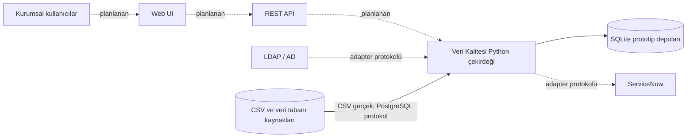
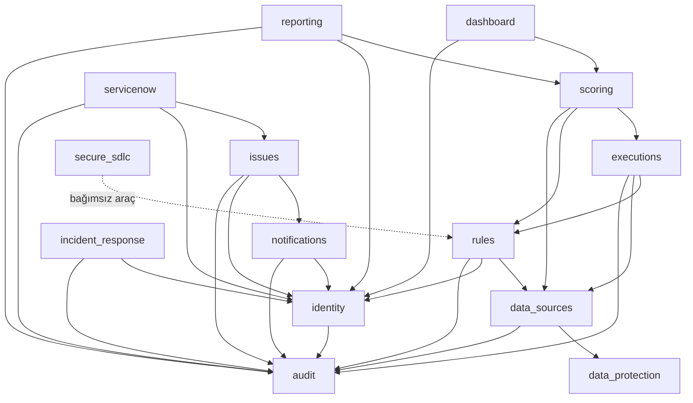
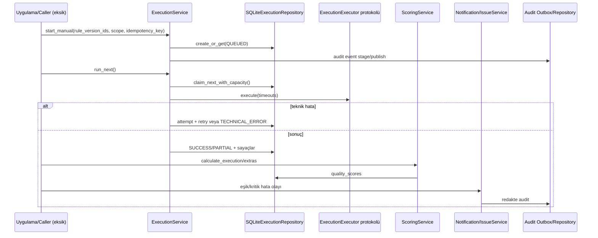
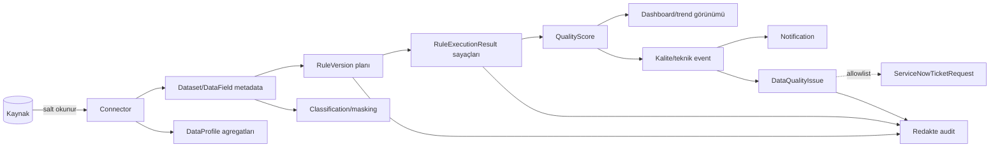

# Sistem Mimarisi

## Proje Dizin Haritası

| Dizin | Amaç ve içerik | Aktiflik |
| --- | --- | --- |
| `00-Proje-Hafizasi/` | İterasyon durumu, kararlar, açık konular ve backlog | Aktif süreç belgesi |
| `01-SRS/` | BR/FR/UC/RULE/NFR, veri modeli ve bankacılık kontrolleri | Taslak gereksinim kaynağı |
| `02-Mimari/` | Hedef bağlam, mantıksal mimari ve güvenlik kararları | Hedef + kısmi uygulama açıklaması |
| `03-Backend/src/veri_kalitesi/` | Çalışan Python domain, servis ve repository kodu | Aktif ana ürün kodu |
| `03-Backend/01-*` ... `12-*` | Modül talimatları ve backend indeksi | Kod değil, yönlendirme |
| `04-Frontend/` | Frontend hedef modülleri | Plan; yalnız indeks var |
| `05-Veritabani/` | Veritabanı çalışma alanı | Plan; migration kodu burada yok |
| `06-Testler/01-Birim/` | 27 test dosyası ve 913 test | Aktif |
| `06-Testler/02-Entegrasyon/` | Entegrasyon test alanı | Boş |
| `06-Testler/03-Uctan-Uca/` | E2E test alanı | Boş |
| `07-Operasyon/` | Runbook ve politika taslakları | Belge; çalışan otomasyon değil |
| `08-Uyum-Kanitlari/` | İterasyon bazlı teknik kanıtlar | Aktif belge |
| `09-Iterasyonlar/` | Bankacılık geçiş iterasyonları | Aktif plan/rapor |
| `pyproject.toml` | Proje metadata, doğrudan bağımlılık, pytest/Ruff ayarı | Aktif fakat eksik build/dev dependency tanımı |

## Teknoloji Yığını

- **Dil:** Python `>=3.10`; async runtime kullanılmıyor.
- **Web/backend framework:** Yok. Kod framework bağımsız domain servisleridir.
- **Frontend:** Yok.
- **Kalıcılık:** Python `sqlite3`; ORM yok, parametreli ham SQL kullanılıyor.
- **Cache:** Yok.
- **Kuyruk:** `rule_executions` ve `servicenow_retry_jobs` SQLite tabloları; broker yok.
- **Zamanlama:** Özel `SchedulingService`; harici scheduler ve cron parser yok.
- **Kimlik:** LDAP adapter protokolü, grup-rol/scope politikası, kalıcı session ve throttle.
- **Dış entegrasyon:** Protocol sınırları; gerçek HTTP/LDAP/PostgreSQL client yok.
- **Test:** pytest; gerçek dış servis yerine fake adapter.
- **Kalite:** Ruff ve mypy komutları kullanılıyor; araçlar manifestte sabitlenmemiş.
- **Güvenli SDLC:** Yerel veri-minimum secret scanner, CycloneDX 1.5 doğrudan
  bağımlılık SBOM üreticisi, ürün bağımsız veri-minimum SAST/bağımlılık zafiyet
  sürüm kapıları, sızma testi bulgu/tekrar test takibi ve deterministik teknik
  kanıt manifesti.
- **Container/orkestrasyon/CI/CD:** Bulunmuyor.
- **Log/metric/trace:** Framework veya exporter bulunmuyor.

## Gerçek Mimari Sınıflandırması

Sistem **modüler monolit çekirdeğidir**. Paketler domain sınırları sağlar; `Protocol`
arayüzleri dış servisleri ve komşu domainleri soyutlar. Bu yapı hexagonal mimariden
özellikler taşır, ancak merkezi composition root, adapter paketi ve açık
application/domain/infrastructure katmanları olmadığı için tam hexagonal veya Clean
Architecture uygulaması değildir.

- **DDD benzeri:** Domain terimleri ve durum makineleri güçlüdür; aggregate sınırları
  ve domain event altyapısı resmileştirilmemiştir.
- **CQRS değil:** Dashboard/reporting okuma servisleri ayrıdır, fakat genel komut ve
  sorgu modeli/altyapısı yoktur.
- **Event-driven değil:** Olay modelleri ve transactional audit outbox vardır; mesaj
  broker'ı ve consumer runtime yoktur.
- **Pipeline benzeri:** Kaynak -> profil/kural -> execution sonucu -> skor ->
  bildirim/issue akışı servis çağrılarıyla kurulabilir, fakat uçtan uca orkestrasyon
  eden çalışan uygulama yoktur.
- **Mikroservis değil:** Paketler tek Python dağıtımı içindir; bağımsız deployment ve
  network sözleşmeleri yoktur.

## Sistem Bağlamı

Kesik çizgiler kodda taşıma veya gerçek istemci olarak bulunmayan sınırları gösterir.

## Ana Bileşenler

Bağımlılık yönü çoğunlukla üst seviye servislerden modeller/protokollere doğrudur.
Belirgin bir paketler arası döngü saptanmamıştır. `audit` ve `identity` ortak çapraz
kesitlerdir; `data_sources` ise kural/execution/scoring zincirinin temel kataloğudur.

## Temel Kontrol Akışı

`Caller`, gerçek kodda tek bir runtime orkestratörü olarak bulunmadığı için bilinçli
olarak eksik gösterilmiştir.

## Veri Akışı

Ham kayıtların skor, bildirim, ServiceNow ve audit akışına taşınmaması hedeflenir.
CSV profil kodu satırları süreç içinde okur; sonuçta yalnız agregat metrik saklar.
PostgreSQL protokolü kaynakta agregasyon bekler, fakat gerçek implementasyon yoktur.

## Senkron ve Asenkron Davranış

- Servis metotları senkrondur.
- Execution ve ServiceNow retry kayıtları kalıcı iş modeli sunar; çalışan worker
  loop/process kodu yoktur.
- Retry gecikmesi `ExecutionService` içinde varsayılan olarak `sleep` ile uygulanır;
  bu gerçek worker'da thread/process bloklar.
- Audit outbox işlemsel olarak stage edilir, ardından servis çağrısı içinde
  `publish_pending()` denenir. Bağımsız publisher worker yoktur.
- Zamanlama yalnız `run_due()` benzeri çağrı yapıldığında ilerler; daemon yoktur.

## Belge ve Kod Farkları

| Belgelenen hedef | Kod gerçekliği |
| --- | --- |
| Web UI ve versiyonlu REST API | Planlanmış ancak uygulanmamış |
| PostgreSQL, SQL Server, Oracle, MySQL, CSV, Excel, REST bağlayıcıları | Yalnız CSV gerçek; PostgreSQL protokol; diğerleri enum |
| Bağımsız ölçeklenebilir servisler | Tek Python modüler monolit |
| Cron tabanlı planlar | ONCE/DAILY/WEEKLY/MONTHLY; genel cron yok |
| Merkezi log/metric altyapısı | Uygulanmamış |
| Metadata kataloğu/BI entegrasyonu | Uygulanmamış |
| ServiceNow ticket oluşturma/güncelleme | Oluşturma sözleşmesi var; gerçek client ve güncelleme yok |

## Kullanılmayan ve Eski Yüzeyler

- `dashboard/_legacy.py` içindeki `LegacyDashboardQueryAdapter` deprecated olarak
  tutulur ve test edilir; geçiş tamamlanınca kaldırılmalıdır.
- `data_sources.audit_records` eski audit tablosudur; merkezi `audit_events`
  geçişi için `LegacyAuditMigrator` vardır, gerçek ortam migration/temizleme yoktur.
- Eski `rule_versions` kayıtları için `prepared_by_actor_id='LEGACY_UNKNOWN'`
  migration varsayımı maker-checker geçiş prosedürü gerektirir.
- Frontend, entegrasyon testi ve E2E dizinleri içerik taşımayan yer tutuculardır.
