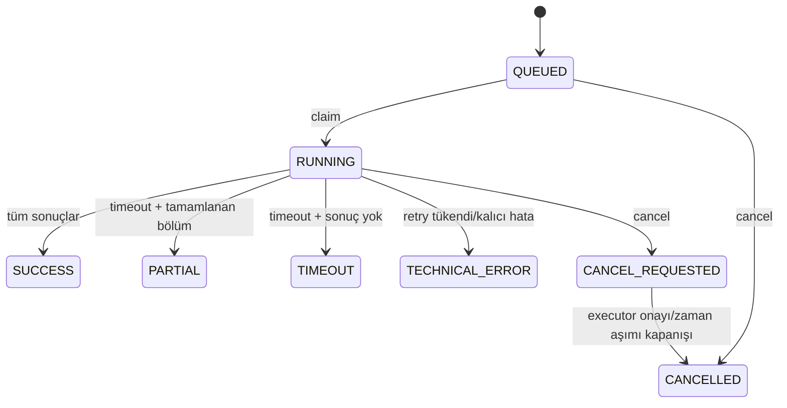

# Domain ve Veri Modeli

## Domain Kavramları

| Kavram | Kod karşılığı | Kalıcılık | Durum |
| --- | --- | --- | --- |
| Veri kaynağı | `DataSource` | `data_sources` | Uygulanmış |
| Veri seti/tablo/görünüm | `Dataset`, `DatasetType` | `datasets` | Uygulanmış |
| Kolon/alan | `DataField` | `data_fields` | Uygulanmış |
| Veri sahibi | `owner_user_id` | source/dataset/rule alanları | Kimlik referansı; dizin adaptörü yok |
| Kural | `QualityRule` | `quality_rules` | Uygulanmış |
| Kural sürümü | `RuleVersion` | `rule_versions` | Uygulanmış, değişmez geçmiş |
| Kural tipi | `RuleType` | `rule_versions.rule_type` | Sekiz tip |
| Kontrol/çalıştırma | `RuleExecution` | `rule_executions` | Orkestrasyon uygulanmış, executor adaptörü eksik |
| Sonuç | `RuleExecutionResult` | `rule_execution_results` | Sayaç bazlı |
| Eşik | `ThresholdSet`, kural `threshold` | scoring config/rule version | Uygulanmış |
| Skor | `QualityScore` | `quality_scores` | RULE/DATASET/DIMENSION/SOURCE/ENTERPRISE |
| Boyut | `QualityDimension` | Enum kodu | Ayrı UUID varlığı yok |
| İhlal/sorun | `DataQualityIssue` | `data_quality_issues` | Uygulanmış state machine |
| Olay | `NotificationEvent`, `IssueTrigger` | Kaynak event ID/digest | Domain mesajı; broker yok |
| Uyarı | `Notification` | `notifications` | Sistem içi; e-posta yok |
| Atama | `IssueAssignment` | issue alanı/tarihçesi | Resolver protokolü; gerçek dizin yok |
| Aksiyon/çözüm | `IssueResolutionRecord` | `issue_resolutions` | Koruma protokolüyle uygulanmış |
| Onay | Rule/scoring approval modelleri | approval tabloları | Maker-checker uygulanmış |
| SLA | Ayrı model yok | Yok | Planlanmış ancak uygulanmamış |
| İstisna/yanlış pozitif | Ayrı model yok | Yok | Planlanmış ancak uygulanmamış |
| Kapsam/güven özeti | Ayrı model yok | Yalnız kısmi politika ayrıntıları | `DQ-SCR-020/021` hedefi uygulanmamış |
| Ölçüm yeterlilik sonucu | Ayrı model yok | Yok | Sekiz durumlu `MeasurementQualificationResult` hedefi uygulanmamış |
| Ham/nihai skor ve kullanım kararı | Mevcut `QualityScore` tek skor taşır | `quality_scores` | Kanonik ayrım uygulanmamış |
| Dataset kritiklik profili | `Dataset.criticality` | Dataset metadata | Kalite agregasyonunda kullanılıyor; `DQ-SCR-018` hedefiyle uyumsuz |
| Veri riski | Ayrı model yok | Yok | `DQ-SCR-019` hedefi uygulanmamış |
| Skor değerlendirme/override | Ayrı model yok | Yok | `DQ-SCR-023` hedefi uygulanmamış |
| Trend | `DashboardScoreTrend` | `quality_scores` okuması | Sabit 30 UTC gün |
| Kullanılabilirlik boyutu | `QualityDimension` içinde yok | Yok | Planlanmış/Doğrulanamadı |

## Veri Kalitesi Boyutları

`rules/models.py` içindeki `QualityDimension` şu yedi değeri taşır:

- `COMPLETENESS` - eksiksizlik
- `ACCURACY` - doğruluk
- `VALIDITY` - geçerlilik
- `CONSISTENCY` - tutarlılık
- `UNIQUENESS` - tekillik
- `TIMELINESS` - güncellik
- `INTEGRITY` - bütünlük

Kullanılabilirlik ayrı bir kalite boyutu değildir. Kaynağın erişilebilir olmaması
`TECHNICAL_ERROR` gibi teknik durumlarla temsil edilir ve kalite skoruna sıfır olarak
katılmaz. Bu ayrım bilinçli ve kodla doğrulanmıştır.

## Mevcut Runtime Skorlama Modeli

Bu bölüm kodun bugünkü davranışını tarif eder. Kabul edilen hedef sözleşme
`DQ-SCR-001`–`DQ-SCR-033`, [ADR-015](../../02-Mimari/Mimari-Kararlar.md) ve
[kanonik skorlama/ölçüm yeterliliği tasarımı](../../02-Mimari/Veri-Kalitesi-Skorlama-ve-Olcum-Yeterliligi.md)
ile tanımlanmıştır; aşağıdaki mevcut davranışların tamamı hedef mimari değildir.

### Kural Skoru

`ScoringService._score_rule()` ve `calculate_rule_score()`:

```text
rule_score = passed_count / checked_count * 100
```

Sonuç iki ondalıklı `Decimal` olarak hesaplanır. Sayaçların negatif olmaması ve
`passed + failed + not_evaluated == checked` tutarlılığı doğrulanır.

### Toplulaştırmalar

| Kapsam | Formül | Ağırlık |
| --- | --- | --- |
| DATASET | `sum(rule_score * rule_weight) / sum(rule_weight)` | `RuleVersion.weight` |
| DIMENSION | Dataset ile aynı aday formülü, seçili boyut kuralları | `RuleVersion.weight` |
| SOURCE | `sum(dataset_score * criticality_weight) / sum(weight)` | Dataset `Criticality` konfigürasyonu |
| ENTERPRISE | `sum(source_score) / source_count` | Eşit kaynak ağırlığı |

`dimension_weights` sürümlü konfigürasyonda saklanır ve açıklama detayına yazılır;
mevcut `calculate_dimension_score()` hesabında çarpan olarak kullanılmaz. Kurum
formülü de boyut ağırlıklarından değil, eşit kaynak skorlarından türetilir. Bu,
onaylanacak kurum agregasyon politikası açısından teknik borç/karar alanıdır.

Varsayılan tüm boyut ve kritiklik ağırlıkları `1.0`'dır. Kurum skoru
`EQUAL_SOURCE_WEIGHT` politikasını kullanır; banka tarafından onaylanmış katsayı
değildir.

Dataset kritikliğini `SOURCE` kalite skoruna ağırlık olarak katan bu davranış
`DQ-SCR-018` ve `ADR-015` ile hedef mimaride `Superseded` durumundadır. Geçmiş
skorlar değiştirilmeyecektir. Yeni sürümde kritiklik ayrı profil, veri riski ayrı
sonuç olacak; migration/backfill/replay ve trend sürüm sınırı uygulanacaktır.

### Eşikler

| Seviye | Aralık |
| --- | --- |
| `CRITICAL` | `0 <= skor < 50.00` |
| `RISKY` | `50.00 <= skor < 75.00` |
| `ACCEPTABLE` | `75.00 <= skor < 90.00` |
| `GOOD` | `90.00 <= skor <= 100` |

Eşikler `ThresholdSet` içinde sürümlenir. Skor konfigürasyonu maker-checker onayıyla
aktive edilebilir; hazırlayan aynı değişikliği onaylayamaz.

Bu aralıklar mevcut prototipin teknik varsayılanlarıdır; üretim eşiği değildir.
`DQ-SCR-014` uyarınca hedef model dataset/kullanım bağlamlı sürümlü politika
kullanır ve üretim değerleri `TBD`'dir.

### Hesaplanamayan Durumlar

- `NO_DATA`: Kontrol kapsamı boş; sayısal skor yok.
- `PARTIAL`: Politika dışı kısmi execution; sayısal resmi skor yok.
- `NOT_CALCULATED_TECHNICAL_ERROR`: Bağlantı/timeout/çalıştırma hatası; sıfır değil.
- `CONFIG_ERROR`: Geçersiz ağırlık vb.; sayısal skor yok.
- Agregasyonda yalnız `CALCULATED` alt skorlar paydaya katılır.
- Tüm bileşenler hesaplanamıyorsa baskın boş durum `_aggregate_empty_status()` ile
  üst seviyeye taşınır.

Hedef model ayrıca `Passed`, `Warning`, `Failed`, `NotApplicable`,
`NotMeasured`, `NoData`, `TechnicalError` ve `SuppressedByException` durumlarını
ayrı temsil eder. Mevcut enumların bu sözlüğe migration eşlemesi uygulanmamıştır.

## Kabul Edilen Hedef Skorlama Modeli

- Oran paydası yalnız gerçekten değerlendirilen kayıtlardır; kapsam dışı,
  istisnalı, teknik değerlendirilemeyen ve `NotApplicable` kayıtlar başarısız
  sayılmaz (`DQ-SCR-004`).
- Ham kalite skoru kural → veri öğesi → boyut → dataset hiyerarşisinde iki
  aşamalı ağırlıklandırılır; kritik kural davranışı ortalamadan bağımsızdır
  (`DQ-SCR-002`, `DQ-SCR-016`, `DQ-SCR-017`).
- Kapsam, güven, kritiklik, risk ve teknik sağlık kalite skorundan ayrıdır
  (`DQ-SCR-005`, `DQ-SCR-018`–`DQ-SCR-021`).
- Ham/nihai kalite skoru, kritik kural durumu, kullanım kararı, teknik çalışma
  durumu ve ölçüm yeterliliği ayrı sonuçlardır. Yeterlilik kapsam, örneklem,
  güncellik, teknik başarı, sürüm, kritik kontrol ve kanıt kapılarıyla değerlendirilir.
- Normalizasyon, eşik, ağırlık, kritik kural ve güven politikaları sürümlü,
  gerekçeli ve risk bazlı onaylıdır (`DQ-SCR-013`–`DQ-SCR-017`).
- İstisna ve override süreli/auditli ayrı varlıklardır; ham skor değişmez
  (`DQ-SCR-022`, `DQ-SCR-023`).
- Her skor model, kural, eşik, ağırlık, normalizasyon ve uygulama sürümünü taşır;
  replay orijinali koruyan ayrı sonuçtur (`DQ-SCR-025`, `DQ-SCR-032`).

Üretim formülleri/katsayıları, rol matrisi ve `OPEN-BNK-013` kapsamı `TBD`'dir.

## Kural Yönetimi

`RuleService` kural oluşturma, yeni sürüm, sınırlı test, aktivasyon, kritik kural
onay isteği/kararı/geri çekme davranışlarını yürütür. `RuleVersion` değişmezdir;
değişiklik yeni `version_no` üretir.

Desteklenen tipler:

1. `REQUIRED`
2. `UNIQUE`
3. `RANGE`
4. `REGEX`
5. `FRESHNESS`
6. `REFERENTIAL_INTEGRITY`
7. `CROSS_TABLE_CONSISTENCY`
8. `CUSTOM_SQL`

`rules/templates.py::build_rule_plan()` parametreleri doğrular. Özel SQL yalnız tek
`SELECT`/`SHOW` ifadesi ve yasaklı anahtar sözcük bulunmaması koşuluyla kabul edilir.
Bu statik kontrol savunma katmanıdır; üretimde veritabanı kullanıcısının gerçek
salt-okunur yetkisi zorunludur.

Kural testi varsayılan en fazla 10.000 kayıtla resmi skordan ayrı yürür. Ancak
`RuleTestExecutor` ve `ExecutionExecutor` yalnız protokoldür; CSV/PostgreSQL üzerinde
kural planını gerçekten çalıştıran üretim adaptörü bulunmaz. Kural bağımlılık grafiği
ve event-triggered çalışma yoktur.

## Çalıştırma Yaşam Döngüsü



Execution idempotency anahtarının kendisi değil SHA-256 özeti saklanır. Aynı anahtar
ve aynı payload mevcut execution'ı döndürür; farklı payload conflict üretir.
Varsayılan retry 3 deneme ve 1 saniye tabanlı üstel gecikmedir. Timeoutlar bağlantı
15 saniye, sorgu 30 dakika, toplam 60 dakikadır. Bunlar protokol alanlarıdır; gerçek
driver düzeyinde zorlanmaları uygulanmamıştır.

HEAVY/LIGHT claim kotaları süreç içi SQLite üzerinde uygulanır: varsayılan 2 ağır,
4 hafif; kaynak başına toplam 4 ve ağır 1. Çoklu process/instance dağıtık kilit yoktur.

## Veri Erişimi ve Profil

- `DataSource.connection_config` secret içermemelidir; yasak anahtarlar recursive
  reddedilir. Secret yalnız `secret://` referansıyla `SecretResolver` üzerinden alınır.
- `CSVConnector` gerçek dosyayı okur. Yol bir sandbox köküne göre sınırlandırılmaz;
  deployment servis hesabının okuyabildiği herhangi bir yol hedeflenebilir.
- CSV `SAMPLE` tüm satırları tarayıp deterministik olarak bazılarını hesaba katar.
  Tekil ve sayısal değerler set/listelerde tutulduğu için yüksek kardinalitede bellek
  büyümesi vardır.
- PostgreSQL connector TLS doğrulama modu, connect timeout, statement timeout ve
  read-only probe şartlarını taşır. Gerçek `PostgreSQLDriver` yoktur.
- PostgreSQL profil protokolü kaynakta toplulaştırma bekler; partition/sample seçimi
  `ProfileOptions` ile iletilir. Gerçek sorgu üretimi doğrulanamamıştır.
- Profil sonucu ham satır yerine count/null/unique/numeric/duplicate agregatlarını
  saklar; `DefaultMaskingPolicy` sınıfa göre alanları fail-closed korur.

## İlişkisel Model

```mermaid
erDiagram
    data_sources ||--o{ datasets : contains
    datasets ||--o{ data_fields : contains
    data_sources ||--o{ connection_test_results : tested_by
    data_sources ||--o{ metadata_discovery_results : discovered_by
    datasets ||--o{ data_profiles : profiled_by
    data_fields ||--o{ data_processing_inventory_versions : governed_by

    quality_rules ||--o{ rule_versions : versions
    rule_versions ||--o{ rule_test_results : tested_by
    rule_versions ||--o| rule_approval_requests : approved_by

    rule_executions ||--o{ execution_attempts : attempts
    rule_executions ||--o{ rule_execution_results : produces
    rule_executions ||--o{ quality_scores : logical_source

    scoring_configurations ||--o| scoring_configuration_approvals : approved_by

    data_quality_issues ||--o{ issue_history : history
    data_quality_issues ||--o{ issue_resolutions : resolutions
    data_quality_issues ||--o{ issue_verifications : verifications
    data_quality_issues ||--o{ issue_relationships : predecessor

    servicenow_ticket_links ||--o{ servicenow_ticket_history : history
    servicenow_ticket_links ||--o{ servicenow_retry_jobs : completed_by

    security_incidents ||--o| personal_data_breach_suspicions : may_have
    personal_data_breach_suspicions ||--o| breach_notification_decisions : decided_by
    security_incidents ||--o{ incident_timeline : timeline
```



ER diyagramındaki `rule_executions -> quality_scores` ve bazı domainler arası bağlar
mantıksaldır; SQLite foreign key olarak tanımlanmamıştır. Ayrıca `data_sources`,
`rules`, `executions` ve `scoring` repository'leri FK tanımlasa da connection açılışında
`PRAGMA foreign_keys=ON` çalıştırmaz; SQLite varsayılanında bu FK'ler enforce edilmez.

## Tablo Ayrıntıları

| Tablo | PK / önemli kolonlar | İlişki, indeks ve yaşam döngüsü |
| --- | --- | --- |
| `data_sources` | `data_source_id`; unique `name`; config, secret reference, status | `ARCHIVED` enumu var, servis lifecycle metodu yok; FK enforcement eksik |
| `connection_test_results` | autoincrement `test_result_id`; result, duration, class | source FK; append geçmiş, retention yok |
| `audit_records` | `audit_id`; actor/action/old/new JSON | Legacy append audit; merkezi migration gerekir |
| `datasets` | `dataset_id`; unique source+namespace+name | source FK; soft delete yok |
| `data_fields` | `data_field_id`; unique dataset+name; classification | dataset FK; runtime classification guard/migration |
| `metadata_discovery_results` | autoincrement `discovery_id`; changes JSON | source FK; sınırsız geçmiş riski |
| `data_profiles` | `profile_id`; execution, method, metrics JSON | dataset FK; büyük/sınırsız geçmiş riski |
| `data_processing_inventory_versions` | `inventory_id`; unique field+version | field FK; descending index; append-only sürüm |
| `quality_rules` | `quality_rule_id`; unique `code`; status | Dataset bağı mantıksal; arşiv durumu var |
| `rule_versions` | `rule_version_id`; unique rule+version | rule FK; değişmez sürüm |
| `rule_test_results` | `rule_test_result_id`; counts/status | version FK; append geçmiş |
| `rule_approval_requests` | `approval_request_id`; unique version | version FK; tek onay kaydı/sürüm |
| `rule_executions` | `execution_id`; unique idempotency hash | Kuyruk ve terminal kayıt; status/time claim indeksi yok |
| `execution_attempts` | `attempt_id`; unique execution+attempt | execution FK; append geçmiş |
| `rule_execution_results` | `rule_result_id`; unique execution+version | execution FK; sayaç sonuçları |
| `schedules` | `schedule_id`; unique `name`; next run | Due-time indeksi yok; active flag soft disable |
| `quality_scores` | `quality_score_id`; scope/value/status/details | unique execution+scope; scope-time index; mantıksal execution ilişkisi |
| `scoring_configurations` | `configuration_id`; unique version | Partial unique index ile tek active; geçmiş korunur |
| `scoring_configuration_approvals` | `approval_id`; unique config | configuration FK; maker/checker karar geçmişi |
| `identity_sessions` | `session_id`; unique credential digest | actor/status ve expiry indeksleri; revoke ile kapanır |
| `authentication_throttle_states` | composite scope+key | blocked-until index; mutable sayaç durumu |
| `audit_events` | autoincrement sequence; unique event/hash | time/correlation index; hash-chain append |
| `audit_outbox` | `event_id`; prepared JSON/status/attempt | pending index; publish sonrası kayıt temizlenmez |
| `notifications` | `notification_id`; unique recipient+dedupe digest | recipient/status/time index; read flag, retention yok |
| `data_quality_issues` | `issue_id`; unique issue no/dedupe digest | assignee/status/time index; terminal CLOSED/CANCELLED |
| `issue_history` | sequence; unique history ID | issue FK/index; append-only |
| `issue_resolutions` | sequence; unique resolution ID | issue FK/index; korunan metin ve kanıt ref |
| `issue_verifications` | sequence; unique verification ref | issue FK/index; güvenilir execution/score ref mantıksal |
| `issue_relationships` | sequence; unique predecessor+successor+type | iki issue FK; recurrence grafiği |
| `servicenow_ticket_links` | `link_id`; issue/external/ticket/idempotency unique | Ticket için tek link |
| `servicenow_ticket_history` | sequence; unique history ID | link FK/index; append-only |
| `servicenow_retry_jobs` | `job_id`; unique issue/client request | status/due claim index; DLQ terminal durumu |
| `servicenow_circuit_breaker` | `target_key`; state/failures/time | Tek varsayılan hedef; mutable global state |
| `security_incidents` | `incident_id`; unique source ref | Ana olay; soft delete yok |
| `personal_data_breach_suspicions` | `breach_id`; unique incident | incident FK; 72 saat hedefi/status |
| `breach_notification_decisions` | sequence; unique decision/breach | breach FK; external dispatch DB check ile daima 0 |
| `incident_timeline` | sequence; unique timeline ID | incident/breach FK; incident-sequence index |

## Veri Modeli Riskleri

- Merkezi migration aracı ve sürümlü migration dosyaları yok; repository açılışında
  `PRAGMA table_info`, `ALTER TABLE` ve tablo rebuild işlemleri çalışır.
- 37 tablo tek fiziksel şema olarak tanımlanmamıştır. Her repository varsayılan
  `:memory:` connection açar; gerçek composition root hangi tabloların aynı DB'de
  olacağını göstermiyor.
- Skor, rule ve execution arasındaki referansların çoğu FK değildir; orphan riski vardır.
- SQLite FK enforcement bazı repository'lerde açılmadığından yazılmış FK'ler pratikte
  koruma sağlamayabilir.
- Tarihçe/audit/result tabloları için retention, partition, arşiv ve kapasite sınırı yoktur.
- `rule_executions(status, created_at)` ve `schedules(is_active, next_run_at)` için
  iş claim/due indeksleri bulunmadığından hacimle tarama maliyeti büyür.
- JSON metin alanları (`scope`, `definition`, `metrics`, `calculation_details`) kolay
  prototipleme sağlar; DB düzeyi şema doğrulama ve hedefli sorgu/indeksleme zayıftır.
- Genel cascade delete yoktur; bu tarihçe koruma için iyi, fakat kontrollü imha ve
  legal hold tasarımı olmadan KVKK yaşam döngüsü tamamlanmaz.
