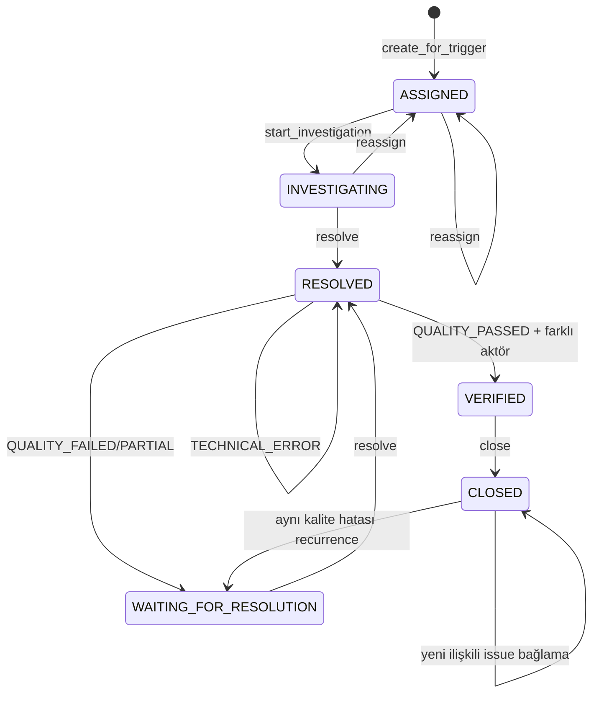

# API ve Entegrasyonlar

## HTTP API Durumu

**Kısmen uygulanmış.** FastAPI composition root'u dashboard özeti ve BFF logout
endpoint'lerini, response şemasını, Problem Details hata eşlemesini, correlation
ID'yi ve OpenAPI üretimini sağlar. Diğer domain servislerinin HTTP yüzeyi yoktur.

| API özelliği | Durum |
| --- | --- |
| Versiyonlama | `/api/v1` uygulanmış |
| Pagination/filter/sort | Yalnız bazı repository/query nesnelerinde yerel filtre; HTTP yok |
| Request validation | FastAPI dashboard/logout sınırında var; diğer alanlarda HTTP yok |
| Hata modeli | RFC 9457 Problem Details dashboard/logout sınırında var |
| Correlation ID | Sunucu tarafından üretilir ve güvenli hata yanıtına bağlanır |
| Rate limit | Login throttle var; genel API rate limit yok |
| OpenAPI/Swagger | FastAPI yüzeyi için var |
| Geriye uyumluluk | SQLite runtime migrationları var; API sözleşmesi yok |

HTTP katmanı caller tarafından verilen `actor_id`, rol veya scope'u yetki kanıtı
olarak kabul etmez; yalnız session resolver sonucunda issuer tarafından üretilmiş
`ActorContext` servislere geçirilir. Production resolver yoksa istek fail-closed
reddedilir.

| Metot | Yol | Mevcut kapsam |
| --- | --- | --- |
| `GET` | `/api/v1/dashboard/summary` | Yetki filtreli veri-minimum özet ve trend |
| `POST` | `/api/v1/session/logout` | BFF cookie/CSRF doğrulamasıyla merkezi logout |

İkinci faz kanıt, lineage, öneri, yeniden üretim, remediation, chaos ve kanıt
paketi operasyon sınıfları `FR-097–FR-111` ile tanımlıdır. Nihai endpoint adları
uydurulmamış; [kanonik hedef mimaride](../../02-Mimari/Kanita-Dayali-Karar-Sistemi.md)
işlem sınıfı, IAM, idempotency ve uzun iş davranışı belirlenmiştir.

## Python Servis API Envanteri

Bu yüzeyler HTTP endpoint'i değil, application/domain servis metotlarıdır.

| Servis | Başlıca komut/sorgular | Yetki ve idempotency |
| --- | --- | --- |
| `DataSourceService` | `create_data_source`, `test_connection`, `discover_metadata`, `run_profile`, inventory | Bazı eski çağrılarda serbest actor ID; audit var |
| `RuleService` | `create_rule`, `create_version`, `test_rule`, `activate_rule`, approval lifecycle | Kritik aktivasyonda trusted actor + maker-checker |
| `ExecutionService` | `start_manual`, `start_scheduled`, `run_next`, `cancel` | Payload/idempotency hash; identity bağlama kısmi |
| `SchedulingService` | plan oluşturma/önizleme/due çalıştırma | Schedule-time idempotency; daemon yok |
| `ScoringConfigurationService` | config oluştur/gönder/onayla | Trusted actor, maker-checker |
| `ScoringService` | rule/dataset/dimension/source/enterprise hesapla | Scope bazlı unique skor; kullanıcı yetkisi bu katmanda yok |
| `DashboardQueryService` | `get_score_tree`, `get_source_detail`, `get_score_trend` | `AuthorizationService` ve trusted scope |
| `NotificationService` | `create_for_event`, `list_my_notifications`, `mark_read` | Producer service, reader user; dedupe |
| `IssueService` | oluştur, incele, ata, çöz, doğrula, kapat | Actor type/scope, farklı doğrulayan, dedupe |
| `ServiceNowService` | ticket oluştur, retry işle, DLQ requeue | Yalnız service actor, idempotency, allowlist |
| `AuditQueryService` | filtreli audit görüntüleme | `AUDIT_VIEWER` benzeri policy rolü, 31 gün sınırı |
| `ReportPreviewService` | `preview_summary` | Rol/source scope, 31 gün ve 500 source sınırı |
| `IncidentResponseService` | incident/breach/decision/timeline | Güvenilir roller, farklı karar aktörü |

`DQ-SCR-001`–`DQ-SCR-033` ve
[kanonik tasarım](../../02-Mimari/Veri-Kalitesi-Skorlama-ve-Olcum-Yeterliligi.md)
hedefinde HTTP skorlama yanıtı `raw_quality_score`, `final_quality_score`,
`quality_status`, `measurement_qualification_status`, `critical_rule_status`,
`usage_decision`, `execution_status`, kapsam/örneklem/güven/geçerlilik,
risk/kritiklik, istisna/override ve tüm model/politika/referans sürümlerini ayrı
taşımalıdır. Mevcut `ScoringService` ve `DashboardQueryService` bu sözleşmenin
yalnız kalite skoru, temel açıklama ve trend alt kümesini sağlar; ayrı
yeterlilik/kullanım/risk/güven/istisna/override API yüzeyi uygulanmamıştır. Nihai
endpoint ve OpenAPI şeması güvenli HTTP/API sınırı uygulanmadan dış erişime
açılmaz; bu sınır ayrı ürün artımında sürümlü sözleşmeyle tamamlanacaktır.

## Kimlik Doğrulama ve Yetkilendirme

### ActorContext Güven Sınırı

`identity/models.py::ActorContext` actor, actor type, roller, source/dataset scope,
enterprise görüntüleme, privileged bayrağı, session, geçerlilik zamanları ve politika
sürümlerini değişmez nesnede taşır. Normal constructor yerine özel issuer doğrulaması
amaçlanır. `PolicyAuthorizationService` şu kontrollerde deny-by-default davranır:

- context güvenilir issuer tarafından üretilmiş mi,
- henüz geçerli mi veya süresi dolmuş mu,
- policy sürümü eşleşiyor mu,
- actor type izinli mi,
- enterprise/source/dataset kapsamı yeterli mi.

Rol kodları merkezi enum değildir; LDAP group grant ve servis politikalarında string
setleri olarak yapılandırılır. Banka onaylı grup-rol matrisi kodda bulunmaz.

### LDAP

`LdapAuthenticationService` credential girdisini `LdapIdentityAdapter.authenticate()`
protokolüne verir, gelen `LdapIdentityAssertion` ve grup listesini sürümlü
`LdapGroupRoleScopePolicy` ile rol/scope'a dönüştürür. Grup bulunmaması, rol
üretilmemesi, geçersiz actor type ve adapter hatası fail-closed sonuçlanır; audit
olayı veri-minimum sayaç/reason code taşır.

**Kısmen uygulanmış:** Gerçek LDAP client, endpoint, TLS trust, bind modeli, timeout,
servis hesabı ve Active Directory özellikleri yoktur.

### Login Throttle ve Session

- `AuthenticationThrottleService` opak principal/client anahtarlarını ayrı kapsamda
  sayar ve SQLite'da pencere/blok süresi saklar.
- `SessionService.open_authenticated_session()` rastgele credential üretimini dışarıdan
  alır, yalnız digest saklar; absolute ve idle timeout uygular.
- Session status `ACTIVE`, `EXPIRED`, `REVOKED` yaşam döngüsünü taşır; logout
  `REVOKED` geçişi ve gerekçe ile temsil edilir.
- Validate/touch/logout ve hata yolları auditlenir.

**Karar:** `OPEN-BNK-020` banka onaylıdır. HTTP sınırı BFF, sunucu taraflı
access/refresh token, opak `__Host-session` cookie, synchronizer-token CSRF,
Origin/Referer/Fetch Metadata, CORS allowlist, tek aktif oturum, `PT1H` idle,
`PT10H` absolute timeout ve merkezi iptal uygular.

**Eksik uygulama:** Gerçek IdP callback/state/nonce, MFA/PAM/break-glass entegrasyonu,
kurum onaylı yüksek erişilebilir session store
ve fallback PostgreSQL, at-rest şifreleme/KMS-HSM ve `P90D` fiziksel
saklama/imha kanıtı.

## Veri Kaynağı Entegrasyonları

| Kaynak | Durum | Gerçek davranış |
| --- | --- | --- |
| CSV | Uygulanmış | Yerel dosya okuma, header keşfi, FULL/SAMPLE profil |
| PostgreSQL | Kısmen uygulanmış | Config/TLS/read-only/probe ve metadata/profile protokolü |
| MSSQL | Planlanmış ancak uygulanmamış | Yalnız enum |
| Oracle | Planlanmış ancak uygulanmamış | Yalnız enum |
| MySQL | Planlanmış ancak uygulanmamış | Yalnız enum |
| Excel | Planlanmış ancak uygulanmamış | Yalnız enum |
| REST kaynak | Planlanmış ancak uygulanmamış | Yalnız enum |

Connection pool yoktur. Secret manager yerine `SecretResolver` portu vardır;
`EmptySecretResolver` ve test amaçlı `InMemorySecretResolver` dışında ürün adaptörü
yoktur. PostgreSQL bağlantı testi read-only probe sonucunu doğrular. Kaynak veritabanı
için yazma işlemi üreten sürücü kodu yoktur; buna rağmen gerçek DB rolünün salt-okunur
olduğu ancak üretim konfigürasyonuyla kanıtlanabilir.

## ServiceNow

`ServiceNowService` dışarı yalnız şu allowlist alanlarını çıkarır:

- client request/idempotency referansı,
- veri-minimum issue referansı,
- `source_event_type`, priority,
- ayrıntı içeriği yerine `detail_reference_id`,
- correlation ID.

Ham hatalı satır, çözüm metni, müşteri verisi veya secret ticket payload'ına eklenmez.
Senkron transient hata için retry/backoff/`Retry-After`; kalıcı kuyruk için
`PENDING/PROCESSING/COMPLETED/DEAD_LETTER`; beş ardışık transient hatada varsayılan
beş dakikalık circuit breaker vardır.

**Kısmen uygulanmış:** `ServiceNowAdapter` yalnız Protocol'dür. Gerçek HTTP client,
endpoint/TLS/credential, banka field-state eşlemesi, ticket güncelleme/senkronizasyon,
dağıtık retry state ve alarm yoktur.

## Bildirim ve Sorun İş Akışı

Bildirimler sabit veri-minimum şablonlarla üretilir. Resolver en az bir trusted UUID
recipient döndürmelidir. `(recipient_user_id, deduplication_key_digest)` unique
constraint'i tekrarları yeni kayıt yerine `occurrence_count` artışıyla toplar.
E-posta, SMS, push veya message broker entegrasyonu yoktur.

Issue tetikleyicileri `QUALITY_THRESHOLD`, `CRITICAL_RULE_FAILURE` ve
`TECHNICAL_ERROR` olabilir. Teknik olaylar issue üretebilir, fakat skor hesabında
kalite başarısızlığına çevrilmez. Atama `IssueAssignmentResolver`, kullanıcı kapsamı
`IssueAssigneeDirectory`, çözüm koruma ve doğrulama ayrı portlardır.

`NEW` ve `CANCELLED` enum değerleri vardır, fakat mevcut servis oluşturmayı doğrudan
`ASSIGNED` yapar ve cancellation metodu sunmaz. Bunlar kullanılmayan/gelecek durum
adaylarıdır. `DQ-SCR-022`, `DQ-SCR-023` ve `DQ-SCR-029` hedefindeki SLA,
eskalasyon, istisna, ham skordan ayrı override ve risk bazlı remediation modeli
yoktur.

## Zamanlanmış ve Asenkron İşler

| İş | Tetik | Retry/timeout | Eşzamanlılık/idempotency | Eksik |
| --- | --- | --- | --- | --- |
| Rule execution | Manuel veya schedule due | 3 retry; 15s/30m/60m contract | HEAVY/LIGHT + source kotası, hash key | Gerçek executor/worker/broker |
| Schedule dispatch | Harici caller `run_due` | Plan geçersizse pasifleştir | schedule+run time key | Daemon, cron, distributed lock |
| Audit outbox publish | Domain transaction sonrası senkron çağrı | attempt/error kaydı | event ID | Publisher worker, backoff/alarm |
| ServiceNow retry | Harici caller `process_next_retry` | 3 attempt + due-time | Tek claim, request ID | Lease/heartbeat/multi-instance |
| Session expiry | `validate` sırasında lazy | Retry yok | Credential digest | Sweeper/retention job |

## Hata Yönetimi

Her paket kendi kök exception'ını ve validation/authorization/technical/not-found/
conflict alt türlerini tanımlar. Örnekler:

- `ValidationError`, `ConnectionTestTechnicalError`
- `RuleValidationError`, `RuleTechnicalError`
- `ExecutionValidationError`, `ExecutionTechnicalError`, `ExecutionTimeoutError`
- `ScoringValidationError`, `ScoringTechnicalError`
- `DashboardAuthorizationError`, `DashboardQueryError`
- `NotificationTechnicalError`, `IssueTechnicalError`
- ServiceNow transient/rate-limit/non-transient hataları
- `AuditWriteError`, `AuditQueryAuthorizationError`

Kalite başarısızlığı exception değildir; `failed_count`, issue trigger ve skor
seviyesiyle temsil edilir. Harici sistem/SQLite hataları çoğunlukla correlation ID
içeren veri-minimum teknik hataya çevrilir. Global exception handler ve kullanıcıya
dönecek HTTP hata zarfı yoktur; traceback/log politikası da runtime olmadığı için
doğrulanamamıştır.

## API Tasarımında Zorunlu Sonraki Kontroller

1. `/api/v1` gibi sürümlü route sözleşmesi ve OpenAPI.
2. Session credential'dan trusted `ActorContext` üretimi; request rol/scope reddi.
3. Standardize error code, correlation ID ve teknik ayrıntı redaksiyonu.
4. Cursor pagination ve sabit üst limitler; özellikle audit, issue ve execution listeleri.
5. Mutating komutlarda idempotency header ve maker-checker entegrasyonu.
6. Genel rate limit, body boyutu, timeout, CORS/CSRF ve security header politikası.
7. API contract ve gerçek adaptör entegrasyon testleri.
