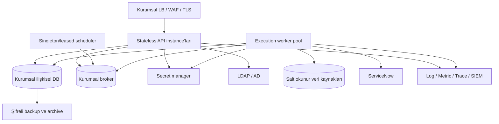

# Deployment ve Operasyon

## Mevcut Çalıştırılabilirlik

Depoda son kullanıcıya hizmet veren uygulama giriş noktası yoktur. `uvicorn`, web
server, worker daemon, scheduler daemon veya composition root bulunmaz. Çalıştırılabilen
yüzeyler testler ve güvenli SDLC CLI modülleridir.

```bash
python3 -m pytest -q
python3 -m ruff check .
python3 -m compileall -q 03-Backend/src 06-Testler
PYTHONPATH=03-Backend/src python3 -m veri_kalitesi.secure_sdlc .
PYTHONPATH=03-Backend/src python3 -m veri_kalitesi.secure_sdlc.sbom pyproject.toml
PYTHONPATH=03-Backend/src python3 -m veri_kalitesi.secure_sdlc.evidence 08-Uyum-Kanitlari/Surum-Paketleri/Iterasyon-29A-Teknik-Kanit-Katalogu.json .
PYTHONPATH=03-Backend/src python3 -m veri_kalitesi.secure_sdlc.evidence_gate 08-Uyum-Kanitlari/Surum-Paketleri/Iterasyon-29A-Teknik-Kanit-Katalogu.json 08-Uyum-Kanitlari/Surum-Paketleri/Iterasyon-29A-Teknik-Kanit-Manifesti.json .
```

`pyproject.toml` proje adı/sürümü, Python sınırı, iki runtime bağımlılığı ve
pytest/Ruff ayarını içerir. `[build-system]`, console script, dev dependency group,
lock dosyası ve dağıtılabilir package üretim kanıtı yoktur. Secret scanner,
`secure_sdlc/__main__.py` üzerinden paket modülü olarak çalıştırılır.

## Bulunmayan Deployment Varlıkları

| Varlık | Durum |
| --- | --- |
| Dockerfile / Compose | Yok |
| Kubernetes/Helm/OpenShift manifesti | Yok |
| CI/CD workflow | Yok |
| Reverse proxy/WAF ayarı | Yok |
| TLS sertifika/termination ayarı | Yok |
| Environment config şeması | Yok |
| Secret manager adapter/config | Yok |
| Üretim DB migration aracı | Yok |
| Seed/bootstrap komutu | Yok |
| API/worker start komutu | Yok |
| Health/readiness/liveness | Yok |
| Backup/restore otomasyonu | Yok |
| Rollback otomasyonu | Yok |

Dolayısıyla Docker ile lokal çalışma ve üretim dağıtım adımları **doğrulanamadı**;
belgelenebilecek çalışan komut yoktur.

## Konfigürasyon ve Secret

Uygulama merkezi settings nesnesi veya environment variable sözleşmesi kullanmaz.
Servisler dependency'lerini constructor ile alır; repository'ler varsayılan olarak
`:memory:` database açar. Veri kaynağı bağlantı ayarları `connection_config` JSON'u ve
`secret_reference` olarak saklanır.

Üretim için gerekli konfigürasyon en az şunları kapsamalıdır:

- environment adı ve fail-closed production profili,
- API bind/port ve trusted proxy listesi,
- metadata/result/audit DB DSN referansları,
- broker/worker concurrency ve lease politikası,
- LDAP endpoint/TLS/bind secret referansı,
- ServiceNow endpoint/TLS/service account secret referansı,
- secret manager adresi ve workload identity,
- source network allowlist ve egress proxy,
- audit sink/SIEM hedefi,
- log/metric/trace hedefleri,
- retention, backup ve encryption policy sürümleri.

Secret değerleri environment dosyasına veya deploy manifestine yazılmamalı; yalnız
kurumsal secret manager referansı ve workload identity kullanılmalıdır.

## Veritabanı Hazırlığı ve Migration

Mevcut repository'ler ilk açılışta `CREATE TABLE IF NOT EXISTS` çalıştırır. Bazıları
`PRAGMA table_info` ile kolon ekler, `quality_scores` tablosunu geçici tablo üzerinden
yeniden kurar. Bu yaklaşım yerel prototip için yeterlidir, üretim için değildir:

- şema sürümü ve migration checksum'u yok,
- forward/backward migration dosyası yok,
- preflight, backup, lock window ve rollback yok,
- birden çok instance aynı anda migration çalıştırabilir,
- SQLite'tan hedef üretim DB'sine tip/constraint uyumluluğu tanımsızdır.

Üretim geçişinde merkezi migration aracı seçilmeli; her migration reversible veya
açık forward-fix planlı, test edilmiş ve auditli olmalıdır. Legacy `audit_records`
geçişi ayrı envanter/yedek/geri dönüş planı gerektirir.

## Önerilen Runtime Topolojisi

Bu topoloji hedef öneridir, uygulanmış değildir:



API stateless olabilir; session ve throttle state ortak DB/cache'te olmalıdır.
Scheduler tek instance yerine lease/fencing ile çalışmalıdır. Worker'lar source ve
HEAVY/LIGHT kotasını paylaşımlı state üzerinden uygulamalıdır.

## Network ve TLS

Portlar koddan doğrulanamaz. Üretim network tasarımı en az şu akışları ayrı allowlist
etmelidir:

- kullanıcı/LB -> API (HTTPS),
- API -> LDAP ve metadata DB,
- worker -> yalnız onaylı kaynak DB/dosya mount'ları,
- worker -> ServiceNow proxy/endpoint,
- tüm runtime -> secret manager ve gözlemlenebilirlik,
- backup agent -> onaylı immutable backup hedefi.

Kaynak DB hesabı DDL/DML yetkisiz olmalı; read-only transaction ve statement timeout
DB tarafında zorlanmalıdır. TLS trust store, sertifika rotasyonu ve hostname
verification deployment testine dahil edilmelidir.

## Dosya Sistemi

CSV connector yerel/mount edilmiş dosya yolu bekler. Üretimde:

- yalnız belirli read-only mount kökleri açılmalı,
- canonical path allowlist ve symlink kontrolü uygulanmalı,
- upload ile source mount birbirinden ayrılmalı,
- process temp/export dizinleri quota ve no-exec ile sınırlandırılmalı,
- SQLite üretimde kullanılmayacaksa yerel kalıcı volume ihtiyacı kaldırılmalıdır.

## Gözlemlenebilirlik

Mevcut durumda domain audit'i vardır; operasyon telemetry'si yoktur. Gerekli minimum:

- JSON structured log ve correlation/trace ID,
- secret/PII redaction processor,
- request latency/error/rate metric'leri,
- queue depth, oldest job age, retry, DLQ ve circuit state metric'leri,
- source bazlı query duration/timeout fakat ham SQL/veri içermeyen etiketler,
- audit outbox pending/failed alarmı,
- LDAP/ServiceNow dependency health,
- API liveness ve bağımlılık kontrollü readiness,
- OpenTelemetry trace veya kurum standardı eşdeğeri,
- SIEM'e güvenlik olay kodları.

Metric label'larında actor ID, dataset adı, müşteri bilgisi veya yüksek kardinaliteli
correlation ID kullanılmamalıdır.

## Backup, DR ve İş Sürekliliği

**Planlanmış ancak uygulanmamış.** Banka onaylı RTO/RPO, backup sıklığı, encryption,
immutable kopya, restore tatbikatı ve bölgesel/veri merkezi topolojisi yoktur.

Gerekli çalışma:

1. Kayıt türü ve kritik iş akışı bazlı RTO/RPO kararı.
2. DB point-in-time recovery ve şifreli backup.
3. Secret/config yeniden kurulum runbook'u.
4. Queue ve audit outbox recovery/idempotent replay.
5. ServiceNow/LDAP kesintisi için degraded-mode politikası.
6. Düzenli restore testi ve kanıt dosyası.
7. DR failover/failback, veri tutarlılığı ve hash-chain doğrulama.

## Rollback ve Güvenli Pasifleştirme

Bugün release rollback mekanizması yoktur. Üretim tasarımında:

- API ve worker image'ı immutable/sürüm etiketli,
- DB migration backward-compatible expand/contract,
- yeni connector/schedule/export feature flag ile fail-closed kapatılabilir,
- worker tüketimi durdurulup queued iş korunabilir,
- audit yazımı bozulduğunda işlem bazlı fail-closed/durable buffer politikası,
- konfigürasyon ve rule sürümleri önceki aktif sürüme auditli dönüş,
- rollback sonrası integrity ve smoke test zorunlu olmalıdır.

## Operasyon Runbook Öncelikleri

1. API ve worker start/stop/drain.
2. Stuck execution, retry ve DLQ inceleme/replay.
3. Audit outbox backlog ve integrity failure müdahalesi.
4. LDAP/ServiceNow/source outage sınıflandırması.
5. Session revoke ve privileged access olayı.
6. Backup/restore ve DR tatbikatı.
7. Kişisel veri ihlali şüphesi timeline ve insan karar akışı.
8. Retention/imha/legal hold uygulaması.
